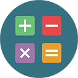
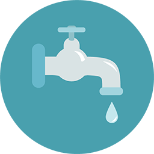
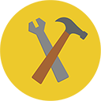

# 시작하기 {#getting-started}

## 1단계 마케팅 소개 {#what-is-marketo}

마케터가 무엇이라고 생각하십니까? 좋은 질문입니다!

[마케팅 학습](getting-started/what-is-marketo.md)

## 2단계 설정 {#get-set-up}

IT 팀의 도움을 통해 신속하게 작업을 완료할 수 있습니다.

[설치 시작](getting-started/setup-steps.md)

## 3단계 빠른 성과 달성 {#get-some-quick-wins}

Marketing To의 핵심 기능을 살펴보려면 이 작업을 완료하십시오.

[  1. 설정 및 사람 추가](https://docs.marketo.com/pages/viewpage.action?pageId=2359351)

[  2. 이메일 보내기](getting-started/quick-wins/send-an-email.md)

[  3. 양식이 있는 랜딩 페이지](getting-started/quick-wins/landing-page-with-a-form.md)

[  4. 단순 점수 지정](getting-started/quick-wins/simple-scoring.md)

[  5. 이메일 자동 응답](getting-started/quick-wins/email-auto-response.md)

[  6. 사람 목록 가져오기](getting-started/quick-wins/import-a-list-of-people.md)

[  7. 드립 드립](getting-started/quick-wins/drip-drip-nurture.md)

[  8. 이메일 개인화](getting-started/quick-wins/personalize-an-email.md)

[  9. 영업 담당자에게 알림](getting-started/quick-wins/alert-the-sales-rep.md)

[  10. 개인 데이터 업데이트](getting-started/quick-wins/update-person-data.md)

## 4단계 축하! 당신은 국가를 위해 준비가 되었습니다  {#congrats-youre-ready-for-the-nation}

마케팅 국가의 참여 시기!

[국가 가입](https://nation.marketo.com)
