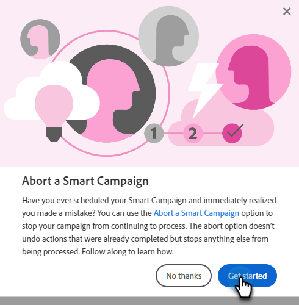

# 도움말 센터 {#help-center}

Marketo Engage의 도움말 센터는 지원을 받을 수 있는 중앙 위치의 역할을 합니다. 다양한 리소스에 연결(예: [제품 설명서](/help/marketo/home.md){target="_blank"}, [release information](/help/marketo/release-notes/current.md){target="_blank"}, the [Marketo Community](https://nation.marketo.com/){target="_blank"})에서는 경험 수준별로 구성된 유용한 제품 내 연습에 액세스할 수 있습니다.

## 액세스 방법 {#how-to-access}

Marketo Engage에 로그인한 후 도움말 아이콘을 클릭합니다.

### 안내서 {#guides}

안내서는 인기 있는 기능에 대한 빠른 연습의 역할을 합니다.

원하는 안내선을 클릭하여 봅니다.

클릭 **시작**.

클릭 **다음** 계속합니다.

클릭 **완료** 연습을 종료합니다.

>[!TIP]
>
>언제든지 을 클릭하여 안내서를 종료합니다. **닫기**.

### 새로운 기능 {#whats-new}

새로운 기능 탭에는 Marketo Engage 최신 릴리스에 대한 전체 세부 정보가 포함되어 있습니다.

>[!TIP]
>
>Experience League 페이지를 보려면 맨 아래에 있는 화살표 아이콘을 클릭합니다.

### 리소스 {#resources}

리소스 탭에서는 Marketo Engage 인스턴스에 대한 추가 지원을 받을 수 있는 다양한 방법에 빠르고 직접 액세스할 수 있습니다.

