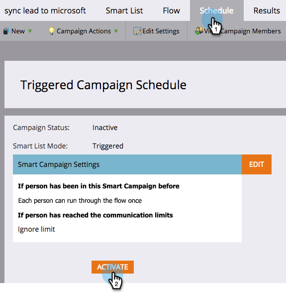

# 중복 가능성이 있는 사용자에 대한 경고 자동화 {#automate-an-alert-for-possible-duplicate-people}

가능한 중복 사용자가 생성될 때마다 경고가 필요하십니까? 스마트 캠페인을 설정하여 이를 수행하는 방법은 다음과 같습니다.

1. [새 스마트 캠페인을 만듭니다](/help/marketo/product-docs/core-marketo-concepts/smart-campaigns/creating-a-smart-campaign/create-a-new-smart-campaign.md){target="_blank"}. 다음 스마트 목록을 정의합니다.

* 트리거: **[!UICONTROL 개인이 생성됨]**
* 필터: **[!UICONTROL 중복 필드]**. 필드 이름 **[!UICONTROL is] [!UICONTROL 전체 이름]**

  

  >[!TIP]
  >
  >창의적이 되세요. 더 나은 필터링 결과를 얻기 위해 다른 필드를 실험하십시오.

1. 흐름 단계에서 [[!UICONTROL 경고 보내기]](/help/marketo/product-docs/core-marketo-concepts/smart-campaigns/flow-actions/send-alert.md){target="_blank"} 흐름 동작을 선택합니다.

   

   >[!TIP]
   >
   >[경고 정보 보내기 토큰](/help/marketo/product-docs/email-marketing/general/using-tokens/use-the-send-alert-info-token.md){target="_blank"}을 사용하여 CRM에 있는 사용자에 대한 링크를 포함합니다.

   >[!CAUTION]
   >
   >큰 목록을 가져오면 한 번에 여러 개의 경고를 받을 수 있습니다!
   >
   >또한, 같은 이름을 가진 두 사람이 자동적으로 같은 사람이라는 것을 의미하지는 않는다.

1. **[!UICONTROL 일정]** 탭에서 캠페인을 활성화합니다.

   

다 됐습니다! 이 스마트 캠페인은 Marketo에서 기존 전체 이름을 가진 새 사용자가 생성될 때마다 트리거됩니다.

>[!MORELIKETHIS]
>
>[중복 사용자 찾기 및 병합](/help/marketo/product-docs/core-marketo-concepts/smart-lists-and-static-lists/managing-people-in-smart-lists/find-and-merge-duplicate-people.md){target="_blank"}
