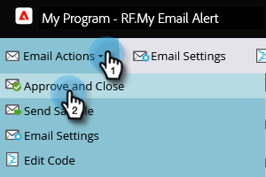
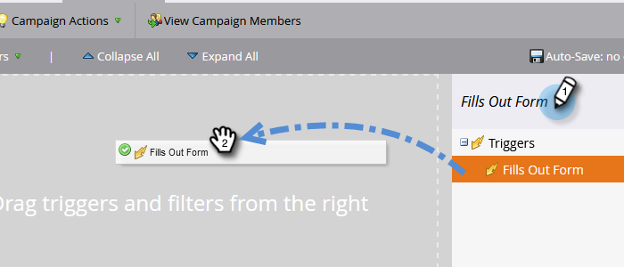
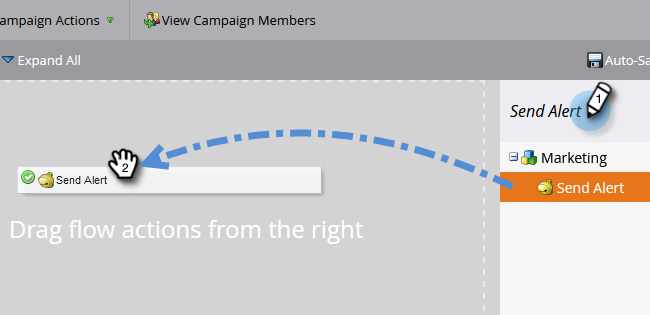

# 영업 담당자에게 알림 {#alert-the-sales-rep}

## 임무: 웹 사이트에서 양식을 작성하는 경우 영업 담당자에게 알립니다. {#mission-alert-the-sales-rep-when-a-person-fills-out-a-form-on-your-web-site}

영업 담당자에게 경고 이메일을 자동으로 전송하려면 경고 이메일과 이메일 캠페인만 있으면 됩니다. 방법은 다음과 같습니다.

>[!PREREQUISITES]
>
>[양식이 있는 랜딩 페이지](/help/marketo/getting-started/quick-wins/landing-page-with-a-form.md){target="_blank"}

## 1단계: 경고 이메일 만들기 {#step-create-an-alert-email}

1. **[!UICONTROL Marketing Activities]** 영역으로 이동합니다.

   

1. **랜딩 페이지에서 양식** 빠른 승리로 만든 [내 프로그램](/help/marketo/getting-started/quick-wins/landing-page-with-a-form.md){target="_blank"}을(를) 선택한 다음 **[!UICONTROL New]**&#x200B;에서 **[!UICONTROL New Local Asset]**&#x200B;을(를) 클릭합니다.

   

1. **[!UICONTROL Email]**&#x200B;을(를) 클릭합니다.

   

1. **이름** 전자 메일 &quot;내 전자 메일 경고&quot;를 선택하고 **[!UICONTROL Create]**&#x200B;을(를) 클릭합니다.

   

1. 영업팀에서 보려는 **이름에서**, **이메일에서**, **[!UICONTROL Reply-to]** 및 **[!UICONTROL Subject]**&#x200B;을(를) 입력하십시오.

   

1. 이메일 텍스트를 편집하려면 두 번 클릭하십시오.

   

1. 이메일 콘텐츠를 입력합니다.

   

1. 대화 상대 정보를 삽입할 위치에 커서를 놓고 **토큰 삽입** 아이콘을 클릭합니다.

   

1. `{{SP_Send_Alert_Info}}` **[!UICONTROL Token]**&#x200B;을(를) 찾아 선택하고 **[!UICONTROL Insert]**&#x200B;을(를) 클릭합니다.

   

   >[!NOTE]
   >
   >{{SP_Send_Alert_Info}}은(는) 경고 전자 메일에 대한 특수 토큰입니다. 자세한 내용은 [경고 정보 보내기 토큰 사용](/help/marketo/product-docs/email-marketing/general/using-tokens/use-the-send-alert-info-token.md){target="_blank"}{target="_blank"}을 참조하세요.

1. **[!UICONTROL Save]**&#x200B;을(를) 클릭합니다.

   

1. **[!UICONTROL Email Actions]** 드롭다운을 클릭하고 **[!UICONTROL Approve and Close]**&#x200B;을(를) 선택합니다.

   

## 2단계: 경고 트리거 캠페인 만들기 {#step-create-an-alert-trigger-campaign}

1. 이전에 만든 **내 프로그램**&#x200B;을 선택한 다음 **[!UICONTROL New]**&#x200B;에서 **[!UICONTROL New Smart Campaign]**&#x200B;을(를) 클릭합니다.

   

1. **이름** 캠페인 &quot;내 경고 캠페인&quot;을 클릭하고 **[!UICONTROL Create]**&#x200B;을(를) 클릭합니다.

   

1. **[!UICONTROL Smart List]** 탭에서 **[!UICONTROL Fills Out Form]** 트리거를 찾아 캔버스로 드래그합니다.

   

1. 이전에 만든 양식을 선택합니다.

   

1. **[!UICONTROL Flow]** 탭에서 **[!UICONTROL Send Alert]** 흐름 작업을 찾아 캔버스로 드래그합니다.

   

1. 이전에 만든 **[!UICONTROL My Alert Email]**&#x200B;을(를) 선택하고 **[!UICONTROL Send To]**&#x200B;을(를) **[!UICONTROL Sales Owner]**(으)로 둡니다.

   

1. **[!UICONTROL To Other Emails]** 필드에 전자 메일 주소를 입력하십시오.

   

1. **[!UICONTROL Schedule]** 탭으로 이동하여 **[!UICONTROL Activate]** 단추를 클릭합니다.

   

   >[!TIP]
   >
   >같은 사람이 경고를 여러 번 트리거할 수 있도록 하려면 **[!UICONTROL Qualification Rules]**&#x200B;을(를) **[!UICONTROL every time]**(으)로 설정하십시오(스마트 캠페인 편집).

1. 확인 화면에서 **[!UICONTROL Activate]**&#x200B;을(를) 클릭합니다.

   

## 3단계: 테스트해 보십시오. {#step-test-it-out}

1. 랜딩 페이지를 선택하고 **[!UICONTROL View Approved Page]**&#x200B;을(를) 클릭합니다.

   

   >[!NOTE]
   >
   >랜딩 페이지를 승인하는 것을 잊지 마십시오. 승인될 때까지 활성화되지 않습니다.

1. 양식을 작성하고 **[!UICONTROL Submit]**&#x200B;을(를) 클릭합니다.

   

1. 곧 이메일을 받게 됩니다. 모든 것이 제대로 작동하는지 확인한 후에는 경고 보내기 흐름에서 이메일 주소를 제거합니다(위의 2.7단계 참조).

   >[!NOTE]
   >
   >연락처 정보를 보려면 Marketo에서 **[!UICONTROL Person Info]** 탭을 클릭하십시오.

## 임무 완료! {#mission-complete}

  

[◄ 미션 7: 이메일 개인화](/help/marketo/getting-started/quick-wins/personalize-an-email.md)

[미션 9: 개인 데이터 ► 업데이트](/help/marketo/getting-started/quick-wins/update-person-data.md)
