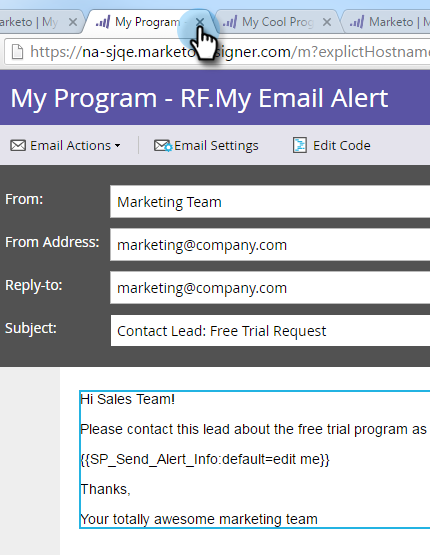
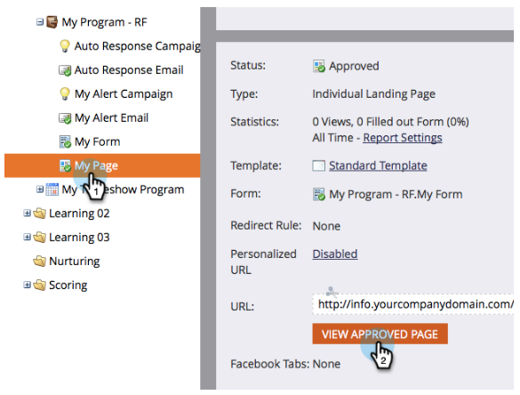

# 영업 담당자에게 알림 {#alert-the-sales-rep}

## 임무:사용자가 웹 사이트에서 양식을 작성하면 영업 담당자에게 알림 {#mission-alert-the-sales-rep-when-a-person-fills-out-a-form-on-your-web-site}

세일즈 담당자에게 경고 이메일을 자동으로 보내려면 알림 이메일과 이메일 캠페인만 있으면 됩니다. 방법

>[!PREREQUISITES]
>
>[양식이 있는 랜딩 페이지](/help/marketo/getting-started/quick-wins/landing-page-with-a-form.md)

## 1단계:경고 이메일 만들기 {#step-create-an-alert-email}

1. 마케팅 활동 **영역으로** 이동합니다.

   

1. 양식 **빠른 승인으로** 랜딩 페이지에서 만든 내 프로그램 [을 선택한 다음](/help/marketo/getting-started/quick-wins/landing-page-with-a-form.md) 새 ******클릭**&#x200B;새 로컬 자산아래에서내 프로그램을 선택합니다.

   

1. 이메일을 **클릭합니다**.

   

1. **이메일** 이름을 &quot;내 이메일 알림&quot;으로 지정하고, 템플릿을 선택하고 **만들기를 클릭합니다**.

   

1. 영업 팀이 **확인할 이름**, 이메일 ****&#x200B;에서 **, 회신**&#x200B;및 **** 제목을 입력합니다.

   

1. 이메일 텍스트를 편집하려면 두 번 클릭합니다.

   

1. 이메일 컨텐츠를 입력합니다.

   

1. 연락처 정보를 삽입할 위치에 커서를 놓고 토큰 **삽입 아이콘을** 클릭합니다.

   

1. 토큰을 찾아 선택하고 `{{SP_Send_Alert_Info}}` 삽입 **을** 클릭합니다 ****.

   

   >[!NOTE]
   >
   >{{SP_Send_Alert_Info}}은(는) 경고 이메일에 대한 특수 토큰입니다. 자세한 [내용은 알림 정보 토큰](/help/marketo/product-docs/email-marketing/general/using-tokens/use-the-send-alert-info-token.md) 보내기 사용을 참조하십시오.

1. 저장을 **클릭합니다**.

   

1. 이메일 편집기 탭/창을 닫습니다.

   

1. 이메일 **작업** 아래에서 승인을 **클릭합니다**.

   

## 2단계:경고 트리거 캠페인 만들기 {#step-create-an-alert-trigger-campaign}

1. 이전에 만든 **내** 프로그램을 선택한 다음 **새로 만들기** 아래에서 **새**&#x200B;스마트 캠페인을 클릭합니다.

   

1. **캠페인** 이름을 &quot;내 경고 캠페인&quot;으로 지정하고 만들기를 **클릭합니다**.

   

1. [ **스마트 목록** ] 탭에서 **채우기 양식** 트리거를 찾아 캔버스로 드래그합니다.

   

1. 이전에 만든 양식을 선택합니다.

   

1. 흐름 **탭** 아래에서 경고 **보내기** 흐름 작업을 찾아 캔버스로 드래그합니다.

   

1. 이전에 만든 **내 경고 이메일** 을 선택하고 **Send To** as **Sales Owner**&#x200B;를선택합니다.

   

1. [다른 이메일로 보내기] 필드에 **이메일 주소를** 입력합니다.

   

1. 예약 **탭으로** 이동하여 **활성화** 단추를 클릭합니다.

   

   >[!TIP]
   >
   >스마트 **캠페인을 편집하여** 언제든지 **** 자격 조건 규칙을 설정하여 동일한 사람이 경고를 여러 번 트리거할 수 있습니다.

1. 확인 **화면에서** 활성화를 클릭합니다.

   

## 3단계:테스트해 보기! {#step-test-it-out}

1. 랜딩 페이지를 선택하고 승인된 페이지 **보기를 클릭합니다**.

   

   >[!NOTE]
   >
   >랜딩 페이지를 승인하는 것을 잊지 마십시오.승인될 때까지 라이브되지 않습니다.

1. 양식을 채우고 [제출]을 **클릭합니다**.

   

1. 곧 이메일을 받게 됩니다. 모든 것이 제대로 작동하는지 확인했으면 경고 보내기 흐름에서 이메일 주소를 제거합니다(위의 2.7단계 참조).

   >[!NOTE]
   >
   >연락처 정보를 보려면 **Marketing** 의 [사람 정보] 탭을 클릭합니다.

## 임무 완료! {#mission-complete}

  

[◄ 미션 7:이메일 개인화](personalize-an-email.md)

[임무 9:리드 데이터 업데이트 ►](update-person-data.md)
