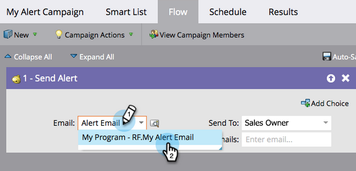

# 영업 담당자에게 알림 {#alert-the-sales-rep}

## 임무: 웹 사이트에서 양식을 작성하는 경우 영업 담당자에게 알립니다. {#mission-alert-the-sales-rep-when-a-person-fills-out-a-form-on-your-web-site}

영업 담당자에게 경고 이메일을 자동으로 전송하려면 경고 이메일과 이메일 캠페인만 있으면 됩니다. 방법은 다음과 같습니다.

>[!PREREQUISITES]
>
>[양식이 있는 랜딩 페이지](/help/marketo/getting-started/quick-wins/landing-page-with-a-form.md){target="_blank"}

## 1단계: 경고 이메일 만들기 {#step-create-an-alert-email}

1. 로 이동 **[!UICONTROL 마케팅 활동]** 영역입니다.

   

1. 선택 **내 프로그램** 에서 생성한 항목 [양식이 있는 랜딩 페이지](/help/marketo/getting-started/quick-wins/landing-page-with-a-form.md){target="_blank"} 빠른 성공, 그 다음 아래 **[!UICONTROL 신규]** 클릭 **[!UICONTROL 새 로컬 자산]**.

   

1. 클릭 **[!UICONTROL 이메일]**.

   

1. **이름** 이메일 &quot;내 이메일 경고&quot;에서 템플릿을 선택하고 **[!UICONTROL 만들기]**.

   

1. 다음을 입력합니다. **보낸 사람 이름**, **보낸 사람 이메일**, **[!UICONTROL 회신 대상]**, 및 **[!UICONTROL 제목]** 영업 팀이 확인해야 할 사항입니다.

   

1. 이메일 텍스트를 편집하려면 두 번 클릭하십시오.

   

1. 이메일 콘텐츠를 입력합니다.

   

1. 개인 연락처 정보를 삽입할 위치에 커서를 놓고 **토큰 삽입** 아이콘.

   

1. 다음 항목을 찾아 선택합니다. `{{SP_Send_Alert_Info}}` **[!UICONTROL 토큰]** 및 클릭 **[!UICONTROL 삽입]**.

   

   >[!NOTE]
   >
   >{{SP_Send_Alert_Info}} 는 경고 이메일에 대한 특수 토큰입니다. 다음을 참조하십시오 [경고 정보 보내기 토큰 사용](/help/marketo/product-docs/email-marketing/general/using-tokens/use-the-send-alert-info-token.md){target="_blank"}{target="_blank"} 자세히 알아보십시오.

1. 클릭 **[!UICONTROL 저장]**.

   

1. 다음을 클릭합니다. **[!UICONTROL 이메일 작업]** 드롭다운 및 선택 **[!UICONTROL 승인 및 닫기]**.

   

## 2단계: 경고 트리거 캠페인 만들기 {#step-create-an-alert-trigger-campaign}

1. 선택 **내 프로그램** 이전에 만든 다음 아래에 **[!UICONTROL 신규]** 클릭 **[!UICONTROL 새 스마트 캠페인]**.

   

1. **이름** 캠페인 &quot;내 경고 캠페인&quot; 및 클릭 **[!UICONTROL 만들기]**.

   

1. 아래 **[!UICONTROL 스마트 목록]** 탭을 클릭하고 **[!UICONTROL 양식 작성]** 캔버스를 트리거합니다.

   

1. 이전에 만든 양식을 선택합니다.

   

1. 아래 **[!UICONTROL 플로우]** 탭을 클릭하고 **[!UICONTROL 경고 보내기]** 캔버스에 대한 플로우 작업.

   

1. 선택 **[!UICONTROL 내 경고 이메일]** 이전에 만든 후 나가기 **[!UICONTROL 전송 대상]** 다음으로: **[!UICONTROL 영업 담당자]**.

   

1. 에 이메일 주소를 입력합니다. **[!UICONTROL 다른 전자 메일로]** 필드.

   

1. 로 이동 **[!UICONTROL 예약]** 탭을 클릭하고 **[!UICONTROL 활성화]** 단추를 클릭합니다.

   

   >[!TIP]
   >
   >설정 **[!UICONTROL 자격 규칙]** 끝 **[!UICONTROL 항상]** (Smart Campaign을 편집하여) 동일한 사람이 경고를 여러 번 트리거할 수 있도록 합니다.

1. 클릭 **[!UICONTROL 활성화]** 확인 화면에서 다음을 수행합니다.

   

## 3단계: 테스트해 보십시오. {#step-test-it-out}

1. 랜딩 페이지를 선택하고 **[!UICONTROL 승인된 페이지 보기]**.

   

   >[!NOTE]
   >
   >랜딩 페이지를 승인하는 것을 잊지 마십시오. 승인될 때까지 활성화되지 않습니다.

1. 양식을 작성하고 을 클릭합니다. **[!UICONTROL 제출]**.

   

1. 곧 이메일을 받게 됩니다. 모든 것이 제대로 작동하는지 확인한 후에는 경고 보내기 흐름에서 이메일 주소를 제거합니다(위의 2.7단계 참조).

   >[!NOTE]
   >
   >다음을 클릭합니다. **[!UICONTROL 개인 정보]** 연락처 정보를 보려면 Marketo에서 탭을 탭하십시오.

## 임무 완료! {#mission-complete}

  

[◄ 미션 7: 이메일 개인화](/help/marketo/getting-started/quick-wins/personalize-an-email.md)

[임무 9: 개인 데이터 ► 업데이트](/help/marketo/getting-started/quick-wins/update-person-data.md)
