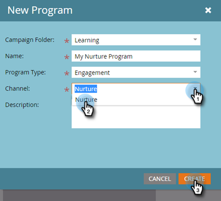
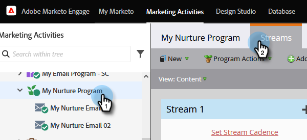
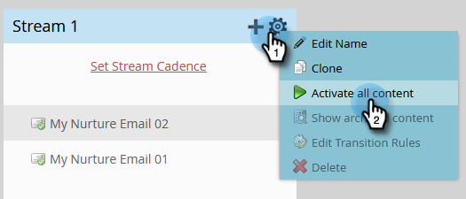

# 드립, 드립, 육성 {#drip-drip-nurture}

## 임무: 최근 박람회에 참석한 사람들을 육성하십시오. {#mission-nurture-the-people-who-attended-your-recent-tradeshow}

Marketo에서 고급 및 정교한 육성 시스템을 쉽게 만들 수 있습니다. 방법은 다음과 같습니다!

>[!PREREQUISITES]
>
>* [설정 및 사용자 추가](/help/marketo/getting-started/quick-wins/get-set-up-and-add-a-person.md){target="_blank"}
>* [사람 목록 가져오기](/help/marketo/getting-started/quick-wins/import-a-list-of-people.md){target="_blank"}

## 1단계: 참여 프로그램 만들기 {#step-create-an-engagement-program}

1. 로 이동 **[!UICONTROL 마케팅 활동]** 영역입니다.

   

1. 다음 항목 선택 **학습** 폴더에서 **[!UICONTROL 신규]** 드롭다운 및 선택 **[!UICONTROL 새 프로그램]**.

   

1. 입력 **[!UICONTROL 이름]** 및 선택 **[!UICONTROL 참여]** 대상: **[!UICONTROL 프로그램 유형]**.

   

1. 다음을 확인합니다. **[!UICONTROL 채널]** 필드는 입니다. **[!UICONTROL 육성]** 및 클릭 **[!UICONTROL 만들기]**.

   

   이제 참여 프로그램을 만들었습니다.

## 2단계: 이메일 만들기 {#step-create-an-email}

1. 참여 프로그램을 선택하고 **[!UICONTROL 신규]** 및 선택 **[!UICONTROL 새 로컬 자산]**.

   

1. 클릭 **[!UICONTROL 이메일]**.

   

1. 입력 **[!UICONTROL 이름]**&#x200B;를 선택하고 **[!UICONTROL 템플릿]** 을(를) 사용하고 **[!UICONTROL 만들기]**.

   

   >[!NOTE]
   >
   >이메일 편집기가 표시되지 않습니까? 브라우저가 창을 차단했을 수 있습니다. 다음에서 팝업 활성화 `app.marketo.com` 브라우저에서 을(를) 클릭하고 **[!UICONTROL 초안 편집]** 을 클릭합니다.

1. 제목을 입력합니다.

   

1. 편집할 이메일 영역을 선택하고 톱니바퀴 아이콘을 클릭한 다음 을(를) 선택합니다 **[!UICONTROL 편집]**.

   

1. 이메일 편집 및 클릭 **[!UICONTROL 저장]**.

   

1. 아래 **[!UICONTROL 이메일 작업]**, 클릭 **[!UICONTROL 승인 및 닫기]**.

   

   >[!NOTE]
   >
   >이메일을 승인해야 합니다. 승인하지 않으면 나중에 활성화할 수 없습니다.

1. 이제 2-7단계의 작업을 반복하여 다른 이메일을 만듭니다.

   

## 3단계: 스트림에 컨텐츠 추가 {#step-add-content-to-your-stream}

이제 만든 이메일을 사용하여 참여 프로그램의 콘텐츠 스트림을 만들 차례입니다.

1. 참여 프로그램을 선택하고 **[!UICONTROL 스트림]** 탭.

   

1. 다음을 클릭합니다. **[!UICONTROL 콘텐츠 추가]** 단추입니다.

   

   >[!TIP]
   >
   >다음을 사용할 수도 있습니다 **+** 아이콘.

1. &quot;이메일&quot; 유형을 선택한 상태로 둡니다. 만든 두 개의 이메일을 찾아 선택합니다.

   

## 4단계: 스트림 콘텐츠 활성화 {#step-activate-stream-content}

1. 스트림 톱니바퀴 아이콘을 클릭하여 모든 콘텐츠를 한 번에 활성화한 다음 **[!UICONTROL 모든 콘텐츠 활성화]**.

   

   >[!NOTE]
   >
   >먼저 승인하지 않으면 콘텐츠를 활성화할 수 없습니다.

   훌륭합니다! 한 단계 더 진행하면 참여 프로그램이 준비됩니다.

## 5단계: 스트림 케이던스 설정 {#step-set-the-stream-cadence}

1. 클릭 **[!UICONTROL 스트림 케이던스 설정]**.

   

1. 원하는 일정과 일치하도록 설정을 편집하고 **[!UICONTROL 저장]**.

   

   참여 프로그램이 모두 설정되었습니다. 이제 프로그램에 테스트 사용자를 추가하겠습니다.

   >[!NOTE]
   >
   >테스트 담당자는 참여 프로그램을 확인하여 고객에게 보내기 전에 정확한지 테스트하는 사람입니다.

## 6단계: 참여 프로그램에 테스트 직원 추가 {#step-add-a-test-person-to-your-engagement-program}

1. 로 이동 **[!UICONTROL 데이터베이스]** 영역입니다.

   

1. 테스트 사용자를 검색합니다.

   

   >[!NOTE]
   >
   >테스트할 때 이메일 수신을 확인할 수 있도록 테스트 사용자에게 유효한 이메일 주소가 있는지 확인하십시오.

1. 해당 사용자를 마우스 오른쪽 단추로 클릭한 다음 **[!UICONTROL 프로그램]** 및 **[!UICONTROL 참여 프로그램에 추가...]**.

   

1. 다음 항목 선택 **[!UICONTROL 프로그램]** 및 **[!UICONTROL 스트림]**&#x200B;을 클릭한 다음 을 클릭합니다 **[!UICONTROL 지금 실행]**.

   

1. 임무 완료!

1. 지정한 시간과 케이던스에 이메일을 수신해야 합니다.

   >[!NOTE]
   >
   >자세히 알아보기 [참여 프로그램](/help/marketo/product-docs/email-marketing/drip-nurturing/creating-an-engagement-program/understanding-engagement-programs.md){target="_blank"}.

## 임무 완료! {#mission-complete}

  

[◄ 미션 5: 사람 목록 가져오기](/help/marketo/getting-started/quick-wins/import-a-list-of-people.md)

[미션 7: 이메일 ► 개인화](/help/marketo/getting-started/quick-wins/personalize-an-email.md)
