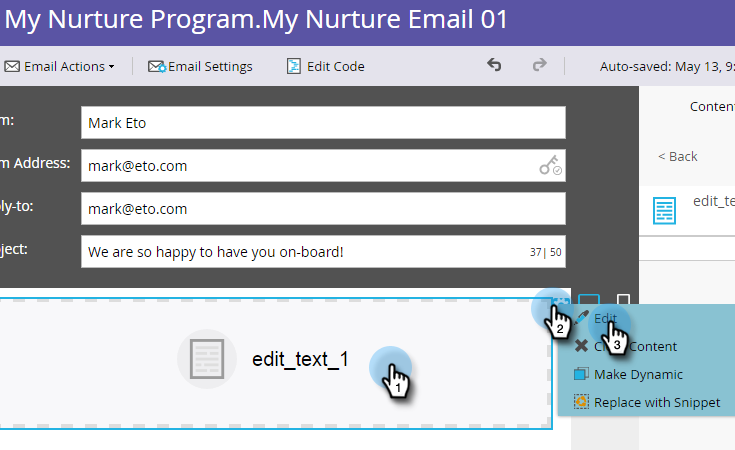
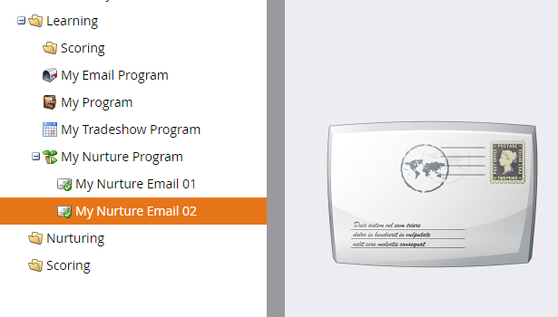

# 드립, 드립, 배드 {#drip-drip-nurture}

## 임무:최근 무역 박람회에 참석한 사람들을 키우세요 {#mission-nurture-the-people-who-attended-your-recent-tradeshow}

Marketing To에서 고급 교육 시스템을 손쉽게 만들 수 있습니다. 방법

>[!PREREQUISITES]
>
>* [설정 및 사람 추가](/help/marketo/getting-started/quick-wins/get-set-up-and-add-a-person.md)
>* [사람 목록 가져오기](/help/marketo/getting-started/quick-wins/import-a-list-of-people.md)

## 1단계:참여 프로그램 만들기 {#step-create-an-engagement-program}

1. 마케팅 활동 **영역으로** 이동합니다.

   

1. [ **학습** ] 폴더를 **선택하고 [** 새로 **만들기] 드롭다운을 클릭한 다음 [**&#x200B;새 프로그램]을 선택합니다.

   

1. 이름을 **입력하고** **프로그램** 유형에 대한 **참여**&#x200B;를선택합니다.

   

1. [ **채널** ] 필드가 [교육] **인지** 확인하고 [만들기 **]를**&#x200B;클릭합니다.

   

   이제 참여 프로그램을 만들었습니다.

## 2단계:이메일 만들기 {#step-create-an-email}

1. 참여 프로그램을 선택한 다음 새로 **만들기를** 클릭하고 **새 로컬 자산을 선택합니다**.

   

1. 이메일을 **클릭합니다**.

   

1. 이름을 **입력하고**&#x200B;사용할 **템플릿** 을 선택한 다음 만들기를 **클릭합니다**.

   

   >[!NOTE]
   >
   >이메일 편집기가 표시되지 않습니까? 브라우저가 창을 차단했을 수 있습니다. 브라우저에서 [app.marketing.com](https://app.marketo.com) 에서 팝업을 활성화하고 상단 메뉴 모음에서 **초안** 편집을 클릭합니다.

1. 제목을 입력합니다.

   

1. 편집할 이메일 영역을 선택하고 톱니바퀴 아이콘을 클릭한 다음 편집을 **선택합니다**.

   

1. 이메일을 편집하고 저장을 **클릭합니다**.

   

1. 이메일 편집기 탭/창을 닫습니다.

   

1. 이메일 **작업**&#x200B;아래에서 승인을 **클릭합니다**.

   

   >[!NOTE]
   >
   >나중에 이메일 승인을 잊지 마십시오.

1. 이제 2단계 작업을 반복하여 다른 이메일을 만듭니다.

   

## 3단계:스트림에 컨텐츠 추가 {#step-add-content-to-your-stream}

1. 이제 만든 이메일을 사용하여 참여 프로그램에 대한 콘텐츠 스트림을 만들 차례입니다.

1. 참여 프로그램을 선택하고 스트림 탭을 **클릭합니다** .

   

1. 만든 이메일 2개를 올바른 캔버스로 드래그합니다.

   

   >[!TIP]
   >
   >[내용 **추가** ] 단추 또는 스트림 **+** 아이콘을 사용할 수도 있습니다.

## 4단계:스트림 콘텐츠 활성화 {#step-activate-stream-content}

1. 스트림 톱니바퀴 아이콘을 클릭하여 모든 컨텐츠를 한 번에 활성화한 다음 **모든 컨텐츠**&#x200B;활성화를 클릭합니다.

   

   >[!NOTE]
   >
   >먼저 승인하지 않으면 콘텐츠를 활성화할 수 없습니다.

   멋진 작품! 한 단계 더 업그레이드하면 참여 프로그램이 준비됩니다.

## 5단계:스트림 패턴 설정 {#step-set-the-stream-cadence}

1. [ **스트림 대상 설정]을 클릭합니다**.

   

1. 원하는 일정에 맞게 설정을 편집하고 저장을 **클릭합니다**.

   

   참여 프로그램이 모두 설정되었습니다. 이제 프로그램에 테스트 대상자를 추가합니다.

   >[!NOTE]
   >
   >테스트 담당자는 고객에게 보내기 전에 참여 프로그램을 확인하여 맞는지 테스트하는 사람입니다.

## 6단계:참여 프로그램에 테스트 사람 추가 {#step-add-a-test-person-to-your-engagement-program}

1. 데이터베이스 **영역으로** 이동합니다.

   

1. 테스트 대상자를 검색합니다.

   

   >[!NOTE]
   >
   >테스트할 때 이메일의 수신을 확인할 수 있도록 테스트 담당자의 이메일 주소가 유효한지 확인합니다.

1. 사용자를 마우스 오른쪽 단추로 클릭한 다음 프로그램 및 참여 프로그램에 추가를 클릭합니다.

   

1. 프로그램 **및** 스트림 **을**&#x200B;선택한 다음 지금 **실행을**&#x200B;클릭합니다.

   

1. 임무 완료!

1. 지정한 시간 및 간격으로 이메일을 수신해야 합니다.

   >[!NOTE]
   >
   >참여 프로그램에 대한 자세한 [내용을 살펴보십시오](/help/marketo/product-docs/email-marketing/drip-nurturing/creating-an-engagement-program/understanding-engagement-programs.md).

  

[◄ 미션 5:리드 목록 가져오기](/help/marketo/getting-started/quick-wins/import-a-list-of-people.md)

[미션 7:이메일 개인화 ►](/help/marketo/getting-started/quick-wins/personalize-an-email.md)
