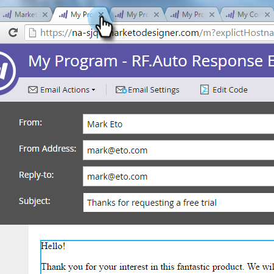

# 이메일 자동 응답 {#email-auto-response}

## 임무:사람이 양식을 작성할 때 감사 인사 이메일 보내기 {#mission-send-out-a-thank-you-email-when-a-person-fills-out-a-form}

>[!NOTE]
>
>**FYI**
>
>Marketing은 이제 모든 구독 간의 언어를 표준화하므로 구독에 리드/리드 및 docs.markto.com에 있는 사람/사람을 볼 수 있습니다. 이 용어는 같은 것을 의미한다.아티클 지침에는 영향을 주지 않습니다. 다른 변화도 있습니다 [자세한](http://docs.marketo.com/display/DOCS/Updates+to+Marketo+Terminology)내용

>[!NOTE]
>
>**사전 요구 사항**
>
>* [설정 및 사람 추가](get-set-up-and-add-a-person.md)
>* [양식이 있는 랜딩 페이지](landing-page-with-a-form.md)

>

## 1단계:이메일 만들기 {#step-create-an-email}

1. 마케팅 활동 영역으로 이동합니다.

   

1. 왼쪽 메뉴에서 내 프로그램을 선택하고 새로 만들기 드롭다운을 클릭한 다음 새 로컬 자산을 선택합니다.

   

1. 이메일을 클릭합니다.

   

1. 이메일 이름을 &quot;자동 응답 이메일&quot;으로 지정하고, 템플릿을 선택하고 만들기를 클릭합니다.

   

   이메일 편집기가 새 창이나 탭에 열립니다. 팝업이 차단된 경우 자산 요약 페이지에서 [초안 편집]**을 클릭하여 이메일에 액세스합니다.

1. 제목 줄을 입력한 다음, 이메일의 편집 가능한 영역을 두 번 클릭합니다.

   

   이메일 편집기 상단에 리치 텍스트 편집기가 열립니다.

1. 기존 이메일 컨텐츠를 강조 표시합니다.

   

1. 이메일 컨텐츠를 입력하고 저장을 클릭합니다.

   

1. 변경 내용이 자동으로 저장됩니다. 이메일 편집기 탭/창을 닫습니다.

   

1. 새 이메일을 선택합니다. 이메일 작업 아래에서 승인을 클릭합니다.

   

## 2단계:스마트 캠페인 만들기 {#step-create-a-smart-campaign}

1. 내 프로그램 **을 마우스 오른쪽 단추로** 클릭하고 **새 스마트 캠페인을 클릭합니다**.

   

1. **스마트 캠페인 이름을 &quot;자동 응답 캠페인&quot;으로 지정하고** 만들기를 **클릭합니다**.

   

1. **스마트 목록 **탭으로 이동합니다.

   

   사용자가 랜딩 페이지에서 만든 양식을 폼으로 채울 때마다 이 캠페인을 [**실행하도록 설정합니다**](landing-page-with-a-form.md).

1. 양식 채우기 **트리거를 찾아 왼쪽 캔버스로** 드래그합니다.

   

1. 드롭다운 **에서** 내 양식을 선택합니다. **흐름 **탭을 클릭합니다.

   

1. **이메일 보내기 **플로우 동작을 왼쪽 캔버스로 드래그합니다.

   

1. 자동 **응답 이메일을** 선택하고 **예약 **탭으로 이동합니다.

   

1. 편집을 **클릭합니다**.

   
매번 선택하고 저장을 클릭합니다.
   

1. 활성화를 **클릭합니다**.

   

1. 확인 화면에서 **활성화 **를 클릭합니다.

   

>[!NOTE]
>
>활성화되면 사용자가 지정된 양식을 채울 때마다 이 캠페인이 실행됩니다. 캠페인이 비활성화될 때까지 계속 실행됩니다.

## 3단계:양식 채우기 {#step-fill-out-the-form}

1. 내 **페이지를 선택합니다**. 이것은 양식 빠른 승인으로 [랜딩 페이지에서](landing-page-with-a-form.md) 만들어졌습니다.

   

1. 승인된 **페이지 보기를 클릭합니다**.

   

   &quot;무료 시험버전&quot; 랜딩 페이지가 새 탭에 열립니다.

1. 이름, 성 및 이메일 주소로 양식을 작성한 다음 **제출을 클릭합니다**.

   

>[!NOTE]
>
>이메일을 받을 수 있도록 실제 이메일 주소를 사용하십시오.

## 임무 완료 {#mission-complete}

몇 분 안에 받은 편지함에 자동 응답 이메일이 표시됩니다. 잘했어!

  

[임무 ◄ 3:간단한 점수 지정](simple-scoring.md) 임무 [5:리드 목록 가져오기](import-a-list-of-people.md)