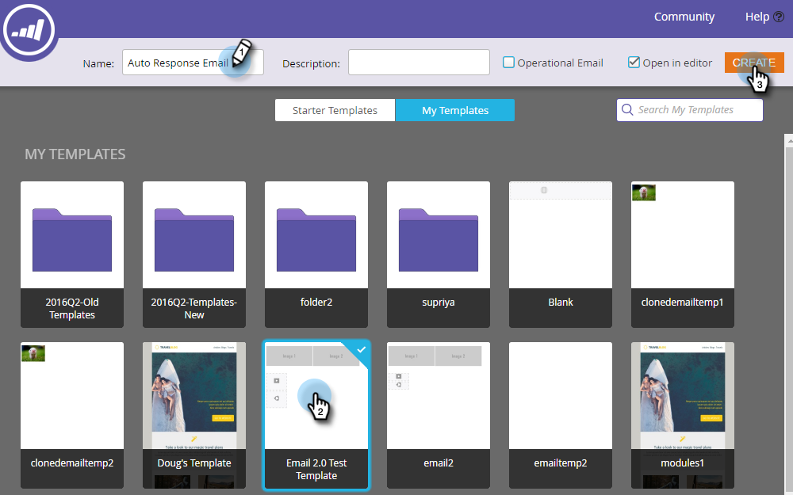

# 이메일 자동 응답 {#email-auto-response}

## 임무: 사용자가 양식을 작성할 때 감사 이메일 보내기 {#mission-send-out-a-thank-you-email-when-a-person-fills-out-a-form}

>[!PREREQUISITES]
>
>* [설정 및 사용자 추가](/help/marketo/getting-started/quick-wins/get-set-up-and-add-a-person.md){target="_blank"}
>* [양식이 있는 랜딩 페이지](/help/marketo/getting-started/quick-wins/landing-page-with-a-form.md){target="_blank"}

## 1단계: 이메일 만들기 {#step-create-an-email}

1. 로 이동 **[!UICONTROL 마케팅 활동]** 영역입니다.

   

1. 왼쪽 메뉴에서 프로그램을 선택하고 **[!UICONTROL 신규]** 드롭다운 및 선택 **[!UICONTROL 새 로컬 자산]**.

   

1. 선택 **[!UICONTROL 이메일]**.

   

1. 이메일 이름을 &quot;자동 응답 이메일&quot;로 지정하고 템플릿을 선택한 다음 **[!UICONTROL 만들기]**.

   

   이메일 편집기가 새 창이나 탭에서 열립니다. 팝업이 차단되면 **[!UICONTROL 초안 편집]** 에셋 요약 페이지에서 이메일에 액세스

1. 제목 줄을 입력한 다음 이메일의 편집 가능 영역을 두 번 클릭합니다.

   

   _전자 메일 편집기 맨 위에서 서식 있는 텍스트 편집기가 열립니다._

1. 기존 이메일 콘텐츠를 강조 표시합니다.

   

1. 이메일 콘텐츠를 입력하고 **[!UICONTROL 저장]**.

   

1. 다음을 클릭합니다. **[!UICONTROL 이메일 작업]** 드롭다운 및 선택 **[!UICONTROL 승인 및 닫기]**.

   

## 2단계: 스마트 캠페인 만들기 {#step-create-a-smart-campaign}

1. 프로그램을 선택하고 **[!UICONTROL 신규]** 드롭다운 및 선택 **[!UICONTROL 새 스마트 캠페인]**.

   

1. **이름** 스마트 캠페인 &quot;자동 응답 캠페인&quot;을 클릭하고 **[!UICONTROL 만들기]**.

   

1. 로 이동 **[!UICONTROL 스마트 목록]** 탭.

   

   사용자가 귀하가 만든 양식을 작성할 때마다 이 캠페인이 실행되도록 설정하고 있습니다. [**양식이 있는 랜딩 페이지**](/help/marketo/getting-started/quick-wins/landing-page-with-a-form.md){target="_blank"}.

1. 을(를) 찾아 드래그합니다. **[!UICONTROL 양식 작성]** 캔버스를 트리거합니다.

   

1. 선택 **[!UICONTROL 내 양식]** 을 클릭합니다. 그런 다음 **[!UICONTROL 플로우]** 탭.

   

1. 드래그 **[!UICONTROL 이메일 보내기]** 왼쪽 캔버스로 이동 작업입니다.

   

1. 다음 항목 선택 **자동 응답 전자 메일**. 그런 다음 **[!UICONTROL 예약]** 탭.

   

1. 클릭 **[!UICONTROL 편집]**.

   

1. 선택 **[!UICONTROL 항상]** 및 클릭 **[!UICONTROL 저장]**.

   

1. 클릭 **[!UICONTROL 활성화]**.

   

1. 클릭 **[!UICONTROL 활성화]** 확인 화면에서 다음을 수행합니다.

   

>[!NOTE]
>
>이 캠페인이 활성화되면 사용자가 지정된 양식을 작성할 때마다 실행됩니다. 캠페인은 비활성화될 때까지 계속 실행됩니다.

## 3단계: 양식 작성 {#step-fill-out-the-form}

1. 선택 **내 페이지** (다음에서 생성됨: [양식이 있는 랜딩 페이지](/help/marketo/getting-started/quick-wins/landing-page-with-a-form.md){target="_blank"} quick win) 을 클릭하여 **[!UICONTROL 미리 보기]**.

   

   _&quot;무료 체험판&quot; 랜딩 페이지가 새 탭에서 열립니다._

1. 이름, 성 및 이메일 주소로 양식을 작성한 다음 **[!UICONTROL 제출]**.

   

>[!NOTE]
>
>이메일을 받을 수 있도록 실제 이메일 주소를 사용해야 합니다.

## 임무 완료 {#mission-complete}

몇 분 안에 받은 편지함에 자동 응답 이메일이 표시됩니다. 잘했어!

  

[◄ 미션 3: 간단한 점수](/help/marketo/getting-started/quick-wins/simple-scoring.md)

[임무 5: 사용자 목록 ►](/help/marketo/getting-started/quick-wins/import-a-list-of-people.md)
