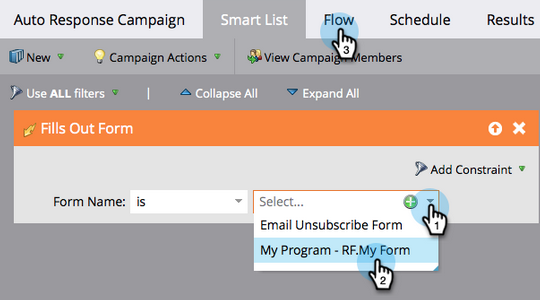
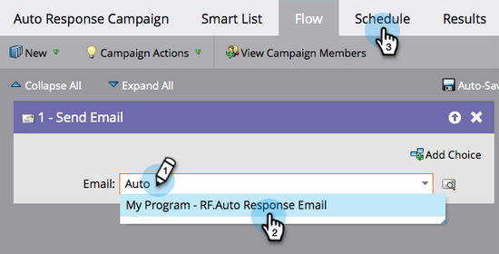
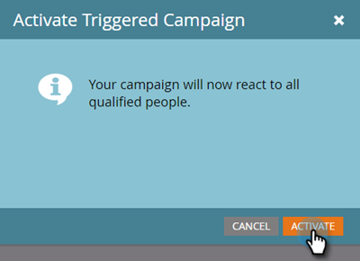

# 이메일 자동 응답 {#email-auto-response}

## 미션: 사용자가 양식을 작성할 때 감사 이메일 보내기 {#mission-send-out-a-thank-you-email-when-a-person-fills-out-a-form}

>[!PREREQUISITES]
>
>* [설정 및 사용자 추가](/help/marketo/getting-started/quick-wins/get-set-up-and-add-a-person.md){target="_blank"}
>* [양식이 있는 랜딩 페이지](/help/marketo/getting-started/quick-wins/landing-page-with-a-form.md){target="_blank"}

## 1단계: 이메일 만들기 {#step-create-an-email}

1. [!UICONTROL Marketing Activities] 영역으로 이동합니다.

   

1. 왼쪽 메뉴에서 프로그램을 선택하고, **[!UICONTROL New]** 드롭다운을 클릭한 다음 **[!UICONTROL New Local Asset]**&#x200B;을 선택합니다.

   

1. **[!UICONTROL Email]**&#x200B;를 선택합니다.

   

1. 이메일 이름을 “자동 응답 이메일”로 지정하고 템플릿을 선택한 다음 **[!UICONTROL Create]**&#x200B;를 클릭합니다.

   

   이메일 편집기는 새 창이나 탭에서 열립니다. 팝업이 차단된 경우, 자산 요약 페이지에서 **[!UICONTROL Edit Draft]**&#x200B;을 클릭하여 이메일에 액세스합니다.

1. 제목을 입력한 다음 이메일의 편집 가능한 영역을 더블 클릭합니다.

   

   _이메일 편집기 위에 리치 텍스트 편집기가 열립니다._

1. 기존 이메일 콘텐츠를 강조 표시합니다.

   

1. 이메일 콘텐츠를 입력하고 **[!UICONTROL Save]**&#x200B;를 클릭합니다.

   

1. **[!UICONTROL Email Actions]** 드롭다운을 클릭하고 **[!UICONTROL Approve and Close]**&#x200B;를 선택합니다.

   

## 2단계: 스마트 캠페인 만들기 {#step-create-a-smart-campaign}

1. 프로그램을 선택하고, **[!UICONTROL New]** 드롭다운을 클릭한 다음 **[!UICONTROL New Smart Campaign]**&#x200B;을 선택합니다.

   

1. 스마트 캠페인의 이름을 “자동 응답 캠페인”으로 **지정**&#x200B;하고 **[!UICONTROL Create]**&#x200B;를 클릭합니다.

   

1. **[!UICONTROL Smart List]** 탭으로 이동합니다.

   

   사용자가 [**양식이 있는 랜딩 페이지**](/help/marketo/getting-started/quick-wins/landing-page-with-a-form.md){target="_blank"}&#x200B;에서 만든 양식을 작성할 때마다 이 캠페인이 실행되도록 설정되었습니다.

1. **[!UICONTROL Fills Out Form]** 트리거를 찾아 캔버스로 드래그합니다.

   

1. 드롭다운에서 **[!UICONTROL My Form]**&#x200B;을 선택합니다. 그런 다음 **[!UICONTROL Flow]** 탭을 클릭합니다.

   

1. **[!UICONTROL Send Email]** 플로우 작업을 왼쪽 캔버스로 드래그합니다.

   

1. **자동 응답 이메일**&#x200B;을 선택합니다. 그런 다음 **[!UICONTROL Schedule]** 탭을 클릭합니다.

   

1. **[!UICONTROL Edit]**&#x200B;를 클릭합니다.

   

1. **[!UICONTROL every time]**&#x200B;으로 선택하고 **[!UICONTROL Save]**&#x200B;를 클릭합니다.

   

1. **[!UICONTROL Activate]**&#x200B;를 클릭합니다.

   

1. 확인 화면에서 **[!UICONTROL Activate]**&#x200B;를 클릭합니다.

   

>[!NOTE]
>
>활성화되면 이 캠페인은 사용자가 지정된 양식을 작성할 때마다 실행됩니다. 캠페인은 비활성화될 때까지 계속 실행됩니다.

## 3단계: 양식 작성 {#step-fill-out-the-form}

1. **내 페이지**([양식이 있는 랜딩 페이지](/help/marketo/getting-started/quick-wins/landing-page-with-a-form.md){target="_blank"}에서 생성됨)를 선택하고 **[!UICONTROL Preview]**&#x200B;를 클릭합니다.

   

   _“무료 체험판” 랜딩 페이지가 새 탭에서 열립니다._

1. 양식에 이름, 성, 이메일 주소를 입력한 다음 **[!UICONTROL Submit]**&#x200B;을 클릭합니다.

   

>[!NOTE]
>
>이메일을 받으려면 실제 이메일 주소를 사용해야 합니다.

## 미션 완료 {#mission-complete}

몇 분 내에 자동 응답 이메일이 받은 편지함에 표시됩니다.

[◄ 미션 3: 간단한 채점](/help/marketo/getting-started/quick-wins/simple-scoring.md)

[미션 5: 사용자 목록 가져오기 ►](/help/marketo/getting-started/quick-wins/import-a-list-of-people.md)
