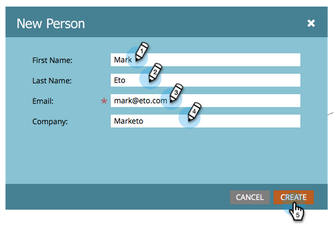

# 설정 및 개인 추가 {#get-set-up-and-add-a-person}

임무를 시작하기 전에 몇 가지 해야 할 일이 있습니다.

## 1단계: Marketo에 로그인 {#step-log-in-to-marketo}

1. [Marketo에 로그인](https://app.marketo.com)전자 메일로 받은 자격 증명을 사용하여 {target=&quot;_blank&quot;}.

   

## 2단계: 학습 폴더 만들기 {#step-create-a-learning-folder}

임무 수행에서 여러분이 할 모든 것을 담을 폴더를 만들자.

1. 로 이동합니다. **마케팅 활동** 영역.

   

1. 을(를) 클릭합니다. **새로 만들기** 드롭다운 및 선택 **새 캠페인 폴더**.

   

1. 폴더 이름을 &quot;Learning&quot;으로 지정하고 **만들기**.

   

1. 왼쪽 메뉴에 새 학습 폴더가 표시됩니다.

   

## 3단계: 사용자로 추가 {#step-add-yourself-as-a-person}

나중에 테스트 이메일을 직접 전송할 수 있도록 Marketo에서 자신을 다른 사람으로 추가합니다.

1. 로 이동합니다. **데이터베이스** 영역.

   

1. 을(를) 클릭합니다. **새로 만들기** 드롭다운 및 선택 **새 사람**.

   

1. 이름과 성, 전자 메일 주소 및 회사 이름을 입력한 다음 **만들기** 자기 자신을 한 사람으로 추가하는 것.

   

   >[!CAUTION]
   >
   >Marketo의 기능 **not** 이모지가 포함된 이메일 주소를 지원합니다.

1. 사람을 보려면 왼쪽 메뉴에서 시스템 스마트 목록을 연 다음 모든 사용자를 클릭합니다.

   

1. 을(를) 클릭합니다. **사람** 탭. 데이터베이스에 가 있어야 합니다.

   

## 완료 설정 {#set-up-complete}

첫 번째 임무를 시작할 준비가 됐군요!

  

[임무 1: Email Blast ► 보내기](/help/marketo/getting-started/quick-wins/send-an-email.md)
