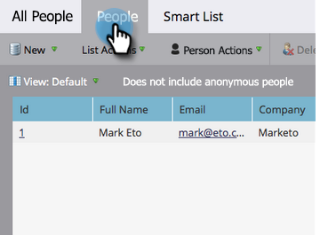

# 설정 및 사용자 추가 {#get-set-up-and-add-a-person}

미션을 시작하기 전에 해야 할 몇 가지 사항이 있습니다.

## 1단계: Marketo에 로그인 {#step-log-in-to-marketo}

1. [Marketo에 로그인](https://app.marketo.com){target="_blank"} 전자 메일로 받은 자격 증명을 사용합니다.

   

## 2단계: 학습 폴더 만들기 {#step-create-a-learning-folder}

미션에서 수행할 모든 작업을 담을 폴더를 만들어 보겠습니다.

1. 로 이동 **[!UICONTROL 마케팅 활동]** 영역입니다.

   

1. 다음을 클릭합니다. **[!UICONTROL 신규]** 드롭다운 및 선택 **[!UICONTROL 새 캠페인 폴더]**.

   

1. 폴더 이름을 &quot;Learning&quot;으로 지정하고 **[!UICONTROL 만들기]**.

   

1. 왼쪽 메뉴에 새 학습 폴더가 표시됩니다.

   

## 3단계: 자신을 사람으로 추가 {#step-add-yourself-as-a-person}

나중에 테스트 이메일을 자신에게 보낼 수 있도록 Marketo에서 자신을 사람으로 추가합니다.

1. 로 이동 **[!UICONTROL 데이터베이스]** 영역입니다.

   

1. 다음을 클릭합니다. **[!UICONTROL 신규]** 드롭다운 및 선택 **[!UICONTROL 새 사용자]**.

   

1. 이름과 성, 이메일 주소 및 회사 이름을 입력한 다음 **[!UICONTROL 만들기]** 자신을 한 사람으로 추가하려는 경우.

   

   >[!CAUTION]
   >
   >Marketo은 **아님** 이모지가 포함된 이메일 주소를 지원합니다.

1. 내 직원을 보려면 [!UICONTROL 시스템 스마트 목록] 왼쪽 메뉴에서 **[!UICONTROL 모든 사람]**.

   

1. 다음을 클릭합니다. **[!UICONTROL 사람]** 탭. 데이터베이스에 있는 자신을 확인해야 합니다.

   

## 설정 완료 {#set-up-complete}

첫 번째 임무를 시작할 준비가 되었습니다!

  

[미션 1: 이메일 폭발 ► 보내기](/help/marketo/getting-started/quick-wins/send-an-email.md)
