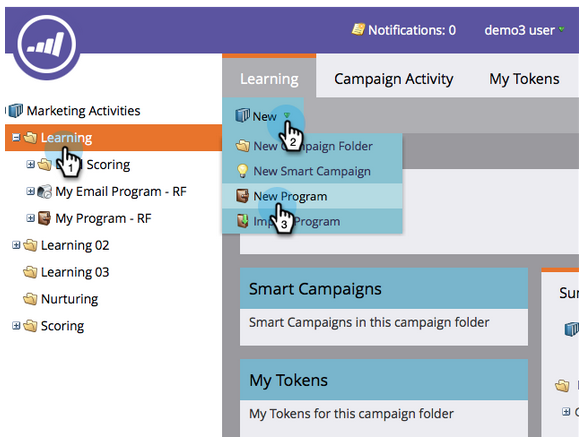
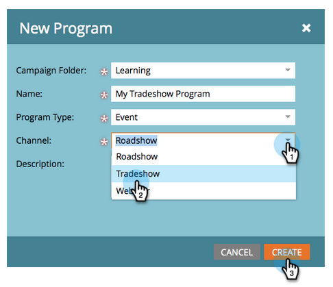
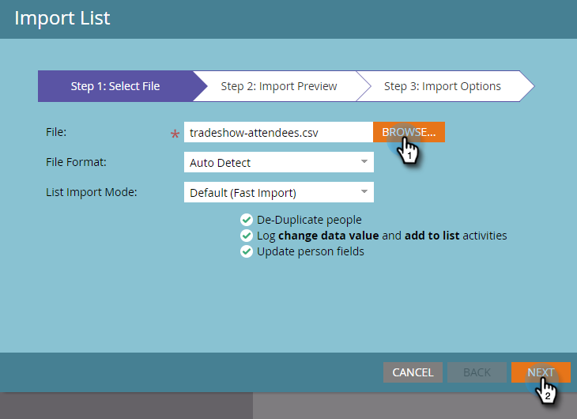

# 사람 목록 가져오기 {#import-a-list-of-people}

## 임무:참석자가 표시된 스프레드시트 목록을 데이터베이스 {#mission-import-a-spreadsheet-list-of-trade-show-attendees-into-your-database}에 가져옵니다.

>[!PREREQUISITES]
>
>[설정 및 사람 추가](/help/marketo/getting-started/quick-wins/get-set-up-and-add-a-person.md)

이 자습서에서는 스프레드시트 파일의 사람을 Marketing To로 가져오는 방법을 알아봅니다.

## 1단계:스프레드시트 다운로드 및 편집 {#step-download-and-edit-a-spreadsheet}

1. 시작하려면 실습용 스프레드시트 파일([**tradeshow-features.csv**](https://docs.marketo.com/display/docs/assets/tradeshow-attendees.csv))을 컴퓨터에 다운로드하십시오.

   

   >[!NOTE]
   >
   >날짜를 가져올 때는 다음 형식을 사용하십시오.**9/21/20**(월/일/년)

   >[!NOTE]
   >
   >가져오는 모든 날짜/시간 필드는 중부 시간으로 처리됩니다. 날짜/시간 필드가 다른 시간대에 있는 경우 Excel 공식을 사용하여 중부 시간(미국/시카고)으로 변환할 수 있습니다.

1. 이름, 성, 이메일 주소 및 직함을 추가한 다음 컴퓨터에 파일을 저장합니다.

   

>[!NOTE]
>
>CSV 파일에 실제 이메일 주소를 입력하여 다음 임무에서 전송할 이메일 양식을 수신할 수 있습니다.

## 2단계:프로그램 {#step-create-a-program} 만들기

1. **마케팅 활동** 영역으로 이동합니다.

   

1. **학습** 폴더를 선택한 다음 **새로 만들기** 아래에서 **새 프로그램**&#x200B;을 클릭합니다.

   

1. **&quot;** My Tradeshow Program&quot; 프로그램의 이름을 지정하고  **프로그램 유형에 대해 &quot;Event&quot;를 선택합니다**.

   

1. **채널**&#x200B;에 대해 **무역 과정**&#x200B;을 선택하고 **만들기**&#x200B;를 클릭합니다.

   

>[!NOTE]
>
>이벤트 프로그램은 특정 날짜에 수행됩니다. [**이벤트**](/help/marketo/product-docs/demand-generation/events/understanding-events/understanding-event-programs.md)&#x200B;에 대해 자세히 알아보십시오.

## 3단계:스프레드시트를 Marketing으로 {#step-import-your-spreadsheet-into-marketo} 가져오기

1. **내 무역 박람회 프로그램**&#x200B;에서 **새로 만들기**&#x200B;를 클릭하고 **새 로컬 자산**&#x200B;을 선택합니다.

   

1. **목록**&#x200B;을 클릭합니다.

   

1. **&quot;** 참석자 표시&quot; 목록의 이름을 지정하고 [만들기] **를 클릭합니다**.

   

1. **참석자 표시** 목록에서 **목록 작업**&#x200B;을 클릭하고 **목록 가져오기**&#x200B;를 선택합니다.

   

   >[!CAUTION]
   >
   >자신의 CSV 파일을 사용하는 경우 UTF-8, UTF-16, Shift-JIS 또는 EUC-JP로 인코딩되어 있는지 확인합니다.

   >[!NOTE]
   >
   >CSV 파일의 크기 제한은 100MB입니다.

1. **컴퓨터** 에서  **tradeshow-** attendees.csvspreadsheet  **파일을 탐색한 다음 [다음]을**&#x200B;클릭합니다.

   

   >[!NOTE]
   >
   >목록 가져오기 모드에서 **새 사람 건너뛰기 및 업데이트**&#x200B;를 선택하면 기존 사람 레코드에 영향을 주지 않고 활동을 기록할 수 없습니다. 마케팅 활동에 사용할 기존 사용자의 사전 필터링된 빠른 정적 목록을 원하는 경우 이 모드를 사용합니다. 이 모드를 선택하면 다음 작업이 수행됩니다.
   >
   > * 새로운 사람 만들기 건너뛰기
   > * 사용자 필드 업데이트 건너뛰기
   > * 활동 로깅 건너뛰기

1. 목록 열 필드를 해당 마케팅 대상 필드에 매핑하고 **다음**&#x200B;을 클릭합니다.

   

   >[!TIP]
   >
   >열 머리글은 최상의 자동 매핑 결과를 얻으려면 항상 필드를 정확하게(대/소문자 구분)해야 합니다. 사용자 정의 필드를 사용하고 있지만 드롭다운에서 해당 필드를 볼 수 없는 경우 뒤로 돌아가 [만들고](/help/marketo/product-docs/administration/field-management/create-a-custom-field-in-marketo.md)이(가) 옵션이 될 수 있도록 만듭니다.

   >[!NOTE]
   >
   >가져오지 않을 필드가 있으면 [Marketing To 필드] 드롭다운 메뉴에서 **무시**&#x200B;를 선택합니다.

1. **획득 프로그램**&#x200B;에 대해 **내 무역 박람회 프로그램**&#x200B;을 선택한 다음 **가져오기**&#x200B;를 클릭합니다.

   

1. 사용자가 가져올 때까지 기다렸다가 가져오기 진행 팝업 창을 닫습니다.

   

1. **내 무역 박람회 프로그램**&#x200B;에서 **구성원** 탭을 클릭합니다. 방금 가져온 모든 사람을 볼 수 있습니다.

   

>[!NOTE]
>
>프로그램 멤버십을 추적하여 프로그램의 성공을 분석할 수 있습니다. [**프로그램**](/help/marketo/product-docs/core-marketo-concepts/programs/creating-programs/understanding-programs.md)&#x200B;에 대해 자세히 알아보십시오.

## 임무 완료 {#mission-complete}

이제 잠재 고객이 마케팅 프로그램의 회원입니다!

  

[◄ 미션 4:이메일 자동 응답](/help/marketo/getting-started/quick-wins/email-auto-response.md)

[임무 6:드립, 드립, 키드 ►](/help/marketo/getting-started/quick-wins/drip-drip-nurture.md)
