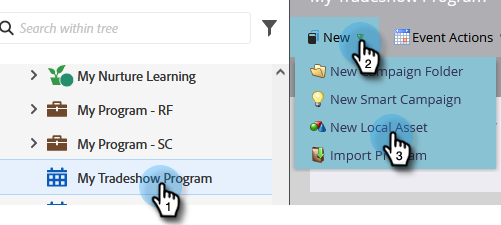
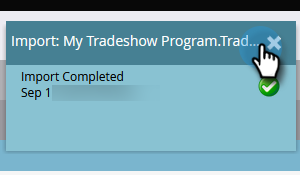

# 사람 목록 가져오기 {#import-a-list-of-people}

## 임무: 트레이드쇼 참석자를 데이터베이스로 스프레드시트 목록 가져오기 {#mission-import-a-spreadsheet-list-of-trade-show-attendees-into-your-database}

>[!PREREQUISITES]
>
>[설정 및 개인 추가](/help/marketo/getting-started/quick-wins/get-set-up-and-add-a-person.md){target=&quot;_blank&quot;}

이 자습서에서는 스프레드시트 파일에서 Marketo으로 사람을 가져오는 방법을 알아봅니다.

## 1단계: 스프레드시트 다운로드 및 편집 {#step-download-and-edit-a-spreadsheet}

1. 시작하려면 연습 스프레드시트 파일([**tradeshow-attents.csv**](/help/marketo/getting-started/assets/tradeshow-attendees.csv){target=&quot;_blank&quot;})를 컴퓨터에 추가합니다.

   

   >[!NOTE]
   >
   >날짜를 가져올 때 다음 형식을 사용하십시오. **9/21/20** (월/일/년).

   >[!NOTE]
   >
   >가져오는 날짜/시간 필드는 모두 중부 시간으로 처리됩니다. 날짜/시간 필드가 다른 시간대에 있는 경우 Excel 공식을 사용하여 중부 표준시(미국/시카고)로 변환할 수 있습니다.

1. 이름, 성, 실제 이메일 주소(다음 임무에서 전송할 육성 이메일 수신) 및 직함을 추가합니다. 컴퓨터에 파일을 저장합니다.

   

   >[!CAUTION]
   >
   >Marketo의 기능 **not** 이모지가 포함된 이메일 주소를 지원합니다.

## 2단계: 프로그램 만들기 {#step-create-a-program}

1. 로 이동합니다. **마케팅 활동** 영역.

   

1. 을(를) 선택합니다 **학습** 폴더, 아래에 **새로 만들기** click **새 프로그램**.

   

1. **이름** 프로그램 &quot;My Tradeshow Program&quot;에서 **프로그램 유형**.

   

1. 선택 **트레이드쇼** 대상 **채널** 을(를) 클릭합니다. **만들기**.

   

>[!NOTE]
>
>이벤트 프로그램은 특정 날짜에 발생합니다. 추가 정보 [**이벤트**](/help/marketo/product-docs/demand-generation/events/understanding-events/understanding-event-programs.md){target=&quot;_blank&quot;}.

## 3단계: 스프레드시트를 Marketo에 가져오기 {#step-import-your-spreadsheet-into-marketo}

1. in **My Tradeshow 프로그램**&#x200B;를 클릭합니다. **새로 만들기** 을(를) 선택합니다. **새 로컬 자산**.

   

1. 선택 **목록**.

   

1. **이름** &quot;Tradeshow Contents&quot; 목록을 클릭한 다음 **만들기**.

   

1. 사용자 **박람회 참석자** 목록, **작업 나열** 을(를) 선택합니다. **목록 가져오기**.

   

   >[!CAUTION]
   >
   >고유한 CSV 파일을 사용하는 경우 UTF-8, UTF-16, Shift-JIS 또는 EUC-JP가 인코딩되어 있는지 확인하십시오.

   >[!NOTE]
   >
   >CSV 파일의 크기 제한은 100MB입니다.

1. **찾아보기** 변환 후 **tradeshow-attents.csv** 스프레드시트 파일을 컴퓨터에 저장한 다음 **다음**.

   

   >[!NOTE]
   >
   >목록 가져오기 모드에서 **새 사용자 및 업데이트 건너뛰기** 즉, 기존 개인 레코드에 영향을 주지 않거나 활동을 기록하지 않습니다. 마케팅 활동에서 사용할 기존 사용자의 빠른 사전 필터링된 정적 목록을 원하는 경우 이 모드를 사용하십시오. 이 모드를 선택하면 다음 작업이 수행됩니다.
   >
   > * 새 사람 만들기 건너뛰기
   > * 개인 필드 업데이트 건너뛰기
   > * 활동 로깅 건너뛰기

1. 목록 열 필드를 해당 Marketo 필드에 매핑하고 을 클릭합니다 **다음**.

   

   >[!TIP]
   >
   >열 머리글은 최상의 자동 매핑 결과를 얻으려면 항상 필드와 정확히 일치해야 합니다(대/소문자 구분). 사용자 지정 필드를 사용하고 있는데 드롭다운에서 이 필드가 표시되지 않으면 뒤로 돌아가서 [만들기](/help/marketo/product-docs/administration/field-management/create-a-custom-field-in-marketo.md){target=&quot;_blank&quot;}(옵션)이 될 수 있습니다.

   >[!NOTE]
   >
   >가져오지 않을 필드가 있으면 을(를) 선택합니다. **무시** Marketo 필드 드롭다운 메뉴에서 을 클릭합니다.

1. 선택 **My Tradeshow 프로그램** 대상 **획득 프로그램**&#x200B;를 클릭한 다음 **가져오기**.

   

1. 사용자가 가져올 때까지 기다렸다가 가져오기 진행률 팝업을 닫습니다.

   

1. 다시 시작 **My Tradeshow 프로그램**&#x200B;를 클릭하고 **멤버** 탭. 방금 가져온 사람들을 모두 보게 될 겁니다

   

>[!NOTE]
>
>프로그램 멤버십을 추적하여 프로그램의 성공을 분석할 수 있습니다. 추가 정보 [**프로그램**](/help/marketo/product-docs/core-marketo-concepts/programs/creating-programs/understanding-programs.md){target=&quot;_blank&quot;}.

## 임무 완료 {#mission-complete}

현재 참석자가 Marketo 프로그램의 회원인 방식에 대한 기존의 설명!

  

[◄ 미션 4: 이메일 자동 응답](/help/marketo/getting-started/quick-wins/email-auto-response.md)

[임무 6: 드립, 드립, 배양 ►](/help/marketo/getting-started/quick-wins/drip-drip-nurture.md)
