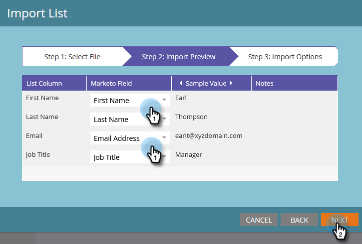

# 사용자 목록 가져오기 {#import-a-list-of-people}

## 미션: 무역 박람회 참석자 스프레드시트 목록을 데이터베이스로 가져오기 {#mission-import-a-spreadsheet-list-of-trade-show-attendees-into-your-database}

>[!PREREQUISITES]
>
>[설정 및 사용자 추가](/help/marketo/getting-started/quick-wins/get-set-up-and-add-a-person.md){target="_blank"}

이 튜토리얼에서는 스프레드시트 파일에서 Marketo로 사용자를 가져오는 방법에 대해 알아봅니다.

## 1단계: 스프레드시트 다운로드 및 편집 {#step-download-and-edit-a-spreadsheet}

1. 시작하려면 연습용 스프레드시트 파일([**tradeshow-attendees.csv**](/help/marketo/getting-started/assets/tradeshow-attendees.csv){target="_blank"})을 컴퓨터에 다운로드합니다.

   

   >[!NOTE]
   >
   >날짜를 가져올 때 월/일/연도 형식(예: **9/21/20**)을 사용합니다.

   >[!NOTE]
   >
   >가져오는 모든 날짜/시간 필드는 중부 표준시로 처리됩니다. 다른 시간대의 날짜/시간 필드가 있는 경우 Excel 수식을 사용하여 중부 표준시(아메리카/시카고)로 변환할 수 있습니다.

1. 자신의 이름, 성, 실제 이메일 주소(다음 미션에서 보낼 육성 이메일을 받을 수 있도록), 직책을 추가합니다. 파일을 컴퓨터에 저장합니다.

   

   >[!CAUTION]
   >
   >* 이메일 주소에 ASCII 문자만 포함되어 있는지 확인합니다.
   >
   >* Marketo는 이모지가 포함된 이메일 주소를 지원하지 **않습니다**.
   >
   >* CSV를 통해 `NULL` 값을 가져오면 _필드가 이미 비어 있는 경우에도_ 사용자의 [활동 로그](/help/marketo/product-docs/core-marketo-concepts/smart-lists-and-static-lists/managing-people-in-smart-lists/locate-the-activity-log-for-a-person.md){target="_blank"}에 숫자 필드에 대한 “데이터 값 변경”이 생성될 수 있습니다. “데이터 값 변경” 필터 또는 “데이터 값 변경” 트리거를 사용하는 [스마트 캠페인](/help/marketo/product-docs/core-marketo-concepts/smart-campaigns/understanding-smart-campaigns.md){target="_blank"}이 있는 경우 데이터가 실제로 변경되지 않았더라도 해당 캠페인에 사용자가 적격하게 될 수 있습니다. 가져올 때 누구도 해당 캠페인에 적격하지 않도록 [제한 사항](/help/marketo/product-docs/core-marketo-concepts/smart-lists-and-static-lists/using-smart-lists/add-a-constraint-to-a-smart-list-filter.md){target="_blank"}을 사용할 수 있습니다.

## 2단계: 프로그램 제작 {#step-create-a-program}

1. **[!UICONTROL Marketing Activities]** 영역으로 이동합니다.

   

1. **학습** 폴더를 선택한 다음 **[!UICONTROL New]**&#x200B;에서 **[!UICONTROL New Program]**&#x200B;을 클릭합니다.

   

1. 프로그램 **이름**&#x200B;을 “내 무역 박람회 프로그램”으로 지정하고 **[!UICONTROL Program Type]**&#x200B;으로 “이벤트”를 선택합니다.

   

1. **[!UICONTROL Channel]**&#x200B;로 **[!UICONTROL Tradeshow]**&#x200B;를 선택하고 **[!UICONTROL Create]**&#x200B;를 클릭합니다.

   

>[!NOTE]
>
>이벤트 프로그램은 특정 날짜에 진행됩니다. [**이벤트**](/help/marketo/product-docs/demand-generation/events/understanding-events/understanding-event-programs.md){target="_blank"}&#x200B;에 대해 자세히 알아보십시오.

## 3단계: 스프레드시트를 Marketo로 가져오기 {#step-import-your-spreadsheet-into-marketo}

1. **내 무역 박람회 프로그램**&#x200B;에서 **[!UICONTROL New]**&#x200B;를 클릭하고 **[!UICONTROL New Local Asset]**&#x200B;을 선택합니다.

   

1. **[!UICONTROL List]**&#x200B;를 선택합니다.

   

1. **목록 이름**&#x200B;을 “무역 박람회 참석자”로 지정하고 **[!UICONTROL Create]**&#x200B;를 클릭합니다.

   

1. **[!UICONTROL Tradeshow Attendees]** 목록에서 **[!UICONTROL List Actions]**&#x200B;을 클릭하고 **[!UICONTROL Import List]**&#x200B;를 선택합니다.

   

   >[!CAUTION]
   >
   >자체 CSV 파일을 사용하는 경우 UTF-8, UTF-16, Shift-JIS 또는 EUC-JP로 인코딩되었는지 확인합니다.

   >[!NOTE]
   >
   >CSV 파일의 크기 제한은 100MB입니다.

1. 컴퓨터에서 **tradeshow-attendees.csv** 스프레드시트 파일 **[!UICONTROL Browse]**&#x200B;를 클릭한 다음 **[!UICONTROL Next]**&#x200B;를 클릭합니다.

   

   >[!NOTE]
   >
   >목록 가져오기 모드에서 **[!UICONTROL Skip new people and updates]**&#x200B;를 선택하면 기존 사용자 기록에 영향을 주지 않거나 활동을 로깅하지 않습니다. 이 모드는 마케팅 활동에 사용할 기존 사용자의 사전 필터링된 정적 목록을 빠르게 만들려는 경우에 사용합니다. 이 모드를 선택하면 다음이 수행됩니다.
   >
   > * 새 사용자 생성 건너뛰기
   > * 사용자 필드 업데이트 건너뛰기
   > * 활동 로깅 건너뛰기

1. [!UICONTROL List Column] 필드를 해당 Marketo 필드에 매핑하고 **[!UICONTROL Next]**&#x200B;를 클릭합니다.

   

   >[!TIP]
   >
   >최상의 자동 매핑 결과를 얻으려면 열 헤더가 항상 필드와 정확히 일치해야(대소문자 구분) 합니다. 사용자 정의 필드를 사용 중이고 드롭다운에 표시되지 않으면 뒤로 돌아가서 [해당 필드를 만들어](/help/marketo/product-docs/administration/field-management/create-a-custom-field-in-marketo.md){target="_blank"} 옵션으로 만들 수 있도록 합니다.

   >[!NOTE]
   >
   >가져오지 않으려는 필드가 있는 경우 Marketo 필드 드롭다운 메뉴에서 **무시**&#x200B;를 선택합니다.

1. **[!UICONTROL Acquisition Program]**&#x200B;으로 **내 무역 박람회 프로그램**&#x200B;을 선택한 다음 **[!UICONTROL Import]**&#x200B;를 클릭합니다.

   

1. 사용자가 가져와질 때까지 기다린 다음 가져오기 진행률 팝업을 닫습니다.

   

1. **내 무역 박람회 프로그램**&#x200B;으로 돌아가서 **[!UICONTROL Members]** 탭을 클릭합니다. 방금 가져온 모든 사용자가 표시됩니다.

   

>[!NOTE]
>
>프로그램 멤버십을 추적하여 프로그램의 성공 여부를 분석할 수 있습니다. [**프로그램**](/help/marketo/product-docs/core-marketo-concepts/programs/creating-programs/understanding-programs.md){target="_blank"}&#x200B;에 대해 자세히 알아보십시오.

## 미션 완료 {#mission-complete}

이제 무역 박람회 참석자가 Marketo 프로그램의 멤버가 되었습니다.

  

[◄ 미션 4: 이메일 자동 응답](/help/marketo/getting-started/quick-wins/email-auto-response.md)

[미션 6: 드립, 드립, 육성 ►](/help/marketo/getting-started/quick-wins/drip-drip-nurture.md)
