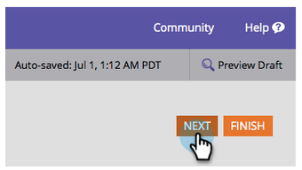
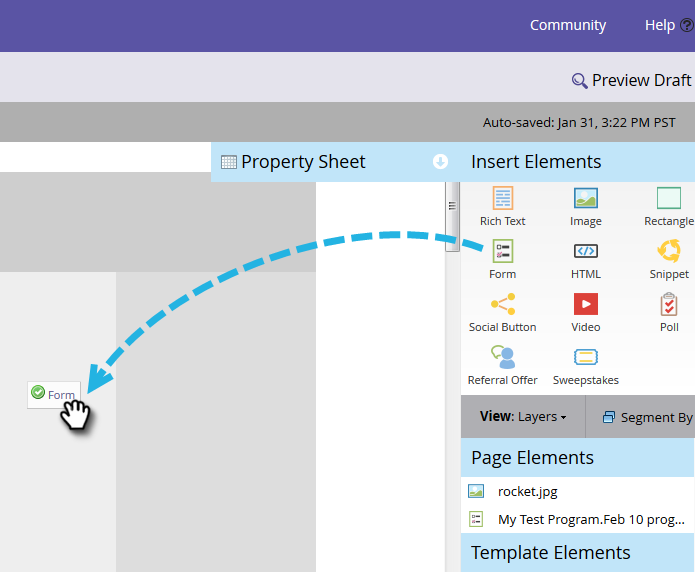
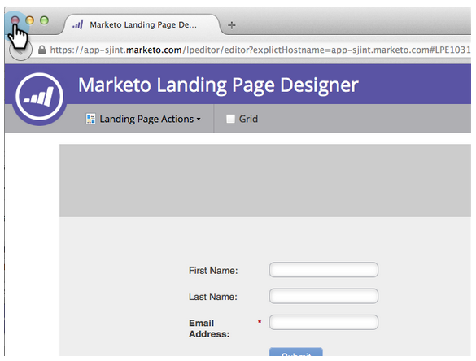
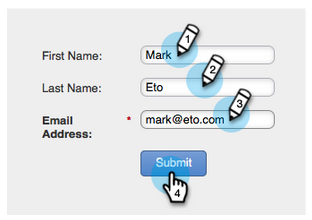

# 양식이 있는 랜딩 페이지 {#landing-page-with-a-form}

## 임무:새 사람을 얻기 위한 양식이 있는 랜딩 페이지를 만듭니다. {#mission-create-a-landing-page-with-a-form-to-acquire-new-people}

>[!PREREQUISITES]
>
>[설정 및 사람 추가](/help/marketo/getting-started/quick-wins/get-set-up-and-add-a-person.md)

## 1단계:프로그램 만들기 {#step-create-a-program}

1. 마케팅 활동 **영역으로** 이동합니다.

   

1. 이전 **빠른** 성과에서 만든 [학습 폴더를 선택합니다](/help/marketo/getting-started/quick-wins/send-an-email.md).

   

1. 새로 **만들기**&#x200B;아래에서 **새 프로그램을 클릭합니다**.

   

1. 프로그램 이름을 **입력하고**&#x200B;채널 **을** 선택한 다음 만들기 **를**&#x200B;클릭합니다.

   >[!NOTE]
   >
   >프로그램 이름 끝에 이니셜을 포함시켜 고유하게 만드십시오.

   

   >[!NOTE]
   >
   >프로그램은 특정 마케팅 이니셔티브입니다. 이 **채널은** 웨비나, 스폰서 또는 온라인 광고와 같은 전달 메커니즘입니다. 자신의 인스턴스에서 사용 가능한 항목에 따라 드롭다운에 다른 채널 옵션이 표시될 수 있습니다. 고유한 채널 [을 만들 수도 있습니다](/help/marketo/product-docs/administration/tags/create-a-program-channel.md).

   

잘했다! 프로그램을 만들었으므로 이제 컨텐츠를 만들어 보겠습니다.

## 2단계:양식 만들기 {#step-create-a-form}

1. 프로그램을 선택한 상태에서 새로 만들기, **새** 로컬 자산 **을 차례로 클릭합니다**.

   

1. 양식 **을 선택합니다**.

   

1. 양식 이름을 **입력하고** 만들기를 **클릭합니다**.

   

   >[!NOTE]
   >
   >편집기에서 **열기** 상자가 선택되어 있는지 확인합니다. 그렇지 않은 경우 양식 **편집 탭을** 클릭해야 합니다.

   >[!TIP]
   >
   >양식 편집기가 표시되지 않습니까? 브라우저가 창을 차단했을 수 있습니다. 브라우저에서 [app.marketing.com](https://app.marketo.com/) 에서 팝업을 활성화하고 상단 메뉴 모음에서 초안 편집을 클릭합니다.

1. 이메일 **주소** 필드를 선택하고 필수 **를 선택합니다**.

   

1. 다음을 **클릭합니다**.

   

1. 화살표를 클릭하여 테마를 스크롤합니다. 하나를 선택합니다.

   

1. 다음을 **클릭합니다**.

   

1. 감사 페이지 섹션에서 후속 작업을 위해 **외부 URL** 을 **선택합니다**.

   

1. URL을 입력합니다.

   

   >[!NOTE]
   >
   >후속 페이지는 양식을 작성한 후 방문자가 다시 이동되는 페이지입니다. 외부 URL은 하나의 옵션이지만 더 있습니다. 양식 [감사 페이지 설정을 참조하십시오](/help/marketo/product-docs/demand-generation/forms/creating-a-form/set-a-form-thank-you-page.md).

1. 마침을 **클릭합니다**.

   

1. 승인 **및 닫기를 클릭합니다**.

   

   수퍼! 이제 양식을 포함하는 프로그램이 있습니다. 다른 페이지로 이동하여 만들어 보죠.

   

## 3단계:랜딩 페이지 만들기 및 양식 추가 {#step-create-a-landing-page-and-add-your-form}

1. 프로그램을 선택한 상태에서 새로 만들기 **를** 클릭한 다음 **새 로컬 에셋을 클릭합니다**.

   

1. 랜딩 **페이지를 선택합니다**.

   

1. 페이지 이름을 **입력하고**&#x200B;템플릿을 선택하고 만들기를 **클릭합니다**.

   >[!NOTE]
   >
   >스크린샷에 있는 것과 다른 템플릿이 있을 수도 있습니다. 괜찮습니다. 하나를 선택하여 계속 진행하세요.

   

1. 랜딩 페이지 편집기가 열리면 양식 요소를 캔버스로 드래그합니다.

   

1. 양식을 찾아 선택하고 삽입을 **클릭합니다**.

   

1. 양식을 원하는 위치로 끕니다.

   

1. 모든 변경 내용이 자동으로 저장됩니다. 양식 편집기 탭/창을 닫습니다.

   

   잘했어요! 이제 양식이 포함된 랜딩 페이지가 있습니다. 페이지를 라이브로 만들 수 있도록 승인합시다.

## 4단계:랜딩 페이지 승인 {#step-approve-your-landing-page}

1. 랜딩 페이지를 선택하고 랜딩 페이지 작업 **에서** 승인을 **클릭합니다**.

   >[!NOTE]
   >
   >랜딩 페이지를 승인하면 라이브되고 인터넷에 액세스할 수 있게 됩니다.

   

   완벽해! 녹색 체크 표시 보이시죠?

   

## 5단계:양식 테스트 {#step-test-your-form}

1. 랜딩 페이지를 선택하고 승인된 페이지 **보기를 클릭합니다**.

   

1. 고유한 정보가 포함된 양식을 작성하고 [제출]을 **클릭합니다**.

   

1. 데이터베이스 **영역으로** 이동합니다.

   

1. 양식을 작성할 때 사용한 고유한 이메일 주소를 검색합니다.

   

   여기 있다! 양식에 새 양식이 포함된 새 랜딩 페이지를 만들고 이 페이지를 사용하여 새 사람을 만듭니다.

   

## 임무 완료! {#mission-complete}

  

[◄ 이메일 발포 보내기](/help/marketo/getting-started/quick-wins/send-an-email.md)

[간단한 점수 ►](/help/marketo/getting-started/quick-wins/simple-scoring.md)
