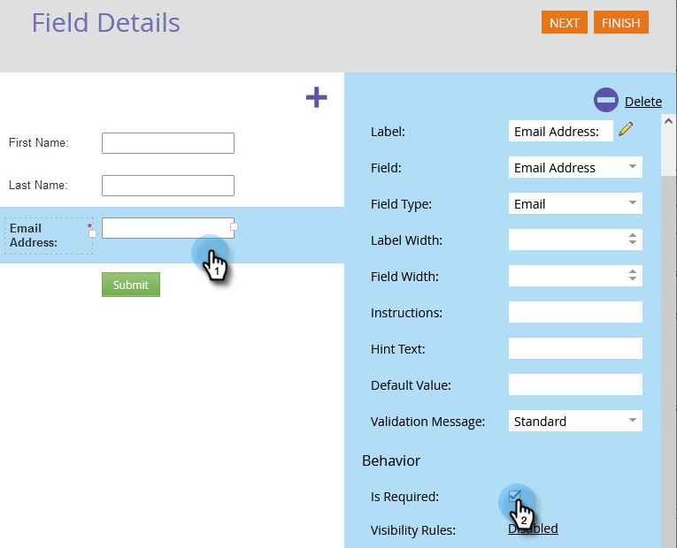
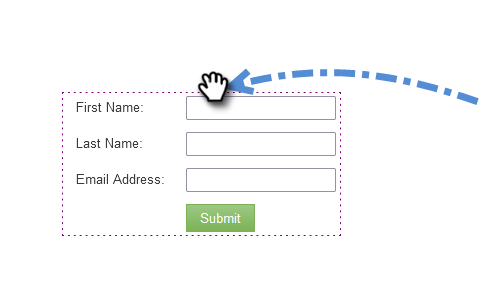

# 양식이 있는 랜딩 페이지 {#landing-page-with-a-form}

## 임무: 새로운 사용자를 확보할 수 있는 양식으로 랜딩 페이지를 만듭니다. {#mission-create-a-landing-page-with-a-form-to-acquire-new-people}

>[!PREREQUISITES]
>
>[설정 및 사용자 추가](/help/marketo/getting-started/quick-wins/get-set-up-and-add-a-person.md)

## 1단계: 프로그램 만들기 {#step-create-a-program}

1. **[!UICONTROL 마케팅 활동]** 영역으로 이동합니다.

   

1. [이전 빠른 성공](/help/marketo/getting-started/quick-wins/send-an-email.md){target="_blank"}에서 만든 **학습** 폴더를 선택하십시오. **[!UICONTROL 새로 만들기]**&#x200B;에서 **[!UICONTROL 새 프로그램]**&#x200B;을 클릭하세요.

   

1. **[!UICONTROL 이름]** 프로그램을 입력하고 **[!UICONTROL 채널]**&#x200B;을 선택한 다음 **[!UICONTROL 만들기]**&#x200B;를 클릭하세요.

   

   >[!TIP]
   >
   >프로그램 이름 끝에 이니셜을 입력하여 고유하게 만듭니다.

   >[!NOTE]
   >
   >프로그램은 하나의 특정 마케팅 이니셔티브입니다. **채널**&#x200B;은(는) 웨비나, 후원 또는 온라인 광고와 같은 게재 메커니즘입니다. 자체 인스턴스에서 사용할 수 있는 기능에 따라 드롭다운에 다른 채널 옵션이 표시될 수 있습니다. [자신의 채널을 만들](/help/marketo/product-docs/administration/tags/create-a-program-channel.md){target="_blank"}수도 있습니다.

잘했어! 이제 프로그램을 만들었으므로 다음으로 이동하여 몇 가지 콘텐츠를 만들어 보겠습니다.

## 2단계: 양식 만들기 {#step-create-a-form}

1. 프로그램을 선택한 상태에서 **[!UICONTROL 새로 만들기]** 드롭다운을 클릭하고 **[!UICONTROL 새 로컬 자산]**&#x200B;을 선택합니다.

   

1. **[!UICONTROL 양식]**&#x200B;을 선택하세요.

   

1. **[!UICONTROL 이름]** 양식을 입력하고 **[!UICONTROL 만들기]**&#x200B;를 클릭합니다.

   

   >[!NOTE]
   >
   >**[!UICONTROL 편집기에서 열기]** 상자가 선택되어 있는지 확인하십시오. 그렇지 않은 경우 **[!UICONTROL 양식 편집]** 탭을 클릭해야 합니다.

   >[!TIP]
   >
   >양식 편집기가 표시되지 않습니까? 브라우저가 창을 차단했을 수 있습니다. 브라우저에서 `app.marketo.com`의 팝업을 사용하도록 설정하고 상단 메뉴 모음에서 [초안 편집]을 클릭합니다.

1. **[!UICONTROL 전자 메일 주소]** 필드를 선택하고 **[!UICONTROL 필수]**&#x200B;을(를) 확인합니다.

   

1. **[!UICONTROL 다음]**&#x200B;을 클릭합니다.

   

1. 화살표를 클릭하여 테마를 스크롤합니다. 하나를 선택하십시오.

   

1. **[!UICONTROL 다음]**&#x200B;을 클릭합니다.

   

1. 감사 페이지 섹션에서 **[!UICONTROL 다음 작업을 수행]**&#x200B;할 **[!UICONTROL 외부 URL]**&#x200B;을(를) 선택합니다.

   

1. URL을 입력합니다.

   

   >[!NOTE]
   >
   >후속 페이지는 방문자가 양식을 작성한 후 리디렉션되는 페이지입니다. 외부 URL은 한 가지 옵션이지만 더 있습니다. [감사 인사 페이지 설정](/help/marketo/product-docs/demand-generation/forms/creating-a-form/set-a-form-thank-you-page.md){target="_blank"}을 참조하세요.

1. **[!UICONTROL 마침]**&#x200B;을 클릭합니다.

   

1. **[!UICONTROL 승인 및 닫기]**&#x200B;를 클릭합니다.

   

   잘됐네! 이제 양식이 포함된 프로그램이 있습니다. 다음으로 이동하여 페이지를 생성하겠습니다.

## 3단계: 랜딩 페이지 만들기 및 양식 추가 {#step-create-a-landing-page-and-add-your-form}

1. 프로그램을 선택한 상태에서 **[!UICONTROL 새로 만들기]** 드롭다운을 클릭하고 **[!UICONTROL 새 로컬 자산]**&#x200B;을 선택합니다.

   

1. **[!UICONTROL 랜딩 페이지]**&#x200B;를 선택하세요.

   

1. **[!UICONTROL 이름]** 페이지를 입력하고 템플릿을 선택한 다음 **[!UICONTROL 만들기]**&#x200B;를 클릭합니다.

   >[!NOTE]
   >
   >스크린샷에 나와 있는 것과 다른 템플릿이 있을 수 있습니다. 괜찮아요, 하나만 골라서 계속 진행하세요.

   

1. 랜딩 페이지 편집기가 열리면 [!UICONTROL Form] 요소를 캔버스로 드래그합니다.

   

1. 양식을 찾아 선택한 다음 **[!UICONTROL 삽입]**&#x200B;을 클릭합니다.

   

1. 양식을 원하는 위치로 드래그합니다.

   

1. 모든 변경 사항이 자동으로 저장됩니다. 양식 편집기 탭/창을 닫습니다.

   

   좋습니다! 이제 양식이 포함된 랜딩 페이지가 있습니다. 페이지를 승인하여 라이브로 만드십시오.

## 4단계: 랜딩 페이지 승인 {#step-approve-your-landing-page}

1. 랜딩 페이지를 선택하고 **[!UICONTROL 초안 승인]**&#x200B;을 클릭합니다.

   

   >[!NOTE]
   >
   >랜딩 페이지를 승인하면 랜딩 페이지가 생동하고 인터넷에서 액세스할 수 있습니다.

   완벽해! 녹색 확인 표시가 보입니까?

   

## 5단계: 양식 테스트 {#step-test-your-form}

1. 랜딩 페이지를 선택하고 **[!UICONTROL 승인된 페이지 보기]**&#x200B;를 클릭합니다.

   

1. 고유한 정보를 사용하여 양식을 작성하고 **[!UICONTROL 제출]**&#x200B;을 클릭합니다.

   

1. **[!UICONTROL 데이터베이스]** 영역으로 이동합니다.

   

1. 양식을 작성할 때 사용한 고유한 이메일 주소를 검색합니다.

   

   여기야! 양식이 있는 새 랜딩 페이지를 만들고 이 페이지를 사용하여 새 사용자를 생성했습니다.

   

## 임무 완료! {#mission-complete}

  

[◄ 미션 1: 이메일 전송](/help/marketo/getting-started/quick-wins/send-an-email.md)

[임무 3: 단순 채점 ►](/help/marketo/getting-started/quick-wins/simple-scoring.md)
