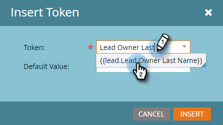

# 이메일 개인화 {#personalize-an-email}

## 미션: 데이터 토큰을 추가하여 이메일을 개인용으로 만들기 {#mission-make-your-emails-personal-by-adding-data-tokens}

>[!PREREQUISITES]
>
>* [설정 및 사용자 추가](/help/marketo/getting-started/quick-wins/get-set-up-and-add-a-person.md){target="_blank"}
>* [이메일 전송](/help/marketo/getting-started/quick-wins/send-an-email.md){target="_blank"}
>* [드립, 드립, 육성](/help/marketo/getting-started/quick-wins/drip-drip-nurture.md){target="_blank"}

## 1단계: 개인화할 이메일 선택 {#step-select-an-email-to-personalize}

1. [이전 빠른 실행](/help/marketo/getting-started/quick-wins/drip-drip-nurture.md){target="_blank"}에서 만든 육성 전자 메일 중 하나를 선택하고 **[!UICONTROL 초안 만들기]**&#x200B;를 클릭합니다.

   

   >[!NOTE]
   >
   >이렇게 하면 이메일 사본이 초안으로 만들어집니다. 변경 내용을 적용할 초안을 승인해야 합니다.

팝업 차단을 활성화하지 않은 경우 이메일 편집기가 새 탭/창에서 열립니다. 그렇지 않으면 **[!UICONTROL 초안 만들기]**&#x200B;를 두 번 클릭합니다.

## 2단계: 영업 사원을 발신자로 설정 {#step-make-the-salesperson-the-sender}

1. **[!UICONTROL 시작]** 필드를 선택하고 강조 표시한 다음 현재 이름을 **삭제**&#x200B;합니다.

   

1. **[!UICONTROL 시작]** 필드 오른쪽에 있는 **토큰** 아이콘을 클릭합니다.

   

1. **`{{lead.Lead Owner First Name}}`** 토큰을 찾아 선택합니다.

   

1. 영업 담당자의 이름을 사용할 수 없을 경우에 대비하여 회사 이름과 **기본값**&#x200B;에 대한 대시를 입력하여 무언가 표시되게 하십시오. **삽입**&#x200B;을 클릭합니다.

   

1. **[!UICONTROL 시작]** 필드의 스페이스 바를 눌러 방금 삽입한 토큰 뒤에 커서가 한 칸 깜박인지 확인합니다. 그런 다음 **토큰** 아이콘을 다시 클릭합니다.

   

1. **`{{lead.Lead Owner Last Name}}`** 토큰을 찾아 선택합니다.

   

1. **기본값**&#x200B;에 대해 &quot;Sales&quot;를 입력하고 **삽입**&#x200B;을 클릭합니다.

   

## 3단계: 잠재 고객의 이름을 이메일에 추가 {#step-add-the-leads-name-to-the-email}

1. 편집 가능한 상위 섹션을 선택하고 톱니바퀴 아이콘을 클릭한 다음 **[!UICONTROL 편집]**&#x200B;을 선택합니다.

   

1. &quot;안녕하세요&quot; 뒤에 공백을 추가하고 커서를 쉼표 앞에 놓은 다음 **토큰 삽입** 아이콘을 클릭합니다.

   

1. **`{{lead.First Name}}`** 토큰을 찾아 선택합니다.

   

1. **[!UICONTROL 기본값]** 필드에 &quot;친구&quot;(또는 원하는 레이블)를 입력하고 **[!UICONTROL 삽입]**&#x200B;을 클릭합니다.

   

   >[!TIP]
   >
   >항상 토큰에 대한 기본값을 포함하십시오. 이렇게 하면 개인 정보의 일부가 누락된 경우 이메일에 기본값이 표시됩니다.

1. **[!UICONTROL 저장]**&#x200B;을 클릭합니다.

   

1. **[!UICONTROL 전자 메일 동작]**&#x200B;에서 **[!UICONTROL 승인 및 닫기]**&#x200B;를 선택합니다.

   

>[!TIP]
>
>전자 메일을 보내는 방법에 대한 빠른 새로 고침이 필요하십니까? [메일 전송](/help/marketo/getting-started/quick-wins/send-an-email.md){target="_blank"}을 참조하세요.

### 임무 완료 {#mission-complete}

축하합니다. 이메일을 개인화했습니다!

  

[◄ 미션 6: 드립, 드립, 육성](/help/marketo/getting-started/quick-wins/drip-drip-nurture.md)

[미션 8: 영업 담당자에게 알림 ►](/help/marketo/getting-started/quick-wins/alert-the-sales-rep.md)
