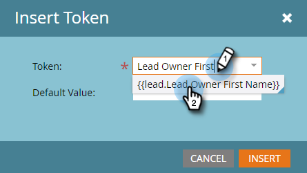

# 이메일 개인화 {#personalize-an-email}

## 임무: 데이터 토큰을 추가하여 이메일을 개인화할 수 있습니다 {#mission-make-your-emails-personal-by-adding-data-tokens}

>[!PREREQUISITES]
>
>* [설정 및 개인 추가](/help/marketo/getting-started/quick-wins/get-set-up-and-add-a-person.md){target=&quot;_blank&quot;}
>* [Email Blast 보내기](/help/marketo/getting-started/quick-wins/send-an-email.md){target=&quot;_blank&quot;}
>* [드립, 드립, 배양](/help/marketo/getting-started/quick-wins/drip-drip-nurture.md){target=&quot;_blank&quot;}

## 1단계: 개인화할 이메일 선택 {#step-select-an-email-to-personalize}

1. 에서 만든 육성형 이메일 중 하나를 선택합니다 [이전 빠른 승리](/help/marketo/getting-started/quick-wins/drip-drip-nurture.md){target=&quot;_blank&quot;} 를 클릭하고 **초안 만들기**.

   

   >[!NOTE]
   >
   >그러면 초안으로 전자 메일 복사본이 만들어집니다. 변경 사항이 라이브로 전환되도록 초안을 승인해야 합니다.

팝업 차단기를 활성화하지 않은 경우 이메일 편집기가 새 탭/창에서 열립니다. 그렇지 않으면 **초안 만들기** 두 번

## 2단계: 영업 사원을 발신자로 지정 {#step-make-the-salesperson-the-sender}

1. 을(를) 선택합니다 **From** 필드, 강조 및 **delete** 현재 이름입니다.

   

1. 을(를) 클릭합니다. **토큰** 아이콘 을 클릭합니다. **From** 필드.

   

1. 을(를) 찾아 선택합니다 **`{{lead.Lead Owner First Name}}`** 토큰.

   

1. 회사 이름과 대시를 입력합니다 **기본값** 판매 담당자의 이름을 사용할 수 없는 경우 어떤 것이 표시되는지 확인합니다. 클릭 **삽입**.

   

1. 스페이스바를 눌러 **From** 필드. 방금 삽입한 토큰 뒤에 커서가 깜박이고 있는지 확인합니다. 그런 다음 **토큰** 다시 아이콘을 클릭합니다.

   

1. 을(를) 찾아 선택합니다 **`{{lead.Lead Owner Last Name}}`** 토큰.

   

1. 에 대해 &quot;Sales&quot;를 입력합니다. **기본값** 을(를) 클릭합니다. **삽입**.

   

## 3단계: 이메일에 리드 이름 추가 {#step-add-the-leads-name-to-the-email}

1. 편집 가능한 맨 위 섹션을 선택하고 톱니바퀴 아이콘을 클릭한 다음, 을 선택합니다 **편집**.

   

1. &quot;Hello&quot; 뒤에 공백을 추가하고 커서를 쉼표 앞에 놓은 다음 **토큰 삽입** 아이콘.

   

1. 을(를) 찾아 선택합니다 **`{{lead.First Name}}`** 토큰.

   

1. 에 &quot;친구&quot;(또는 원하는 레이블)를 입력합니다. **기본값** 필드를 입력하고 **삽입**.

   

   >[!TIP]
   >
   >항상 토큰에 대한 기본값을 포함하십시오. 이렇게 하면 개인 정보의 일부가 누락된 경우 기본값이 이메일에 표시됩니다.

1. 클릭 **저장**.

   

1. 아래 **이메일 작업** 을(를) 선택합니다. **승인 및 닫기**.

   

>[!TIP]
>
>이메일 전송 방법에 대한 빠른 재교육 필요? 자세한 내용은 [Email Blast 보내기](/help/marketo/getting-started/quick-wins/send-an-email.md){target=&quot;_blank&quot;}.

### 임무 완료 {#mission-complete}

축하합니다. 이메일을 개인화했습니다!

  

[◄ 미션 6: 드립, 드립, 배양](/help/marketo/getting-started/quick-wins/drip-drip-nurture.md)

[미션 8: 영업 담당자에게 ►](/help/marketo/getting-started/quick-wins/alert-the-sales-rep.md)
