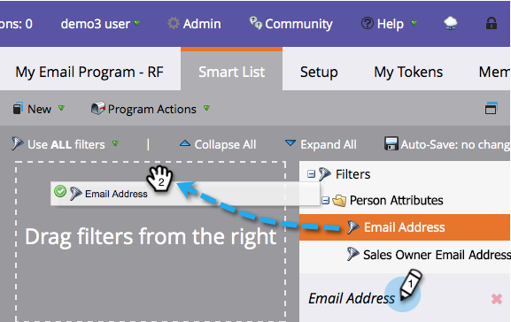
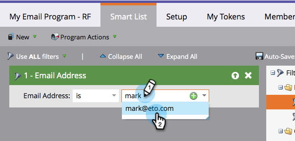
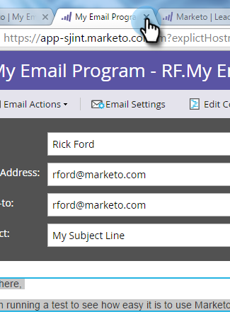

# 이메일 보내기 {#send-an-email}

모두가 가장 먼저 하고 싶어하는 일이잖아 Marketing To에서 이메일을 보내자!

>[!NOTE]
>
>**FYI**
>
>Marketing은 이제 모든 구독 간의 언어를 표준화하므로 구독에 리드/리드 및 docs.markto.com에 있는 사람/사람을 볼 수 있습니다. 이 용어는 같은 것을 의미한다.아티클 지침에는 영향을 주지 않습니다. 다른 변화도 있습니다 [자세한](http://docs.marketo.com/display/DOCS/Updates+to+Marketo+Terminology)내용

>[!PREREQUISITES]
>
>* [설정 및 사람 추가](get-set-up-and-add-a-person.md)

>

## 이메일 프로그램 만들기 {#create-an-email-program}

1. 마케팅 활동 **영역으로** 이동합니다.

   

1. 학습 **폴더를** 선택합니다. 새로 **만들기** 드롭다운을 클릭하고 **새 프로그램을 선택합니다**.

   

1. **이름 **을 입력하고 프로그램 유형 **에 대해 이메일** 을 **선택합니다.**

   >[!TIP]
   >
   >프로그램 이름의 끝에 이니셜을 추가하여 고유하게 만듭니다.

   

1. **채널 아래에서 **이메일 전송**&#x200B;을&#x200B;**선택하고**&#x200B;만들기를 클릭합니다&#x200B;**.** **

   ** 

   **

## 고객 정의 {#define-your-audience}

1. 대상 타일 **아래에서 스마트 목록** 편집을 클릭합니다.

   

1. 이메일 주소 필터를 찾아 캔버스로 드래그합니다.

   

   >[!TIP]
   >
   >필터 **목록** 맨 위에 있는 검색을 사용하여 필터를 보다 쉽게 찾을 수 있습니다.

1. 이메일 주소를 찾아 선택합니다.

   

   >[!NOTE]
   >
   >**미리 알림**
   >
   >
   >이메일이 자동으로 채워지지 않으면 설정 [및 리드 추가를 잊어버렸을 수 있습니다.](get-set-up-and-add-a-person.md)

   >[!NOTE]
   >
   >이 예에서는 본인 자신에게만 이메일을 보내지만 대상에 맞게 사용자 정의할 수 있습니다.

1. 기본 프로그램 탭으로 돌아가서 **사람에 대한 새로 고침 아이콘을 클릭합니다**.

   

   1명으로 계산되는 것을 보셔야 합니다 당신이에요!

## 이메일 만들기 {#create-an-email}

1. 이메일 타일에서 새 이메일 **을 클릭합니다**.

   

1. 이름 **을**&#x200B;입력하고 **템플릿을**&#x200B;선택한 다음* [만들기]**를 클릭합니다.

   

1. 이메일 편집기 창이 열립니다. 50자 이하의 제목을 입력합니다(권장).

   

   >[!NOTE]
   >
   >팝업 차단기가 있는 경우 [초안 **편집** ]을 클릭하여 이메일 편집기를 입력합니다.

1. 편집할 영역을 선택하고 오른쪽에 있는 톱니바퀴 아이콘을 클릭한 다음 **편집 **을 선택합니다. 편집할 편집 가능한 섹션을 두 번 클릭할 수도 있습니다.

   

1. 원하는 컨텐츠를 입력하고 **저장을 클릭합니다**.

   

1. 변경 사항이 자동으로 저장됩니다. 편집기 탭/창을 닫습니다.

   

1. 이메일 작업 **드롭다운을** 클릭하고 승인을 **선택합니다**.

   

   >[!TIP]
   >
   >이메일을 실행하기 전에 이메일이 어떻게 보이는지 간단한 샘플을 보내시겠습니까? 위 메뉴에서 **샘플** 보내기를 선택하거나 **이메일 작업** , 샘플 [**보내기**](../../product-docs/email-marketing/general/creating-an-email/send-a-sample-email.md)&#x200B;순으로클릭합니다.

1. 왼쪽 트리에서 이메일 프로그램을 선택합니다.

   

1. 예약 타일에서 이메일의 실행 날짜를 **오늘로 설정합니다.**

   

1. 향후 15분 이상의 시간을 선택하십시오.

   

   >[!TIP]
   >
   >기본 표준 시간대가 귀하의 것이 아닙니까? 여기에서 [업데이트하는 방법을 살펴보십시오](https://docs.marketo.com/display/DOCS/Select+Your+Language,+Locale+and+Time+Zone#SelectYourLanguage,LocaleandTimeZone-ChangeUserLanguage,Locale&amp;Timezone).

1. 승인 **타일 아래의 프로그램** 승인을 클릭하면 완료됩니다!

   

예약된 날짜/시간 직후에 이메일을 수신해야 합니다.

  

[◄을 사용하여 리드](get-set-up-and-add-a-person.md) 랜딩 [페이지를 설정하고 추가합니다.](landing-page-with-a-form.md)