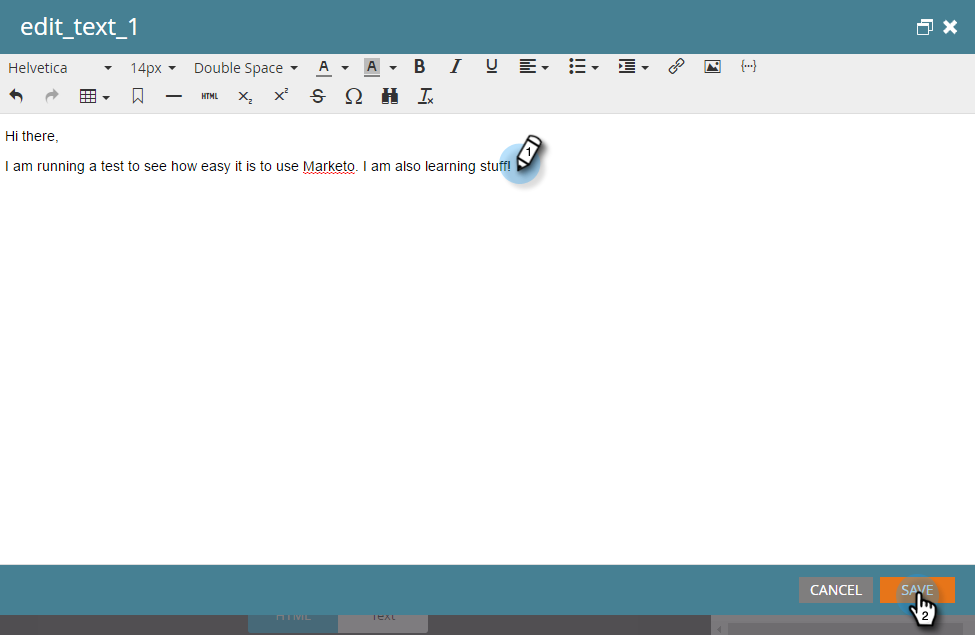
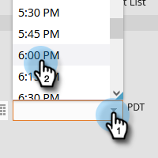

# 이메일 보내기 {#send-an-email}

모든 사용자가 가장 먼저 하고 싶어하는 일입니다. Marketo에서 이메일을 보내 보겠습니다.

>[!PREREQUISITES]
>
>[설정 및 사용자 추가](/help/marketo/getting-started/quick-wins/get-set-up-and-add-a-person.md){target="_blank"}

## 이메일 프로그램 만들기 {#create-an-email-program}

1. **[!UICONTROL Marketing Activities]** 영역으로 이동합니다.

   

1. **[!UICONTROL Learning]** 폴더를 선택합니다. **[!UICONTROL New]** 드롭다운을 클릭하고 **[!UICONTROL New Program]**&#x200B;를 선택합니다.

   

1. **[!UICONTROL Name]**&#x200B;을 입력하고 **[!UICONTROL Program Type]**&#x200B;에 **[!UICONTROL Email]**&#x200B;을 선택합니다.

   >[!TIP]
   >
   >프로그램 이름 끝에 이니셜을 추가하여 고유한 이름을 만듭니다.

   

1. **[!UICONTROL Channel]**&#x200B;에서 **[!UICONTROL Email Send]**&#x200B;를 선택하고 **[!UICONTROL Create]**&#x200B;를 클릭합니다.

   

## 대상자 정의 {#define-your-audience}

1. [!UICONTROL Audience] 타일 아래에서 **[!UICONTROL Edit Smart List]**&#x200B;를 클릭합니다.

   

1. [!UICONTROL Email Address] 필터를 찾아 캔버스로 드래그합니다.

   

   >[!TIP]
   >
   >**[!UICONTROL Search]** 기능을 사용하면 필터를 더 쉽게 찾을 수 있습니다.

1. 이메일 주소를 찾아 선택합니다.

   

   >[!NOTE]
   >
   >이메일이 자동으로 채워지지 않으면 [설정 및 리드 추가](/help/marketo/getting-started/quick-wins/get-set-up-and-add-a-person.md){target="_blank"}를 잊었을 수 있습니다.

   >[!NOTE]
   >
   >이 예에서는 본인에게만 이메일을 보내지만, 원하는 대로 대상자를 사용자 정의할 수 있습니다.

1. 기본 프로그램 탭으로 돌아가 **[!UICONTROL Person]**&#x200B;에 대한 새로 고침 아이콘을 클릭합니다.

   

   사용자 수가 1명으로 늘어나는 것을 볼 수 있습니다. 바로 본인입니다.

## 이메일 만들기 {#create-an-email}

1. 이메일 타일 아래에서 **[!UICONTROL New Email]**&#x200B;을 클릭합니다.

   

1. **[!UICONTROL Name]**&#x200B;을 입력하고 **템플릿**&#x200B;을 선택한 후 **[!UICONTROL Create]**&#x200B;를 클릭합니다.

   

1. 이메일 편집기 창이 열립니다. 50자 이하의 제목을 입력하는 것이 좋습니다.

   

   >[!NOTE]
   >
   >팝업 차단기가 있는 경우 **[!UICONTROL Edit Draft]**&#x200B;를 클릭하여 이메일 편집기로 이동합니다.

1. 편집하려는 영역을 선택하고 오른쪽의 톱니바퀴 아이콘을 클릭한 다음 **[!UICONTROL Edit]**&#x200B;을 선택합니다(편집 가능한 섹션을 더블 클릭해도 편집할 수 있습니다).

   

1. 원하는 콘텐츠를 입력하고 **[!UICONTROL Save]**&#x200B;를 클릭합니다.

   

1. **[!UICONTROL Email Actions]** 드롭다운을 클릭하고 **[!UICONTROL Approve and Close]**&#x200B;를 선택합니다.

   

   >[!TIP]
   >
   >실행 전에 이메일이 어떻게 보이는지 확인하기 위해 샘플을 자신에게 보내고 싶으십니까? 위 메뉴에서 **[!UICONTROL Send Sample]**&#x200B;을 선택하거나 **[!UICONTROL Email Actions]**&#x200B;을 클릭한 다음 [**[!UICONTROL Send Sample]**](/help/marketo/product-docs/email-marketing/general/creating-an-email/send-a-sample-email.md){target="_blank"}를 클릭합니다.

1. 왼쪽 트리에서 이메일 프로그램을 선택합니다.

   

1. [!UICONTROL Schedule] 타일 아래에서 이메일 실행일을 **[!UICONTROL Today]**&#x200B;로 설정합니다.

   

   >[!NOTE]
   >
   >[수신자 시간대](/help/marketo/product-docs/email-marketing/email-programs/email-program-actions/scheduling-with-recipient-time-zone/schedule-email-programs-with-recipient-time-zone.md){target="_blank"} 및 [Head Start](/help/marketo/product-docs/email-marketing/email-programs/email-program-actions/head-start-for-email-programs.md){target="_blank"}에 대해 자세히 알아봅니다.

1. 최소 15분 후의 시간을 선택합니다.

   

   >[!TIP]
   >
   >기본 시간대가 귀하의 시간대가 아닙니까? 업데이트하는 방법은 [여기](/help/marketo/product-docs/administration/settings/select-your-language-locale-and-time-zone.md){target="_blank"}에서 알아보십시오.

1. [!UICONTROL Approval] 타일 아래에서 **[!UICONTROL Approve Program]**&#x200B;을 클릭하면 완료됩니다.

   

예약된 날짜/시간 직후에 이메일을 받게 됩니다.

## 미션 완료 {#mission-complete}

  

[◄ 설정 및 사용자 추가](/help/marketo/getting-started/quick-wins/get-set-up-and-add-a-person.md)

[미션 2: 양식이 있는 랜딩 페이지 ►](/help/marketo/getting-started/quick-wins/landing-page-with-a-form.md)
