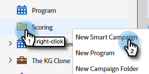
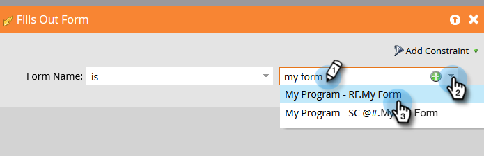
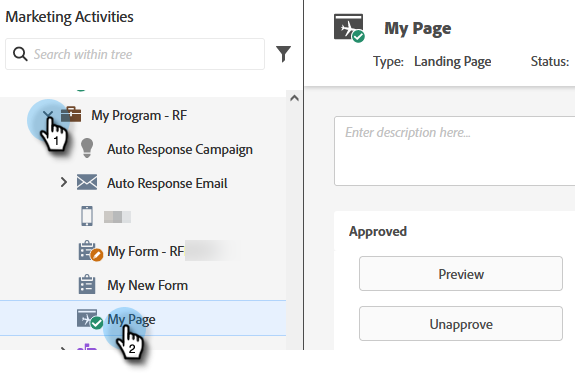

# 단순 채점 {#simple-scoring}

>[!PREREQUISITES]
>
>* [설정 및 사용자 추가](/help/marketo/getting-started/quick-wins/get-set-up-and-add-a-person.md){target="_blank"}
>* [양식이 있는 랜딩 페이지](/help/marketo/getting-started/quick-wins/landing-page-with-a-form.md){target="_blank"}

## 1단계: 채점 캠페인 만들기 {#step-create-a-scoring-campaign}

1. **[!UICONTROL Marketing Activities]** 영역으로 이동합니다.

   

1. **학습** 폴더를 마우스 오른쪽 단추로 클릭하고 **[!UICONTROL New Campaign Folder]**&#x200B;을(를) 클릭합니다.

   

1. 캠페인 폴더의 이름을 &quot;Scoring&quot;으로 지정하고 **[!UICONTROL Create]**&#x200B;을(를) 클릭합니다.

   

   >[!NOTE]
   >
   >채점 폴더가 이미 있는 경우 이 폴더의 이름을 채점 1과 같이 다르게 지정합니다. 폴더 이름은 고유해야 합니다.

1. **채점** 폴더를 마우스 오른쪽 단추로 클릭하고 **[!UICONTROL New Smart Campaign]**&#x200B;을(를) 선택합니다.

   

1. 캠페인 이름을 &quot;점수 변경&quot;으로 지정하고 **[!UICONTROL Create]**&#x200B;을(를) 클릭합니다.

   

1. **[!UICONTROL Smart List]** 탭을 클릭합니다.

   

   사용자가 **평가판 요청 양식**&#x200B;을 작성할 때마다 이 캠페인을 실행하십시오.

1. **[!UICONTROL Fills Out Form]** 트리거를 찾아 왼쪽 캔버스로 드래그합니다.

   

1. **내 양식**&#x200B;을 선택하세요.

   

   >[!NOTE]
   >
   >양식으로 [랜딩 페이지](/help/marketo/getting-started/quick-wins/landing-page-with-a-form.md){target="_blank"} 빠른 완료를 완료한 경우 양식이 있어야 합니다. 양식에 다른 이름을 사용한 경우 해당 이름을 선택합니다.

1. **[!UICONTROL Flow]** 탭을 클릭합니다.

   

1. **[!UICONTROL Change Score]** 흐름 작업을 왼쪽 캔버스로 드래그합니다.

   

1. 개인의 점수에 추가할 값을 입력할 수 있습니다. **[!UICONTROL Change]** 필드에 &quot;+5&quot;를 입력하겠습니다.

   

   >[!TIP]
   >
   >좋은 점수 캠페인은 높은 품질의 인력을 영업에 제공하는 핵심입니다. 잠재 고객 점수에 대한 [**확실한 가이드**](https://www.marketo.com/definitive-guides/lead-scoring/){target="_blank"}를 읽어 보십시오.

1. **[!UICONTROL Schedule]** 탭과 **[!UICONTROL Activate]** 단추를 클릭합니다.

   

1. 확인 화면에서 **[!UICONTROL Activate]**&#x200B;을(를) 클릭합니다.

   

>[!NOTE]
>
>활성화하면 이 캠페인은 사용자가 양식을 작성할 때마다 실행됩니다. 캠페인은 비활성화될 때까지 계속 실행됩니다.

## 2단계: 양식 작성 {#step-fill-out-the-form}

1. 양식이 있는 [랜딩 페이지에서 만든 랜딩 페이지를 선택](/help/marketo/getting-started/quick-wins/landing-page-with-a-form.md){target="_blank"} 빠른 성공.

   

1. **[!UICONTROL Preview]**&#x200B;을(를) 클릭합니다. 랜딩 페이지가 새 탭에서 열립니다.

   

1. 이름, 성, 전자 메일 주소로 양식을 작성한 다음 **[!UICONTROL Submit]**&#x200B;을(를) 클릭합니다.

   

   >[!NOTE]
   >
   >처음 인물로 입력했을 때 사용한 것과 동일한 이름과 이메일 주소를 사용하여 &quot;+5&quot; 점수 상승을 적용합니다.

## 3단계: 개인 정보 보기 {#step-view-the-person-info}

1. **[!UICONTROL Database]** 영역으로 이동합니다.

   

1. 양식을 작성할 때 사용한 이메일 주소를 검색합니다.

   

1. 사용자를 두 번 클릭합니다.

   

개인 세부 정보가 새 탭 또는 창에 열립니다. 양식을 작성하는 데 있어서 점수가 5점 상승한 것을 알 수 있습니까?

## 임무 완료! {#mission-complete}

  

[◄ 임무 2: 양식이 있는 랜딩 페이지](/help/marketo/getting-started/quick-wins/landing-page-with-a-form.md)

[미션 4: 전자 메일 자동 응답 ►](/help/marketo/getting-started/quick-wins/email-auto-response.md)
