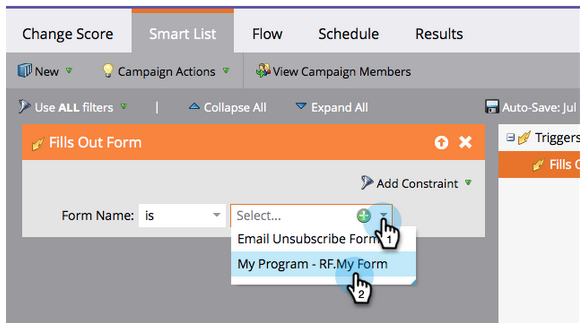

# 단순 점수 지정 {#simple-scoring}

>[!NOTE]
>
>**FYI**
>
>Marketing은 이제 모든 구독 간의 언어를 표준화하므로 구독에 리드/리드 및 docs.markto.com에 있는 사람/사람을 볼 수 있습니다. 이 용어는 같은 것을 의미한다.아티클 지침에는 영향을 주지 않습니다. 다른 변화도 있습니다 [자세한](http://docs.marketo.com/display/DOCS/Updates+to+Marketo+Terminology)내용

>[!NOTE]
>
>**사전 요구 사항**
>
>* [설정 및 사람 추가](get-set-up-and-add-a-person.md)
>* [양식이 있는 랜딩 페이지](landing-page-with-a-form.md)

>

## 1단계:점수 지정 캠페인 만들기 {#step-create-a-scoring-campaign}

1. 마케팅 활동 **영역으로** 이동합니다.

   

1. 학습 **폴더를 마우스 오른쪽** 단추로 클릭하고 **새 캠페인 폴더를 클릭합니다**.

   

1. 캠페인 폴더의 이름을 &quot;점수 지정&quot;합니다.

   

   >[!NOTE]
   >
   >채점 폴더가 이미 있는 경우 점수 지정 1과 같이 다른 이름을 지정합니다. 폴더 이름은 고유해야 합니다.

1. 그런 다음 새 **점수** 폴더를 마우스 오른쪽 단추로 클릭하고 **새 스마트 캠페인**&#x200B;을 선택합니다.

   

1. **캠페인 이름을** &quot;점수 변경&quot;하고 만들기를 **클릭합니다**.

   

1. 스마트 **목록** 탭을 클릭합니다.

   

   사용자가 **평가판 요청 양식을 작성할 때마다 이 캠페인을 실행하길 바랍니다**.

1. 양식 채우기 **트리거를 찾아 왼쪽 캔버스로** 드래그합니다.

   

1. 내 양식 **을 선택합니다**.

   >[!NOTE]
   >
   >양식 빠른 승인으로 [랜딩 페이지를](landing-page-with-a-form.md) 완료한 경우 양식이 있어야 합니다. 양식에 다른 이름을 사용한 경우 해당 이름을 선택합니다.

   

1. **흐름 **탭을 클릭합니다.

   

1. 점수 **변경** 흐름 동작을 왼쪽 캔버스로 드래그합니다.

   

1. 개인 점수에 추가할 값을 입력할 수 있습니다. 변경 필드에 &quot;+5&quot;를 **입력해** 보겠습니다.

   

   >[!TIP]
   >
   >수준 높은 고객을 세일즈 팀에 전달하는 데 있어 좋은 평가 캠페인을 제공하는 것이 중요합니다. 점수 [**를 매기려면 &quot;최종 가이드&quot;를 읽어 보시기 바랍니다**](http://www.marketo.com/definitive-guides/lead-scoring/).

1. 예약 **탭** 및 **활성화** 단추를 클릭합니다.

   

1. 확인 **화면에서** 활성화를 클릭합니다.

   

>[!NOTE]
>
>활성화되면 사용자가 양식을 채울 때마다 이 캠페인이 실행됩니다. 캠페인이 비활성화될 때까지 계속 실행됩니다.

## 2단계:양식 채우기 {#step-fill-out-the-form}

1. 양식 빠른 승인으로 [랜딩 페이지에서 만든 랜딩 페이지를](landing-page-with-a-form.md) 선택합니다.

   

1. 승인된 **페이지 보기를 클릭합니다**. 랜딩 페이지가 새 탭에서 열립니다.

   

1. 이름, 성 및 이메일 주소로 양식을 작성한 다음 **제출을 클릭합니다** .

   

   >[!NOTE]
   >
   >&quot;+5&quot; 점수 증가를 적용하려면 처음으로 개인으로서 입력한 이름과 이메일 주소를 사용하십시오.

## 3단계:개인 정보 보기 {#step-view-the-person-info}

1. 데이터베이스 영역으로 이동합니다.

   

1. 양식을 작성할 때 사용한 이메일 주소를 검색합니다.

   

1. 사람을 두 번 클릭합니다.

   

개인 세부 정보가 새 탭 또는 창에서 열립니다. 양식을 작성하는 데 대한 점수가 5포인트 정도 올라간 방법을 확인하십시오.

**축하합니다!** 점수 지정 캠페인을 만들었습니다.
[임무 ◄ 2:양식](landing-page-with-a-form.md) 임무 [4가 있는 랜딩 페이지:이메일 자동 응답](email-auto-response.md)