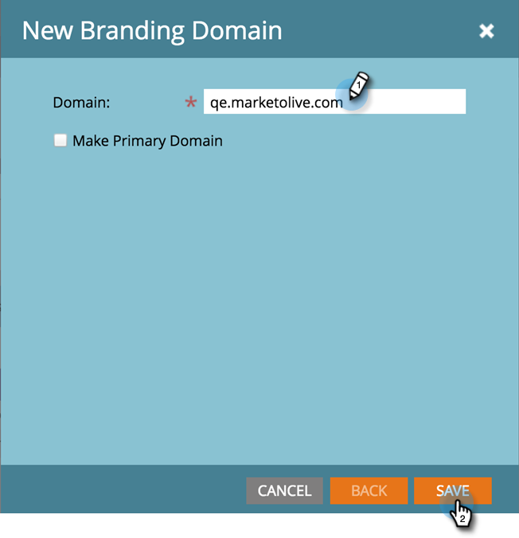

# 설정 단계 {#setup-steps}

**Marketing에 오신 것을 환영합니다!**

Marketing To 사용을 시작하기 전에 몇 가지 단계를 완료해야 합니다.

이러한 단계는 다음과 같습니다.

* 일부 기본 계정 설정
* 랜딩 페이지 URL 및 이메일 링크를 브랜딩하여 신뢰 및 전달 능력 향상
* CRM 동기화
* 회사 웹사이트에 추적 코드 추가

>[!NOTE]
>
>회사가 Marketing **의**&#x200B;신규 회사인 경우에만 이러한 단계를 수행해야 합니다. 그렇지 않은 경우 설정이 이미 완료되었을 수 있습니다.

일부 단계에서는 IT 팀의 도움이 필요합니다.

>[!TIP]
>
>[이 검사 목록](/help/marketo/getting-started/setup-steps/setup-checklist.md)을 인쇄하는 경우 완료할 때 항목을 체크 아웃할 수 있습니다.

1. 로그인 및 추가 마케팅 사용자 만들기

1. 전자 메일로 받은 자격 증명을 사용하여 [여기](https://app.marketo.com/)에 로그인합니다.

   

축하합니다! 지금 Marketing Cloud를 통해 직접 경험해 보십시오. 마케팅 팀의 동료를 초대하여 함께 할 수 있습니다. 이렇게 하려면 새 사용자를 추가합니다.

**관리** 영역으로 이동합니다.

>[!TIP]
>
>여기에 있는 동안 **내 계정**&#x200B;을 클릭하여 계정 및 위치 설정을 변경하고 새 구독 이름을 설정할 수 있습니다.

>[!NOTE]
>
>**관리자 권한 필요**

**사용자 및 역할**&#x200B;을 클릭합니다.

**새 사용자 초대**&#x200B;를 클릭합니다.

동료의 이메일 주소, 이름 및 성을 입력합니다.

달력 선택기를 사용하여 초대 사유와 액세스 만료 날짜를 입력합니다(선택 사항). **확인**&#x200B;을 클릭합니다.

**다음**&#x200B;을 클릭합니다.

>[!TIP]
>
>만료 날짜는 Marketing이 짧은 시간 동안만 액세스해야 하는 단기 외부 관계자 또는 컨설턴트에게 적합합니다.

>[!NOTE]
>
>만료일이 도래하면 만료 알림을 받게 되고 계정이 잠깁니다.

역할을 선택하고 **다음**&#x200B;을 클릭합니다. 표준 사용자는 관리자를 제외한 모든 영역에 액세스할 수 있습니다.

>[!NOTE]
>
>5개의 기본 제공 역할 외에도 사용자 지정 역할을 만들 수도 있습니다. [사용자 역할 및 권한 관리](/help/marketo/product-docs/administration/users-and-roles/managing-user-roles-and-permissions.md)에 대해 자세히 알아보십시오.

초대 텍스트를 자유롭게 수정할 수 있습니다. **보내기**&#x200B;를 클릭합니다.

이제 새 사용자가 [사용자] 탭에 나열되며 암호 및 로그인을 만들 수 있는 링크가 포함된 이메일을 수신해야 합니다. 다음 단계!

1. 공인 지원 연락처 설정

   Marketing To Support에서 귀하가 회사의 Marketing To 고객 지원 관리자라고 밝힌 이메일을 수신했을 수 있습니다. 이 경우 **승인된 지원 연락처**&#x200B;를 팀에 설정할 수 있습니다. 승인된 지원 연락처만 [Marketing To 지원 포털](https://support.marketo.com)을 통해 Marketing To 고객 지원에 직접 문의할 수 있습니다.

   >[!NOTE]
   >
   >만들 수 있는 지원 연락처 수는 구매한 패키지에 따라 결정됩니다. 이 제한은 Marketing To Support의 이메일에 지정됩니다.

   공인 지원 연락처 문서가 Marketing To 커뮤니티로 이동되었습니다. [이 아티클](https://nation.marketo.com/t5/Knowledgebase/Managing-Authorized-Support-Contacts/ta-p/254341)을(를) 참조하십시오.

   >[!NOTE]
   >
   >Marketing To 커뮤니티에 로그인한 사람만 목록에 나타납니다. 해당 사람을 찾을 수 없는 경우 먼저 커뮤니티에 로그인해야 합니다.

1. CNAME으로 랜딩 페이지 URL 사용자 정의

   >[!NOTE]
   >
   >Launch Pack 고객이십니까? 이 단계를 건너뛸 수 있습니다. 컨설턴트가 시작 전화 통화 동안 IT 설정 지침 문서를 제공합니다.

   >[!NOTE]
   >
   >**관리자 권한 필요**

   랜딩 페이지에 대한 CNAME을 선택합니다. 몇 가지 예:

   * **가**.[CompanyDomain].com
   * **www2**.[CompanyDomain].com
   * **lp**.[CompanyDomain].com

   >[!TIP]
   >
   >짧게 해! 짧은 URL은 기억하기 쉽습니다. &quot;go&quot;를 도메인으로 하는 것이 좋습니다.

   첫 번째 부분(굵은체)은 `[LandingPageCNAME]`입니다. 5단계에서 필요합니다.

   랜딩 페이지 CNAME으로 대체할 계정 문자열을 검색하려면 관리 영역으로 이동하십시오.

   

   **랜딩 페이지**&#x200B;를 클릭합니다.

   

   랜딩 페이지 설정에서 계정 문자열을 복사합니다.

   

   이것은 `[AccountString]`입니다. 저장. 5단계에서 IT 부서에 제공해야 합니다.

랜딩 페이지에서 Marketing(호스팅된 위치) 대신 회사 도메인을 사용하도록 도메인 설정을 구성합니다.

1. 이메일 배달 가능성 보장

   >[!NOTE]
   >
   >Launch Pack 고객이십니까? 이 단계를 건너뛸 수 있습니다. 컨설턴트가 시작 전화 통화 동안 IT 설정 지침 문서를 제공합니다.

   이메일이 가능한 한 많은 사람에게 도달하도록 하기 위해 몇 가지 조치를 취할 수 있습니다.

   1. **추적 링크를 브랜딩합니다**. Marketing To의 이메일에 포함하는 링크에서 자신의 도메인(Marketing&#39;s 대신)을 사용할 CNAME을 선택할 수 있습니다. 이로 인해 도메인 브랜딩이 강화되고 수신자와의 신뢰와 전달이 향상되었습니다.
   1. **회사 이메일에 마케팅을 허용 목록에 추가하다 추가합니다.** 실제 사람에게 이메일을 보내기 전에 테스트 계정에 테스트 이메일을 보내는 것이 일반적인 우수 사례입니다. 허용 목록에 추가 마케팅을 통해 이러한 테스트 이메일이 차단되거나 스팸으로 플래그가 지정되지 않도록 할 수 있습니다.
   1. **SPF 및 DKIM을 설정합니다.** 이러한 기술은 수신자에게 마케팅 이메일이 스팸이 아님을 보장합니다. 받는 사람의 스팸 필터가 마케팅 메시지를 거부하는 것을 방지할 수 있도록 하려면 다음 단계를 따라 [SPF 및 DKIM for Your Email Deliverability](/help/marketo/product-docs/email-marketing/deliverability/set-up-spf-and-dkim-for-your-email-deliverability.md)에 문의하십시오.
   1. **도메인에 대한 MX 레코드를 설정합니다.** MX 레코드를 사용하면 회신 및 자동 응답자를 처리하기 위해 이메일을 보내는 도메인에 메일을 수신할 수 있습니다. 회사 도메인에서 보내는 경우 이미 이 설정이 구성되어 있을 수 있습니다. 그렇지 않은 경우 일반적으로 회사 도메인의 MX 레코드에 매핑하도록 설정할 수 있습니다.
   1. **보낸 사람 주소에 대한 권장 설정.** 모든 이메일 캠페인에서 보낸 사람 주소의 유효한 기존 작업 이메일 도메인을 사용해야 합니다. 회사 도메인에서 보내는 것이 아니라 회사 도메인의 하위 도메인을 구성하는 것이 좋을 수 있습니다. 이렇게 하면 회사 메일 스트림의 문제가 Marketing to mailstream에 영향을 주지 않고 그 반대의 경우도 마찬가지입니다. 또한 something@nonexistentdomain.com에서 메일을 보내면 이메일이 필터링되거나 차단됩니다. 보낸 사람의 보낸 사람 보낸 사람 주소에 사용되는 모든 도메인에 유효한 postmaster@ 및 incoduct@ 계정이 있어야 합니다.
회사 전자 메일을 호스팅하기 위해 Google 앱을 사용하는 경우 도메인 아래에 학대@ 또는 사후 마스터@ 이메일을 만들 수 없습니다. 이를 해결하려면 &quot;악용&quot; 및 &quot;포스트마스터&quot;라는 그룹을 만들어야 합니다. 이러한 그룹의 구성원인 사용자는 해당 주소(예: postmaster@domain.com)으로 보낸 이메일을 받게 됩니다. 그룹 만들기에 대한 자세한 지침은 [여기](https://support.google.com/a/answer/33343#adminconsole)에 있습니다.

   이메일 추적 링크에 대한 CNAME을 선택합니다(3단계에서 선택한 랜딩 페이지 CNAME에서 _different_ 중 하나 선택). 몇 가지 예:

   * go2.[CompanyDomain].com
   * em.[CompanyDomain].com
   * 와![CompanyDomain].com

   첫 번째 부분은 이메일 추적 CNAME `[EmailTrackingCNAME]`입니다. 5단계에서 IT 부서에 제공해야 합니다.

   >[!CAUTION]
   >
   >이메일 및 랜딩 페이지 CNAME은 달라야 합니다. 또한 &#39;track&#39; 또는 &#39;link&#39;와 같은 CNAME을 사용하지 마십시오. 스팸으로 분류되는 경우가 많습니다

   마케팅 추적 링크를 찾으려면 **관리** 영역으로 이동하십시오.

   

   **이메일**&#x200B;을 클릭합니다.

   

   이메일 설정에서 추적 링크를 복사합니다.

   추적 링크는 다음과 같습니다.`mkto-[a-z][4 digits].com`.

   

   이것은 `[MktoTrackingLink]`입니다. 저장. 5단계에서 IT 부서에 제공해야 합니다.

   &quot;보낸 사람&quot; 도메인 수집. Marketing To에서 이메일을 보내는 데 사용할 모든 &quot;보낸 사람&quot; 도메인(예: `[Sender]@[FromDomain].com`)의 목록을 만듭니다. 대부분의 경우 하나만 있습니다.

   예: &#39;marketing.com,&#39; &#39;info.marketing.com,&#39;. `[FromDomain1]`,`[FromDomain2]` 등입니다. 저장하여 5단계에서 IT 부서에 제공해야 합니다.

   이제 요청을 IT로 보내는 데 필요한 모든 정보가 있습니다!

1. IT 팀에 프로토콜 구성 요청

   >[!NOTE]
   >
   >Launch Pack 고객이십니까? 이 단계를 건너뛸 수 있습니다. 컨설턴트가 시작 전화 통화 동안 IT 설정 지침 문서를 제공합니다.

   필요한 정보를 모두 수집하면 IT 팀에 요청을 보낼 수 있습니다. 아래 텍스트를 템플릿으로 사용하여 굵은 텍스트를 고유한 정보로 바꿀 수 있습니다.

   [이 아티클에 대한 링크를 포함합니다](/help/marketo/getting-started/setup-steps/configure-protocols-for-marketo.md).

   이 텍스트를 이메일에 붙여 넣고 굵게 표시된 자리 표시자를 바꿉니다.

   >[!NOTE]
   >
   >자리 표시자를 대체할 텍스트를 결정하려면 위의 3단계와 4단계를 참조하십시오. `[LandingPageCNAME]` 및 `[EmailTrackingCNAME]`은(는) 달라야 합니다.

`---------------------------------------------`

Awesome IT 관리자에게,

마케팅 팀은 이제 마케팅 플랫폼을 사용하여 사람들과 커뮤니케이션하고 있습니다. 이메일을 효과적으로 전송하려면 다음 사항을 변경해야 합니다.

`1)` 랜딩 페이지의 경우 LandingPageCNAME에 대한 DNS  **[항목(CNAME)을 추가합니다]**.**[CompanyDomain]**.com,  **[AccountString]**.mktoweb.com을 가리킵니다.

`2)` 이메일의 추적 링크에 EmailTrackingCNAME에 대한 DNS 항목(CNAME)을  **[추가하십시오]**.**[CompanyDomain]**.com, MktoTrackingLink를  **[가리킵니다]**.

`3)` 마케팅 허용 목록에 추가하다.

    * 이메일에서 IP 주소를 사용하는 경우, 아래 나열된 IP를 
    199.15.212.0/22
    
    192.28.144.0/20
    
    192.28.160.0/19
    
    185.28.196.0/22
    
    130.248.172.0/24
    
    130.248.173.0/24
    
    103.237.104.0/229
    
    을 추가하십시오. 4.236.119.0/26

참고:IP의 축약된 목록을 환경에 허용 목록에 추가하다 맞는로 표시하려면 Marketing To Support에 문의하십시오.

    * 스팸 방지 시스템이 도메인에서 보낸 사람을 사용하는 경우 다음을 추가합니다.

**`[FromDomain1]`**
**`[FromDomain2]`**

`4)` Marketing To가 Adobe를 대신하여 서명된 이메일을 보낼 수 있도록 SPF 및 DKIM을 설정해야 합니다.

`a.` SPF를 설정하려면 DNS 항목에 다음 줄을 추가하십시오.

TXT **[도메인]**&#x200B;에서: v=spf1 mx ip4:**[회사 IP]**
 포함:mktomail.com ~all

DNS 항목에 이미 기존 SPF 레코드가 있는 경우 SPF 레코드에 다음을 추가하면 됩니다.

include:mktomail.com

`[`도메인 **에서** 도메인의 전자 메일로 바꾸기(예:company.com) 및  **** CorpIP회사 이메일 서버의 IP 주소를 사용합니다(예:255.255.255.255).  Marketing To를 통해 여러 도메인에서 이메일을 보내는 경우 IT 직원이 각 도메인에 대해 이 라인을 추가하도록 해야 합니다(한 줄에).`]`

`b.` DKIM의 경우 설정하려는 각 도메인에 대한 DNS 리소스 레코드를 만드십시오. 다음은 서명할 각 도메인에 대한 호스트 레코드 및 TXT 값입니다.

**`[DKIMDomain1]`**:호스트 레코드 **`[HostRecord1]`** 는 TXT 값은 TXTValue1 **[입니다]**.

**`[DKIMDomain2]`**:호스트 레코드 **`[HostRecord2]`** 는 이고 TXT 값은  **`[TXTValue2]`**&#x200B;입니다.

`[`여기에  **** 설명된 지침에 따라  **** 설정한 각 DKIDomainyou **** 의 HostRecordand TXTValuein을  [복사합니다](/help/marketo/product-docs/email-marketing/deliverability/set-up-a-custom-dkim-signature.md). IT 직원이 이 단계를 완료한 후 **관리 > 이메일 > DKIM**&#x200B;에서 각 도메인을 확인하는 것을 잊지 마십시오.`]`

`5)` FROM 도메인  **[FromDomain1]**,  **[FromDomain2]** 등에 대한 유효한 MX 레코드가 있는지 확인해야 합니다. 확인 좀 해주시겠어요? 그렇지 않은 경우 회사 도메인 MX 레코드에 매핑하도록 구성하십시오. 이렇게 하면 Marketing Cloud 메일에 대한 회신/자동 응답자를 처리할 수 있습니다.

Marketing Cloud에서 설정 프로세스를 완료할 수 있도록 이러한 단계를 완료하면 저에게 알려주십시오.

감사합니다! 최고야!

사랑,

**`[Your Name]`**

`---------------------------------------------`

IT로 이메일을 보냅니다. IT 팀에서 이러한 작업을 완료하는 데 시간이 걸릴 수 있습니다. 7단계로 계속 진행할 수 있지만 Marketing To 설정을 완료하려면 6단계로 돌아가야 합니다.

1. IT 완료 후 마케팅 설정 완료

   IT 팀에서 작업을 완료하면 다음 단계에 따라 랜딩 페이지와 이메일 CNAME을 추가하고 DKIM 서명을 활성화합니다.

   랜딩 페이지 CNAME을 추가하려면 **관리** 영역으로 이동합니다.

   

   랜딩 페이지를 선택하고 설정 영역에서 **편집**&#x200B;을 클릭합니다.

   

   랜딩 페이지의 도메인 이름 필드에 새 도메인 이름을 입력합니다. 다음 형식이어야 합니다.

   `[LandingPageCNAME].[CompanyDomain].com`

   

   랜딩 페이지를 사용할 수 없는 경우 폴백 페이지 필드에 사람들이 이동할 URL을 입력합니다. 폴백 페이지가 없는 경우 회사 홈 페이지를 사용할 수 있습니다. 홈 페이지 필드에 회사 웹 사이트를 입력합니다.

   

   관리 영역에서 이메일 CNAME을 추가할 이메일을 선택합니다.

   

   아래로 스크롤하고 **편집**&#x200B;을 클릭합니다.

   

   도메인 필드에 이메일 추적 도메인을 입력합니다. 다음 형식이어야 합니다.

   `[EmailTrackingCNAME].[CompanyDomain].com`. **저장**&#x200B;을 클릭합니다.

   

1. 랜딩 페이지 및 이메일 템플릿에 대한 URL 제출

   Adobe 크리에이티브 디자이너는 마케팅 프로그램을 빠르고 쉽게 실행할 수 있는 맞춤형 이메일 및 랜딩 페이지 템플릿을 제공합니다. 템플릿을 회사 웹 사이트 및 로고에 일치시킬 수 있도록 몇 가지 정보를 제공해야 합니다.

   >[!NOTE]
   >
   >이러한 사용자 정의 템플릿은 Launch Pack 고객에게만 제공됩니다.

   [마케팅 템플릿 디자인 및 빌드](http://pages2.marketo.com/CESubmit-URL-ForTemplates.html) 양식으로 이동합니다. 회사 정보를 입력합니다.

   

   랜딩 페이지 URL에 회사의 색상, 로고 및 스타일을 보여주는 회사 웹 사이트의 샘플 URL을 입력합니다. 대부분의 고객은 양식을 포함하는 문의 페이지를 사용합니다.

   

   CNAME의 경우 3단계에서 선택한 랜딩 페이지 CNAME을 입력합니다(`[LandingPageCNAME]`). 요청을 제출합니다.

   

   >[!NOTE]
   >
   >랜딩 페이지 CNAME에 대한 DNS 레코드를 IT 팀에서 만들 때까지 템플릿을 완료할 수 없습니다.

   바로 그거야! Marketing To Design Studio에서 영업일 기준으로 3-5일 내에 새로운 템플릿을 볼 수 있습니다.

1. CRM 통합

   이 단계에서 가장 흥미로운 단계로, CRM에 저장한 모든 리드 및 연락처로 Marketing To를 채워야 합니다.

   회사에서 사용하는 CRM에 따라 다음 중 하나를 선택합니다.

   * [Marketing To와 Salesforce.com 통합](/help/marketo/product-docs/crm-sync/salesforce-sync/understanding-the-salesforce-sync.md)
   * [Microsoft Dynamics와 Marketing To 통합](/help/marketo/product-docs/crm-sync/microsoft-dynamics-sync/understanding-the-microsoft-dynamics-sync.md)

   >[!NOTE]
   >
   >이러한 단계를 완료하려면 회사의 CRM 관리자의 도움이 필요합니다.

## 9. 웹 사이트에 추적 코드 추가 {#add-tracking-code-to-your-website}

>[!NOTE]
>
>Launch Pack 고객이십니까? 이 단계를 건너뛸 수 있습니다. 컨설턴트가 IT 설정 지침 문서에 Munchkin 코드 지침을 제공합니다.

Marketing에는 웹 페이지에서 개인 활동을 추적하는 데 사용할 수 있는 사용자 지정 추적 JavaScript(Munchkin이라고 함)가 있습니다. Munchkin은 웹 사이트를 Marketing에 통합해야 합니다. 다음 단계에 따라 [웹 사이트에 문킨 추적 코드 추가](/help/marketo/product-docs/administration/additional-integrations/add-munchkin-tracking-code-to-your-website.md).

>[!NOTE]
>
>추적 코드를 추가하려면 HTML이 필요합니다.

모든 설정 단계는 끝났습니다. 남은 것은 Marketing To를 사용하여 시작하는 것입니다!
