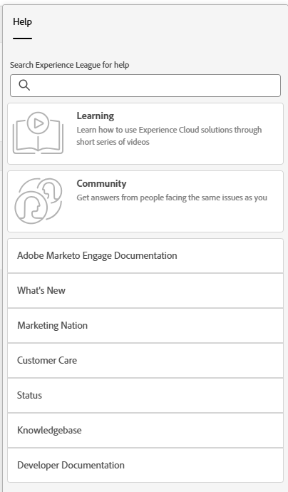

# 도움말 센터 {#help-center}

Adobe Marketo Engage의 도움말 센터는 지원을 받기 위한 중앙 집중식 위치 역할을 합니다. 다양한 리소스(예: [제품 설명서](/help/marketo/home.md){target="_blank"}, [릴리스 정보](/help/marketo/release-notes/current.md){target="_blank"}, [Marketing Nation 커뮤니티](https://nation.marketo.com/){target="_blank"})로 연결되는 것 외에도 경험 수준별로 구성된 유용한 인앱 둘러보기에 액세스할 수 있습니다.

## 액세스 방법 {#how-to-access}

구독이 Adobe Identity Management System(IMS)으로 마이그레이션되었는지 여부에 따라 두 가지 다른 경험이 제공됩니다.

### Adobe IMS 마이그레이션 이전 {#pre-adobe-ims-integration}

다음 단계는 아직 [Adobe IMS](/help/marketo/product-docs/administration/marketo-with-adobe-identity/adobe-identity-management-overview.md){target="_blank"}로 마이그레이션되지 _않은_ Marketo Engage 사용자를 위한 것입니다.

Marketo Engage에 [로그인](https://login.marketo.com/){target="_blank"}하고 도움말 아이콘을 클릭합니다.

#### 안내서 {#guides}

안내서는 인기 기능에 대한 빠른 워크스루 역할을 합니다.

1. 원하는 안내서를 클릭하여 확인합니다.

   

1. **시작하기**&#x200B;를 클릭합니다.

   

1. 계속하려면 **다음**&#x200B;을 클릭하십시오.

   

1. 워크스루를 종료하려면 **완료**&#x200B;를 클릭합니다.

   

   >[!TIP]
   >
   >**닫기**&#x200B;를 클릭하여 언제든지 안내서를 종료할 수 있습니다.

#### 새로운 기능 {#whats-new}

새로운 기능 탭에는 Marketo Engage의 최신 릴리스에 대한 세부 정보가 포함되어 있습니다.

>[!TIP]
>
>Experience League의 페이지를 보려면 하단의 화살표 아이콘을 클릭합니다.

#### 리소스 {#resources}

리소스 탭은 Marketo Engage 인스턴스에 대한 추가 도움말을 얻을 수 있는 다양한 방법에 대한 빠르고 직접적인 액세스를 제공합니다.

### Adobe IMS 마이그레이션 이후 {#post-adobe-ims-integration}

다음 단계는 이미 [Adobe IMS](/help/marketo/product-docs/administration/marketo-with-adobe-identity/adobe-identity-management-overview.md){target="_blank"}로 마이그레이션된 Marketo Engage 사용자를 위한 것입니다.

Marketo Engage에 [로그인](https://experience.adobe.com/){target="_blank"}하고 도움말 아이콘을 클릭합니다.

도움말 센터가 나타납니다. 나열된 도움말 리소스 중 하나를 클릭하면 해당 영역으로 이동합니다. 특정 용어로 검색할 수도 있습니다.

안내서(Adobe IMS 마이그레이션 이전에는 도움말 센터의 일부였음)는 이제 왼쪽 탐색 영역에 있습니다.

안내서 센터에는 안내서 및 새로운 기능의 두 탭이 있습니다. 안내서는 Marketo Engage의 인기 기능에 대한 빠른 워크스루 역할을 합니다. 원하는 안내서를 클릭하거나 특정 안내서를 검색합니다.

새로운 기능 탭에는 Marketo Engage의 최신 릴리스에 대한 세부 정보가 포함되어 있습니다.

