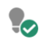

# Marketo Engage 아이콘 용어집 {#icon-glossary}

다음은 현재 Adobe Marketo Engage 인터페이스의 아이콘입니다. Marketo Classic 아이콘을 참조해야 하는 경우 [여기에서 찾을 수 있음](/help/marketo/getting-started/things-to-know/classic-icon-glossary.md).

## 일반 아이콘 {#general-icons}

<table> 
 <tbody>
  <tr>
   <th style="width:25%">이전 아이콘</th>
   <th style="width:25%">새 아이콘</th> 
   <th style="width:50%">설명</th> 
  </tr>
  <tr>
   <td><strong>해당 사항 없음</strong></td> 
   <td></td> 
   <td>계정 스마트 목록</td> 
  </tr>
  <tr>
   <td></td> 
   <td></td> 
   <td>일괄 캠페인 - 활성</td> 
  </tr>
  <tr>
   <td></td> 
   <td></td> 
   <td>일괄 캠페인 - 비활성</td> 
  </tr>
  <tr>
   <td></td> 
   <td></td> 
   <td>기본 프로그램</td> 
  </tr>
  <tr>
   <td></td> 
   <td></td> 
   <td>이메일</td> 
  </tr>
  <tr>
   <td></td>
   <td></td> 
   <td>이메일 프로그램</td> 
  </tr>
  <tr>
   <td></td> 
   <td></td> 
   <td>이메일 템플릿</td> 
  </tr>
  <tr>
   <td></td> 
   <td></td> 
   <td>참여 프로그램</td> 
  </tr>
  <tr>
   <td></td> 
   <td></td> 
   <td>이벤트 프로그램</td> 
  </tr>
  <tr>
   <td></td> 
   <td></td> 
   <td>실행 가능한 캠페인</td> 
  </tr>
  <tr>
   <td></td> 
   <td></td> 
   <td>필드 구성</td> 
  </tr>
  <tr>
   <td></td> 
   <td></td> 
   <td>필터</td> 
  </tr>
  <tr>
   <td><strong>해당 사항 없음</strong></td> 
   <td></td> 
   <td>필터 - 활성</td> 
  </tr>
  <tr>
   <td></td> 
   <td></td> 
   <td>폴더</td> 
  </tr>
  <tr>
   <td></td> 
   <td></td> 
   <td>폴더 - 보관됨</td> 
  </tr>
  <tr>
   <td></td> 
   <td></td> 
   <td>폴더 - 공유</td> 
  </tr>
  <tr>
   <td></td> 
   <td></td> 
   <td>폴더 - 잠김</td> 
  </tr>
  <tr>
   <td></td> 
   <td></td> 
   <td>양식</td> 
  </tr>
  <tr>
   <td></td> 
   <td></td> 
   <td>이미지(및 파일)</td> 
  </tr>
  <tr>
   <td></td> 
   <td></td> 
   <td>인앱 메시지</td> 
  </tr>
  <tr>
   <td></td> 
   <td></td> 
   <td>인앱 프로그램</td> 
  </tr>
  <tr>
   <td></td> 
   <td></td> 
   <td>랜딩 페이지</td> 
  </tr>
  <tr>
   <td></td> 
   <td></td> 
   <td>랜딩 페이지 템플릿</td> 
  </tr>
  <tr>
   <td></td> 
   <td></td> 
   <td>모델</td> 
  </tr>
  <tr>
   <td></td> 
   <td></td> 
   <td>여론 조사</td> 
  </tr>
  <tr>
   <td></td> 
   <td></td> 
   <td>푸시 알림</td> 
  </tr>
  <tr>
   <td></td> 
   <td></td> 
   <td>추천 시 제공 경품</td> 
  </tr>
  <tr>
   <td></td> 
   <td></td> 
   <td>보고</td> 
  </tr>
  <tr>
   <td><strong>해당 사항 없음</strong></td> 
   <td></td> 
   <td>검색</td> 
  </tr>
  <tr>
   <td></td> 
   <td></td> 
   <td>세그먼트</td> 
  </tr>
  <tr>
   <td></td> 
   <td></td> 
   <td>스마트 목록</td> 
  </tr>
  <tr>
   <td></td> 
   <td></td> 
   <td>스마트 목록 - 캐시됨</td> 
  </tr>
  <tr>
   <td></td> 
   <td></td> 
   <td>SMS 메시지</td> 
  </tr>
  <tr>
   <td></td> 
   <td></td> 
   <td>코드 조각</td> 
  </tr>
  <tr>
   <td></td> 
   <td></td> 
   <td>소셜 단추</td> 
  </tr>
  <tr>
   <td></td> 
   <td></td> 
   <td>정적 목록</td> 
  </tr>
  <tr>
   <td></td> 
   <td></td> 
   <td>경품 추첨</td> 
  </tr>
  <tr>
   <td></td> 
   <td></td> 
   <td>테스트 그룹</td> 
  </tr>
  <tr>
   <td></td> 
   <td></td> 
   <td>트리거 - 활성</td> 
  </tr>
  <tr>
   <td><strong>해당 사항 없음</strong></td> 
   <td></td> 
   <td>트리거 - 비활성</td> 
  </tr>
  <tr>
   <td></td> 
   <td></td> 
   <td>작업 영역</td> 
  </tr>
  <tr>
   <td></td> 
   <td></td> 
   <td>YouTube 비디오</td> 
  </tr>
 </tbody>
</table>

## 캠페인 일괄 처리 {#batch-campaigns}

<table> 
 <tbody>
  <tr>
   <th style="width:25%">이전 아이콘</th> 
   <th style="width:25%"> 새 아이콘</th> 
   <th style="width:50%">설명</th> 
  </tr>
  <tr>
   <td></td> 
   <td></td> 
   <td>실행, 예정된 항목 없음</td> 
  </tr>
  <tr>
   <td></td> 
   <td></td> 
   <td>유효하지 않음</td> 
  </tr>
  <tr>
   <td></td> 
   <td></td> 
   <td>실행 안 함</td> 
  </tr>
  <tr>
   <td></td> 
   <td></td> 
   <td>실행 중, 대기 단계</td> 
  </tr>
  <tr>
   <td></td> 
   <td></td> 
   <td>실행하도록 예약됨</td> 
  </tr>
  <tr>
   <td></td> 
   <td></td> 
   <td>다시 실행하도록 예약됨</td> 
  </tr>
  <tr>
   <td></td> 
   <td></td> 
   <td>양육에서 사용됨</td> 
  </tr>
 </tbody>
</table>

## 캠페인 트리거 {#trigger-campaigns}

<table> 
 <tbody>
  <tr>
   <th style="width:25%">이전 아이콘</th> 
   <th style="width:25%"> 새 아이콘</th> 
   <th style="width:50%">설명</th> 
  </tr>
  <tr>
   <td></td> 
   <td></td> 
   <td>활성</td> 
  </tr>
  <tr>
   <td></td> 
   <td></td> 
   <td>요청됨</td> 
  </tr>
  <tr>
   <td><strong>해당 사항 없음</strong></td> 
   <td></td> 
   <td>비활성</td> 
  </tr>
  <tr>
   <td></td> 
   <td></td> 
   <td>유효하지 않음</td> 
  </tr>
 </tbody>
</table>

## 이메일 프로그램 {#email-programs}

<table> 
 <tbody>
  <tr>
   <th style="width:25%">이전 아이콘</th> 
   <th style="width:25%"> 새 아이콘</th> 
   <th style="width:50%">설명</th> 
  </tr>
  <tr>
   <td></td> 
   <td></td> 
   <td>중단됨</td> 
  </tr>
  <tr>
   <td></td> 
   <td></td> 
   <td>완료</td> 
  </tr>
  <tr>
   <td></td> 
   <td></td> 
   <td>승인되지 않음</td> 
  </tr>
  <tr>
   <td></td> 
   <td></td> 
   <td>예약됨</td> 
  </tr>
 </tbody>
</table>

## 참여 프로그램 {#engagement-programs}

<table> 
 <tbody>
  <tr>
   <th style="width:25%">이전 아이콘</th> 
   <th style="width:25%"> 새 아이콘</th> 
   <th style="width:50%">설명</th> 
  </tr>
  <tr>
   <td></td> 
   <td></td> 
   <td>끔</td> 
  </tr>
  <tr>
   <td></td> 
   <td></td> 
   <td>기간</td> 
  </tr>
 </tbody>
</table>

## 인앱 프로그램 {#in-app-programs}

<table> 
 <tbody>
  <tr>
   <th style="width:25%">이전 아이콘</th> 
   <th style="width:25%"> 새 아이콘</th> 
   <th style="width:50%">설명</th> 
  </tr>
  <tr>
   <td></td> 
   <td></td> 
   <td>승인됨</td> 
  </tr>
  <tr>
   <td></td> 
   <td></td> 
   <td>아직 구성되지 않음</td> 
  </tr>
  <tr>
   <td></td> 
   <td></td> 
   <td>일시 중지됨</td> 
  </tr>
  <tr>
   <td><strong>해당 사항 없음</strong></td> 
   <td></td> 
   <td>예약됨</td> 
  </tr>
  <tr>
   <td></td> 
   <td></td> 
   <td>중지됨</td> 
  </tr>
 </tbody>
</table>

## 자산 {#assets}

<table> 
 <tbody>
  <tr>
   <th style="width:25%">이전 아이콘</th> 
   <th style="width:25%"> 새 아이콘</th> 
   <th style="width:50%">설명</th> 
  </tr>
  <tr>
   <td></td> 
   <td></td> 
   <td>승인됨</td> 
  </tr>
  <tr>
   <td></td> 
   <td></td> 
   <td>초안</td> 
  </tr>
  <tr>
   <td></td> 
   <td></td> 
   <td>초안으로 승인됨</td> 
  </tr>
 </tbody>
</table>

## 세그먼트 {#segments}

<table> 
 <tbody>
  <tr>
   <th style="width:25%">이전 아이콘</th> 
   <th style="width:25%"> 새 아이콘</th> 
   <th style="width:50%">설명</th> 
  </tr>
  <tr>
   <td><strong>해당 사항 없음</strong></td> 
   <td></td> 
   <td>승인됨 - 미달 계산</td> 
  </tr>
  <tr>
   <td><strong>해당 사항 없음</strong></td> 
   <td></td> 
   <td>승인됨 - 재계산 중</td> 
  </tr>
  <tr>
   <td><strong>해당 사항 없음</strong></td> 
   <td></td> 
   <td>초안 - 계산 중</td> 
  </tr>
 </tbody>
</table>
