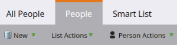

# Marketo 용어 업데이트 {#updates-to-marketo-terminology}

우리는 우리의 플랫폼을 일부 변경하고 있으며, 이는 어떤 것들의 명칭에 영향을 미칠 것입니다. 2016년 3월 현재 새 Marketo 인스턴스가 있거나 2016년 7월 이후 회사가 갱신되는 경우 이제 새로운 용어가 표시될 수 있습니다.

Marketo 설명서에 다른 용어가 표시될 수 있지만, 이러한 변경 사항을 반영하여 모든 문서가 곧 업데이트될 예정이므로 유의하십시오. 모든 지침은 동일합니다.

그럼 뭐가 바뀌었죠?

## Lead 는 Person 임 {#lead-is-now-person}

가장 큰 변화는 리드/리드가 사람/사람으로 이름이 바뀌는 것입니다.

<table> 
 <colgroup> 
  <col> 
  <col> 
 </colgroup> 
 <tbody> 
  <tr> 
   <td><strong>이전</strong></td> 
   <td><strong>신규</strong></td> 
  </tr> 
  <tr> 
   <td> 
    
 
      
    
</td> 
   <td> 
    
 
      
    
</td> 
  </tr> 
 </tbody> 
</table>

&quot;리드&quot;라는 단어가 단순히 제거되는 경우도 있습니다.

<table> 
 <colgroup> 
  <col> 
  <col> 
 </colgroup> 
 <tbody> 
  <tr> 
   <td><strong>이전</strong></td> 
   <td><strong>신규</strong></td> 
  </tr> 
  <tr> 
   <td> 
    
 
      
    
</td> 
   <td> 
    
 
     

 
    
</td> 
  </tr> 
 </tbody> 
</table>

리드 및 개인 **같은 거야**.

## 토큰 {#tokens}

단어에 리드가 포함된 토큰 **변경되지 않음**. 혼동을 드려 죄송합니다. 그러나 새로운 용어에 맞게 모든 토큰을 변경하면 현재 사용 중인 많은 토큰이 손상될 수 있습니다. 따라서 여전히 &quot;&quot;와 같은 토큰이 표시됩니다.`{{lead.First Name}}`.&quot; 사용자별 토큰이 없습니다.

>[!NOTE]
>
>거기 *은(는)* &quot;개인 메모&quot;라는 토큰이지만 이 토큰은 항상 있었습니다. 이 변수는 일반적으로 CRM의 설명 필드에 사용됩니다(있는 경우).

## 필드 관리 {#field-management}

Lead 라는 용어가 포함된 필드가 Person으로 대체되거나 Lead 라는 단어가 삭제되었습니다. 그러나 주목할 만한 예외 중 하나는 &quot;잠재 고객 소유자&quot; 필드입니다. 이제 &quot;판매 소유자&quot;라고 합니다.

<table> 
 <colgroup> 
  <col> 
  <col> 
 </colgroup> 
 <tbody> 
  <tr> 
   <td><strong>이전</strong></td> 
   <td><strong>신규</strong></td> 
  </tr> 
  <tr> 
   <td> 
    
 
      
    
</td> 
   <td> 
    
 
      
    
</td> 
  </tr> 
 </tbody> 
</table>

>[!NOTE]
>
>영향을 받는 필드 이름의 전체 목록은 다음을 참조하십시오. [지원 문서](https://nation.marketo.com/docs/DOC-4218#jive_content_id_Field_Names_and_Tokens){target="_blank"}.

## Real-Time Personalization (RTP)이 이제 웹 개인화입니다. {#real-time-personalization-rtp-is-now-web-personalization}

<table> 
 <colgroup> 
  <col> 
  <col> 
 </colgroup> 
 <tbody> 
  <tr> 
   <td><strong>이전</strong></td> 
   <td><strong>신규</strong></td> 
  </tr> 
  <tr> 
   <td> 
    
 
      
    
</td> 
   <td> 
    
 
      
    
</td> 
  </tr> 
 </tbody> 
</table>

이제 이름 변경 외에도 네 개의 별도 앱으로 구성됩니다.

| **[웹 개인화](https://docs.marketo.com/display/DOCS/Web+Personalization+-+RTP){target="_blank"}** | 홈 화면에 자체 타일이 있음 |
|---|---|
| **[계정 기반 웹 마케팅](https://docs.marketo.com/display/DOCS/Account-Based+Web+Marketing){target="_blank"}** | 웹 개인화 타일을 통해 액세스 가능 |
| **[개인화된 리타겟팅](https://docs.marketo.com/display/DOCS/Website+Retargeting){target="_blank"}** | 웹 개인화 타일을 통해 액세스 가능 |
| **[예측 콘텐츠](https://docs.marketo.com/display/DOCS/Predictive+Content){target="_blank"}** | 홈 화면에 자체 타일이 있음 |

>[!NOTE]
>
>홈 화면에 표시되는 타일은 구입한 모듈을 반영합니다.

이 업데이트 동안 기다려 주셔서 감사합니다.
