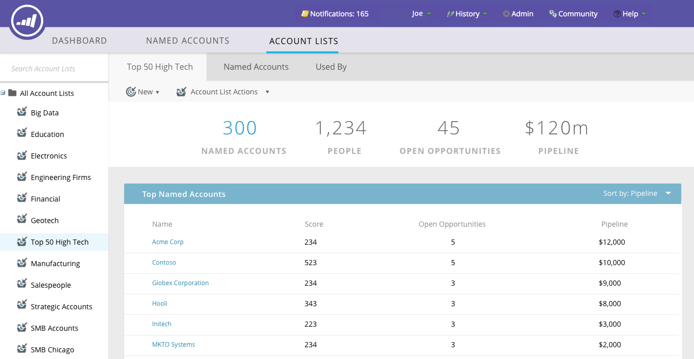

# ABM 기본 대시보드 {#abm-main-dashboard}

기본 대시보드는 계정 기반 마케팅 활동의 요약을 제공합니다. 성공을 보여주는 타겟 계정 또는 계정 목록과 더 많은 주의가 필요한 계정을 볼 수 있습니다.

계정 목록별로 필터링하려면 보기 드롭다운...을 클릭합니다.

...원하는 영역을 선택할 수 있습니다. 이 예에서는 &quot;첨단 기술&quot; 계정 목록을 선택합니다.

계정 [목록 대시보드를](http://docs.marketo.com/display/DOCS/Account+List+Insights#AccountListInsights-AccountListDashboard)보려면 선택한 계정 목록 이름을 클릭합니다.

...대시보드가 로드됩니다.

지정된 계정으로 드릴다운하려는 계정 목록 대시보드를 보는 대신 **추가 세부 정보** ...를 클릭합니다.

...지정된 [계정의 통찰력을 볼 수 있습니다](http://docs.marketo.com/display/DOCS/Named+Account+Insights).

