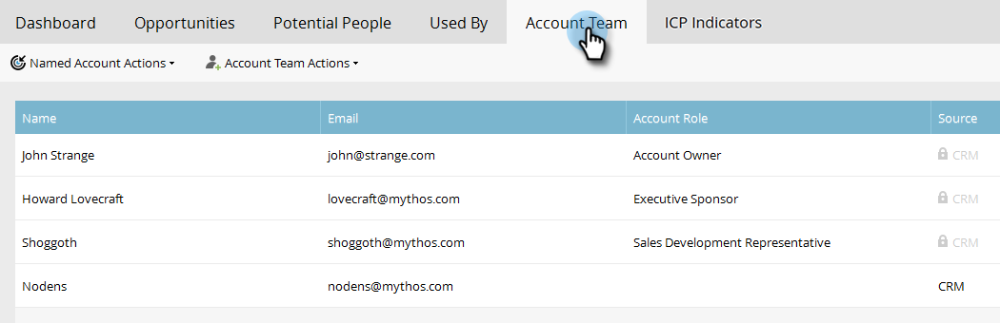

# 명명된 계정 인사이트 {#named-account-insights}

네임드 계정 대시보드는 대상 계정의 360도 보기를 제공합니다.

## 대시보드 {#dashboard}

대시보드는 지정된 계정 내의 모든 사람으로부터 계정 수준에서 주요 통찰력을 집계하므로 각 사람에게 진행 상황을 평가할 필요가 없습니다. [이메일 인사이트](http://docs.marketo.com/display/DOCS/Filtering+in+Email+Insights#FilteringinEmailInsights-AccountBasedMarketing)를 사용하여 이메일 활동에 대해 자세히 드릴다운할 수 있습니다.

>[!NOTE]
>
>차트는 지난 90일 동안의 통찰력을 보여줍니다.

**시간에 따른** 계정  **** 참여오른쪽의 보기 드롭다운을 클릭하여 보는 내용을 변경합니다. 계정 점수 외에도 총 매출액...별로 볼 수 있습니다.

...또는 파이프라인을 참조하십시오.

<table> 
 <tbody> 
  <tr> 
   <td><strong>계정 점수</strong></td> 
   <td>
관리에서 만든 모든 계정 점수를 기반으로 주별 참여를 확인할 수 있습니다. 이 계정 점수를 나란히 비교할 수 있습니다. 주별 참여를 결정하려면 해당 주의 어느 요일이든 최대 참여도를 사용합니다.
</td> 
  </tr> 
  <tr> 
   <td><strong>파이프라인</strong></td> 
   <td>시간의 경과에 따른 파이프라인을 참조하십시오. 주별 파이프라인을 결정하기 위해 마지막 날에 파이프라인을 받습니다.</td> 
  </tr> 
  <tr> 
   <td><strong>매출</strong></td> 
   <td>시간에 따른 매출을 확인할 수 있습니다. 주별 매출을 결정하려면 해당 주의 모든 매출 원화를 합합니다.</td> 
  </tr> 
 </tbody> 
</table>

**흥미로운 순간**

[Marketing To Sales Insight](http://docs.marketo.com/display/DOCS/Marketo+Sales+Insight) 사용자가 사용할 수 있는 계정 수준에서 롤업된 흥미로운 순간을 참조하십시오.

**상위 사람**

이러한 사람은 이름이 지정된 계정의 사용자(매출 인사이트의 [최고의 베팅](http://docs.marketo.com/display/DOCS/Priority,+Urgency,+Relative+Score,+and+Best+Bets)과 동일) 또는 사용자가 정의한 점수와 같은 최근 또는 긴급한 상황을 기반으로 계산됩니다. **우선** 순위는 Marketing to Sales Insight 사용자에게만 제공됩니다.

**하위 포함**

**하위 포함**&#x200B;을 클릭하여 선택한 명명된 계정의 하위 계정을 보고 선택하고 집계 분석을 봅니다.

>[!NOTE]
>
>계정을 선택할 때 모두 선택하거나 최대 100개의 계정을 개별적으로 선택할 수 있습니다.

## 계층 구조 {#hierarchy}

선택한 명명 계정이 계층 구조와 관련하여 어디에 있는지 확인합니다.

## 기회 {#opportunities}

마케팅 팀이 특정 기회를 놓치지 않도록 하기 위해 계정 수준에서 열린 모든 기회를 롤업 봅니다.

## 잠재적인 사람 {#potential-people}

[잠재 고객] 탭에서 해결할 수 있는 취약한 일치 항목을 찾기 위해 계정 간 일치가 모호한 논리를 사용합니다.

>[!NOTE]
>
>나열된 인물 중 하나를 추가하려면 해당 사람을 선택하고 **사람 추가**&#x200B;를 클릭합니다.

## {#used-by}에서 사용됨

이 탭에는 현재 특정 명명 계정 또는 계정 목록을 참조하는 스마트 캠페인, 웹 캠페인, 스마트 목록 또는 보고서가 표시됩니다.

## 계정 팀 {#account-team}

이 탭에서 계정 팀원을 보거나 구성원을 추가/제거하고 계정 소유자를 할당할 수도 있습니다.

>[!NOTE]
>
>계정 구성원을 추가/제거하거나 계정 소유자를 지정하려면 **계정 팀 작업** 드롭다운을 클릭합니다.

## ICP 표시기 {#icp-indicators}

[모델](http://docs.marketo.com/display/DOCS/Account+AI+Overview#AccountAIOverview-ModelTuning)을 조정하면 내보내도록 선택한 ICP 표시기를 봅니다.

