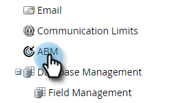

# 계정 팀 설정 {#account-team-setup}

계정 팀은 지정된 계정으로 함께 일하는 이해 관계자 그룹입니다. 다음 단계에 따라 추가할 CRM 계정 역할을 선택합니다.

1. 관리자를 **클릭합니다**.

   

1. ABM **을 클릭합니다**.

   

1. 계정 팀 구성원 아래에서 **편집을 클릭합니다**.

   

   >[!NOTE]
   >
   >계정 역할의 경우, 이름을 지정하고 CRM에서 원하는 사용자 조회 필드에 대응시킵니다.

1. 계정 역할 이름을 입력하고 **CRM** 필드를 선택합니다. 최대 10개 추가

   

   >[!NOTE]
   >
   >계정 소유자를 선택할 수 없습니다. CRM의 계정 수준에서 기본적으로 선택됩니다.

1. 완료되면 **저장을** 클릭합니다.

   

   >[!CAUTION]
   >
   >업데이트를 하면 변경 사항이 ABM에 반영되는 데 시간이 걸릴 수 있습니다.

   >[!NOTE]
   >
   >**설명**
   >
   >    
   >    
   >    * 계정 소유자가 다른 여러 CRM 계정을 네임드 계정으로 병합하면 Marketing에서 &quot;계정 소유자&quot;를 한 개 선택하고 다른 계정 소유자를 &quot;계정 공유자&quot;로 추가합니다
   >    * CRM &quot;역할&quot; 필드의 이름이 나중에 변경되거나 삭제된 경우 Marketing ABM은 사용자가 ABM에서 수동으로 설정을 업데이트할 때까지 업데이트된 값의 동기화를 중단합니다

