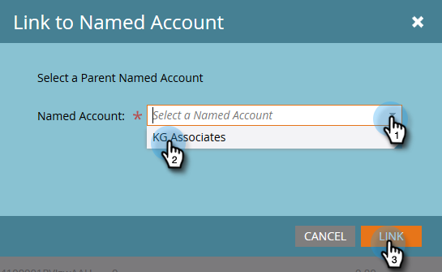

# {#create-a-hierarchy} 계층 만들기

계층은 CRM에서 생성되어야 합니다. 그러나 CRM이 없는 경우 다음 단계에 따라 수동으로 계층을 만듭니다.

1. 이름 있는 계정에서 **계층별 그룹** 확인란을 클릭합니다.

   

   >[!NOTE]
   >
   >**미리 알림**
   >
   >
   >CRM이 아닌 계정만 수동으로 계층을 만드는 데 사용할 수 있습니다. CRM 연결 계정은 CRM에서 해당 계층을 만들어야 합니다.

1. Ctrl+클릭(Windows) 또는 Cmd+클릭(Mac)을 사용하여 계층 구조에서 함께 그룹화할 모든 계정을 선택합니다.

   

1. **명명된 계정 작업** 드롭다운을 클릭하고 **명명된 계정에 연결**&#x200B;을 선택합니다.

   

   >[!NOTE]
   >
   >계정의 연결을 해제하려면 위의 단계를 따르고 **명명된 계정에서 연결 해제**&#x200B;를 선택합니다.

1. 드롭다운에서 상위 명명 계정을 선택하고 **링크**&#x200B;를 클릭합니다.

   

1. 이름이 지정된 계정은 이제 계층에 속합니다. 왼쪽 화살표를 클릭하여 모든 하위 계정을 확인합니다.

   

