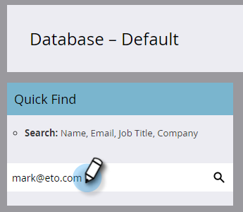

# 명명된 계정 {#add-people-to-a-named-account}에 인물 추가

ABM의 지정된 계정에 수동으로 사람을 추가하는 방법에는 3가지가 있습니다.

## 단일 흐름 작업 {#single-flow-action}

1. **데이터베이스**&#x200B;를 클릭합니다.

   

1. 사람의 이메일 주소를 입력하고 Enter 키를 누릅니다.

   

1. 선택할 사람을 클릭합니다. **사람 작업** 드롭다운을 클릭하고 **마케팅**&#x200B;을 클릭한 다음 **명명된 계정에 추가**&#x200B;를 선택합니다.

   

1. **명명된 계정** 드롭다운을 클릭하고 원하는 명명 계정을 선택한 다음 **지금 실행**&#x200B;을 클릭합니다.

   

## 스마트 캠페인 흐름 단계 {#smart-campaign-flow-step}

1. 스마트 캠페인을 선택하고 **흐름**&#x200B;을 클릭합니다.

   

1. 검색 상자에 &quot;명명된 계정에 추가&quot;를 입력합니다.

   

1. 필터를 캔버스로 드래그합니다.

   

1. **명명된 계정** 드롭다운을 클릭하고 원하는 지정된 계정을 선택합니다.

   

   바로 그거야! 다음으로 스마트 캠페인을 예약(또는 활성화)하면 흐름 단계로 지정된 지정된 계정에 자격이 있는 사람을 추가하기 시작합니다.

## 목록 가져오기 {#list-import}

1. 목록을 선택하고 **목록 작업** 드롭다운을 클릭한 다음 **목록 가져오기**&#x200B;를 선택합니다.

   

1. 파일과 설정을 선택한 후 **다음**&#x200B;을 클릭합니다.

   

1. 원하는 필드를 매핑합니다. **명명된 계정** 필드가 매핑되어 있는지 확인합니다.

   

1. 원하는 설정을 선택한 다음 **가져오기**&#x200B;를 클릭합니다.

   

>[!MORELIKETHIS]
>
>[계정 일치로 이동](/help/marketo/product-docs/account-based-marketing/target/named-accounts/lead-to-account-matching.md)
