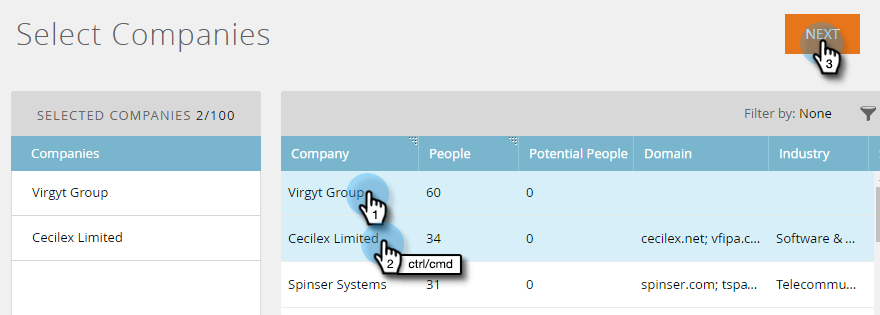

# Discover 계정 {#discover-accounts}

Discover 옵션을 사용하여 잠재적 타겟 계정을 식별합니다.

## CRM 계정 검색 {#discover-crm-accounts}

CRM에서 잠재적 타겟 계정을 식별합니다.

>[!NOTE]
>
>CRM을 Marketing ABM에 연결한 후 **Discover CRM** 계정은 올바른 명명 계정을 선택하는 데 도움이 되는 모든 CRM 계정 및 관련 정보를 표시합니다. Marketing to는 CRM에서 받은 정보 위에 추가 정보를 추가합니다.

**사람** (Discover CRM 계정 및 Discover 마케팅 회사):연락처 및 리드 모두를 포함합니다. 리드는 Marketing To의 [리드-계정 일치를 사용하여 검색할 수 있습니다](http://docs.marketo.com/display/DOCS/Lead+to+Account+Matching). **잠재적인 사람** (Discover CRM 계정 및 Discover 마케팅 회사):CRM 계정에 속할 수 있는 리드를 Marketing에서 찾은 횟수를 표시합니다.

**사용자 지정 CRM 필드** (Discover CRM 계정만 해당):이를 통해 올바른 타겟 계정을 선택할 수 있도록 세일즈 및 마케팅 조직을 조정할 수 있습니다. 사용자 지정 CRM 필드 [를 Marketing to ABM과](http://docs.marketo.com/x/1wnG) 매핑하면, 매핑된 데이터를 표시하여 대상 계정을 식별하는 데 도움이 됩니다.

1. 네임드 계정에서 **새로** 만들기 드롭다운을 클릭하고 **Discover CRM 계정을 선택합니다**.

   

1. 새 창/탭이 열립니다. 네임드 계정에 추가할 CRM 계정을 선택하고 **다음을 클릭합니다**.

   

1. 미리 보기 화면에서 선택한 양이 확인됩니다. 만들기를 **클릭합니다**.

   

   그게 다야!

   

## 마케팅 기업 검색 {#discover-marketo-companies}

타깃팅할 적합한 회사를 식별합니다.

>[!NOTE]
>
>Discover Marketing Company에서는 CRM에서 오지 않은 Marketing Company가 표시됩니다.

1. 지정된 계정에서 **새로 만들기** 드롭다운을 클릭하고 **Discover 마케팅 회사를 선택합니다**.

   

1. 새 창/탭이 열립니다. 네임드 계정에 추가할 회사를 선택하고 **다음을 클릭합니다**.

   

   >[!NOTE]
   >
   >Discover Marketing Company와 Discover CRM에서 Marketing은 자동으로 다음을 수행합니다.
   >
   > * 해당 회사가 레코드에 나열된 Marketing 데이터베이스에서 사용자를 찾습니다. 일부 속성(예: 산업)에 대해 여러 값이 표시되는 경우 Marketing에서 해당 개별 사용자에 대해 다른 값을 발견했기 때문입니다. 히트가 가장 많은 속성이 승리함
   >
   >Discover **CRM에서만** Marketing에서 자동으로 다음을 수행합니다.
   >
   > * CRM 연락처를 지정된 계정과 동기화 및 연결
   >
   >Discover **Marketing** Company에서만 Marketing은 자동으로 다음을 수행합니다.
   >
   > * 대부분의 인터넷 서비스 제공업체 및 공개 도메인(예: [Yahoo.com](https://yahoo.com), [Gmail.com](https://gmail.com))을 회사 이름으로 필터링합니다.
      >
      > 
   * CRM 계정을 삭제합니다. 한 개의 레코드와 &quot;Acme Inc&quot;(또는 다음 접미사 중 하나를 가진 경우:Co, Corp, Corporation, Gmbh, Inc, Incorporated, LLP, LP, Ltd, PA, PC, PLC, PLLC)는 ABM에서 &quot;Acme&quot;로 병합합니다.
   >
   >Marketing to에서 회사 이름이 아닌 CRM ID 또는 계정 소유자별로 중복 제거 계정을 제거하려는 경우 [Marketing To 지원에 문의하십시오](https://nation.marketo.com/t5/Support/ct-p/Support).

1. 지정된 계정 열 아래의 아래쪽 화살표를 클릭하여 드롭다운을 표시합니다.

   

   >[!CAUTION]
   >
   >앞으로 새로 선정된 회사의 모든 구성원은 자동으로 해당 지정된 계정에 할당됩니다. 이 회사들을 다시 확인하고 올바른 명명 계정에 할당되었는지 확인하십시오.

1. 기존 계정을 선택하려면 **명명된 계정** 드롭다운을 클릭하고 원하는 계정을 선택한 다음 **다음을 클릭합니다**.

   

   드롭다운 상자에 원하는 이름을 직접 입력하여 새 네임드 계정을 만들 수도 있습니다. 완료되면 상자에서 을 클릭합니다...

   

   ...그러면 새로운 네임드 계정이 표시됩니다. 이때 4단계처럼 **다음** 을 클릭하면 됩니다.

   

1. 만들기를 **클릭합니다**.

   

   잘했어!

   

>[!NOTE]
>
>선택한 CRM 계정과 Discover CRM 그리드에 있는 계정 간에 불일치가 발생하는 경우, 다음 중 하나 이상이 표시될 수 있습니다.
>
>* 비슷한 이름의 다른 CRM 계정을 가지고 있는 경우
>* 다음 예약된 동기화가 아직 발생하지 않았습니다.

>[!MORELIKETHIS]
>
>* [계정 일치로 이동](/help/marketo/product-docs/account-based-marketing/target/named-accounts/lead-to-account-matching.md)

