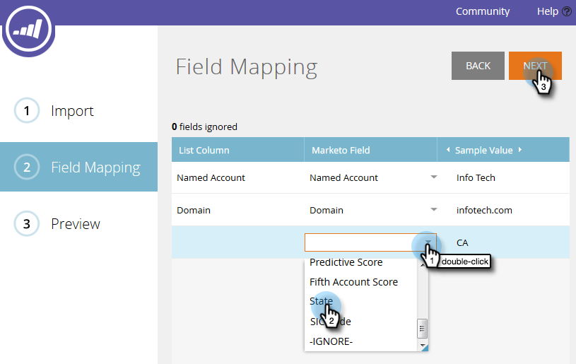

# 지정된 계정 가져오기 {#import-named-accounts}

잠재적인 타겟 계정으로 가득 찬 CSV가 이미 있습니까? ABM으로 바로 가져올 수 있습니다.

1. 새로 **만들기** 드롭다운을 클릭하고 **명명된 계정 가져오기를 선택합니다**.

   

1. 새 창이 열립니다. 찾아보기를 **클릭한**&#x200B;다음 가져올 이름의 계정 파일을 선택합니다.

   

   >[!TIP]
   >
   >파일에 가능한 [많은 정보를](http://docs.marketo.com/display/DOCS/Named+Account+Overview#NamedAccountOverview-NamedAccountAttributes) 제공하십시오. 첫 번째 정보만 추가할 수 있습니다.Marketing to는 계산되지 않습니다(예: 파이프라인). CRM 계정을 기반으로 지정된 계정을 만들려면 CRM에서 계정 이름과 CRM ID를 CSV 파일로 내보내고 계정 이름 옵션을 사용하고 가져오기 프로세스 동안 CRM ID를 매핑하면 됩니다. CRM 계정을 지정된 계정에 제대로 연결하려면 CRM 계정의 정확한 이름을 제공해야 합니다.

1. 다음 두 가지 데이터 중복 제거 모드 중에서 선택계정 이름 또는 도메인 이름. 이 예에서는 계정을 선택합니다. 모드 **드롭다운을** 클릭하고 계정 이름별 **을 선택합니다**.

   

   >[!NOTE]
   >
   >[도메인 **모드 기준**]을 선택하는 경우 이름이 지정된 계정과 도메인 필드를 모두 포함해야 합니다.

1. 이름이 지정된 계정을 추가할 계정 목록을 선택하려면 **계정 목록** 드롭다운을 클릭하고 선택합니다.

   

   >[!NOTE]
   >
   >또한 드롭다운 상자에 이름을 간단히 입력하여 새로운 계정 목록을 만들 수도 있습니다.

1. 가져오기에 대한 알림을 전송하려면 경고 전송 대상 **드롭다운을** 클릭하고 Marketing 사용자를 선택합니다. 이메일 주소를 수동으로 입력할 수 *없습니다* .

   

1. 다음을 **클릭합니다**.

   

1. 마케팅 필드 **드롭다운을 두 번 클릭하고** 적절한 필드를 선택하여 각 필드를 매핑합니다. 완료되면 **다음** 을 클릭합니다.

   

   성공!

   

   >[!NOTE]
   >
   >&quot;가져오기 상태 확인&quot;은 최근 3일 동안의 활동만 표시합니다.

<table> 
 <tbody> 
  <tr> 
   <td>기존 명명 계정 이름으로 레코드 가져오기</td> 
   <td>
기존 기록을 갱신하겠습니다
</td> 
  </tr> 
  <tr> 
   <td>새 명명 계정 이름으로 레코드 가져오기</td> 
   <td>새 기록을 만들 겁니다</td> 
  </tr> 
 </tbody> 
</table>

도메인 이름으로 중복 제거 시 발생하는 시나리오:

| **새 계정 이름과 새 도메인 이름으로 레코드 가져오기** | 제공된 정보가 있는 새 네임드 계정을 만듭니다. |
|---|---|
| **기존 계정 이름과 기존 도메인 이름으로 레코드 가져오기** | 기존 명명 계정을 업데이트합니다. |
| **새 계정 이름과 기존 도메인 이름이 있는 레코드 가져오기** | 도메인 이름과 일치하는 새 계정 이름을 추가하고 기타 정보(예: 업계, 주 등)를 업데이트합니다. |
| **기존 명명 계정 이름과 새 도메인 이름으로 레코드 가져오기** | 계정 이름과 일치하고 기타 정보(예: 업계, 주 등)를 업데이트하는 기존 네임드 계정에 새 도메인 이름을 추가합니다. |

>[!NOTE]
>
>Marketing to applying a named account, we are updating a rule (behind the behind) that allows us to identify people that should be a part of the Named Account. 예:&quot;IBM&quot;을 &quot;IBM, USA&quot;로 업데이트하면 두 회사 이름을 가진 사용자가 지정된 계정과 연결됩니다.

Marketing To가 중복으로 보이는 레코드를 찾으면 첫 번째 레코드만 처리됩니다.

계정 이름별로 중복 제거 시 발생하는 시나리오: