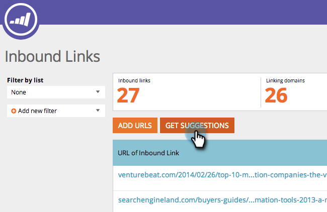

# SEO - 인바운드 링크 제안 가져오기 {#seo-get-inbound-link-suggestions}

마케터는 [페이지 외 최적화](/help/marketo/product-docs/additional-apps/seo/understanding-seo/understanding-search-engine-optimization.md)에 중요한 인바운드 링크를 제안할 수 있습니다.

1. **인바운드 링크** 섹션으로 이동합니다.

   

1. **제안 가져오기**&#x200B;를 클릭합니다.

   

1. 키워드를 입력합니다. **링크 제안**&#x200B;을 클릭합니다.

   

1. 링크를 선택합니다. **선택한 항목 추가**&#x200B;를 클릭합니다.

   

   >[!TIP]
   >
   >[링크를 새 목록 또는 기존 목록](/help/marketo/product-docs/additional-apps/seo/inbound-links/seo-add-remove-an-inbound-link-url-from-a-list.md)에 추가할 수 있다는 것을 알고 계십니까? 확인!

1. 굉장해! 이제 이러한 추가된 링크가 추적됩니다.

   >[!NOTE]
   >
   >[인바운드 링크 이해](/help/marketo/product-docs/additional-apps/seo/inbound-links/seo-understanding-inbound-links.md)
