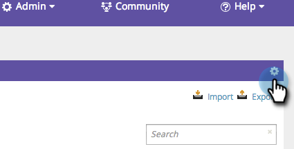

# SEO - 키워드 보기에서 열 추가/제거 {#seo-add-remove-columns-from-your-keywords-view}

키워드 보기를 조정하여 가장 관심 있는 데이터를 표시할 수 있습니다.

1. 키워드 **섹션으로** 이동합니다.

   

   기본 열은 다음과 같습니다.

1. 

1. 톱니바퀴 아이콘을 클릭합니다.

   

1. 표시할 열을 선택하거나 선택 취소합니다. 저장을 **클릭합니다**.

   

   대단해! 이제 키워드 보기를 사용자 지정했습니다.

   

   >[!NOTE]
   >
   >**관련 문서**
   >
   >    
   >    
   >    * [키워드 이해 - 요약 보기](seo-understanding-keywords.md)

