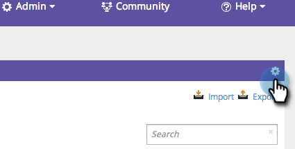

# SEO - 키워드 보기에서 열 추가/제거 {#seo-add-remove-columns-from-your-keywords-view}

키워드 보기를 조정하여 가장 관심 있는 데이터를 표시할 수 있습니다.
>[!IMPORTANT]
>
>2026년 3월 31일에 Marketo Engage은 검색 엔진 최적화 기능을 사용하지 않습니다. 3월 30일 이전에 관련 데이터를 내보내십시오. [자세히 알아보기](https://nation.marketo.com/t5/product-blogs/marketo-engage-seo-feature-deprecation/ba-p/359060){target="_blank"}
>
>* [내보내기 문제](https://experienceleague.adobe.com/ko/docs/marketo/using/product-docs/additional-apps/seo/pages/seo-export-issues-to-csv){target="_blank"}
>* [키워드 결과 내보내기](https://experienceleague.adobe.com/ko/docs/marketo/using/product-docs/additional-apps/seo/keywords/seo-exporting-keyword-results){target="_blank"}
>* [키워드 트렌드 내보내기](https://experienceleague.adobe.com/ko/docs/marketo/using/product-docs/additional-apps/seo/reports/seo-use-the-keyword-trends-report#exporting-data){target="_blank"}
>* [경쟁업체 키워드 트렌드 내보내기](https://experienceleague.adobe.com/ko/docs/marketo/using/product-docs/additional-apps/seo/reports/seo-use-the-competitor-kw-trends-report#exporting-data){target="_blank"}

1. **[!UICONTROL Keywords]** 섹션으로 이동합니다.

   

   다음은 기본 열입니다.

   

1. 톱니바퀴 아이콘을 클릭합니다.

   

1. 보려는 열을 선택하거나 선택 취소합니다. **[!UICONTROL Save]**&#x200B;를 클릭합니다.

   

   멋지다! 이제 키워드 보기를 맞춤화했습니다.

   

   >[!MORELIKETHIS]
   >
   >[키워드 이해 - 요약 보기](/help/marketo/product-docs/additional-apps/seo/keywords/seo-understanding-keywords.md)
