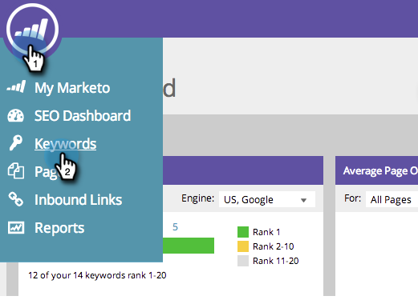

# SEO - 키워드 결과 내보내기 {#seo-exporting-keyword-results}

키워드 결과를 내보내어 팀과 공유하거나 보고서를 만들 수 있습니다.
>[!IMPORTANT]
>
>2026년 3월 31일에 Marketo Engage은 검색 엔진 최적화 기능을 사용하지 않습니다. 3월 30일 이전에 관련 데이터를 내보내십시오. [자세히 알아보기](https://nation.marketo.com/t5/product-blogs/marketo-engage-seo-feature-deprecation/ba-p/359060){target="_blank"}
>
>* [내보내기 문제](https://experienceleague.adobe.com/ko/docs/marketo/using/product-docs/additional-apps/seo/pages/seo-export-issues-to-csv){target="_blank"}
>* [키워드 결과 내보내기](https://experienceleague.adobe.com/ko/docs/marketo/using/product-docs/additional-apps/seo/keywords/seo-exporting-keyword-results){target="_blank"}
>* [키워드 트렌드 내보내기](https://experienceleague.adobe.com/ko/docs/marketo/using/product-docs/additional-apps/seo/reports/seo-use-the-keyword-trends-report#exporting-data){target="_blank"}
>* [경쟁업체 키워드 트렌드 내보내기](https://experienceleague.adobe.com/ko/docs/marketo/using/product-docs/additional-apps/seo/reports/seo-use-the-competitor-kw-trends-report#exporting-data){target="_blank"}

1. **[!UICONTROL Keywords]** 섹션으로 이동합니다.

   

1. **[!UICONTROL Export]**&#x200B;를 클릭합니다.

   

   네, 정말 쉽습니다.
