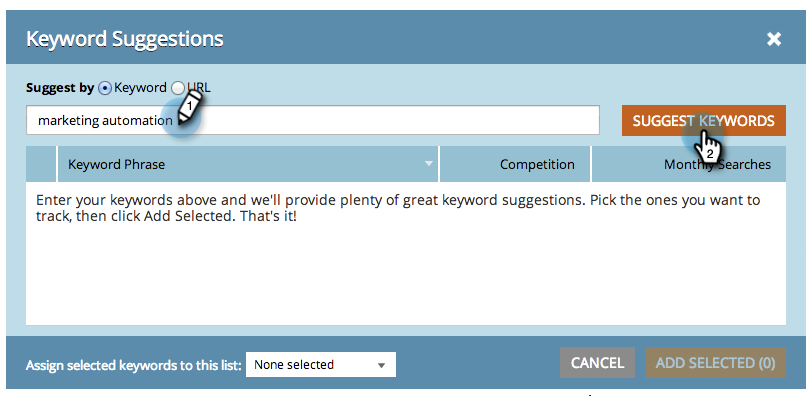

# SEO - 추천 키워드 {#seo-get-suggested-keywords} 가져오기

Marketing SEO는 추적해야 하는 키워드를 제안할 수 있습니다. 키워드 또는 사이트의 URL을 기반으로 제안을 제공할 수 있습니다. 빨리 해!

## 키워드 {#get-keyword-suggestions-using-a-keyword}을(를) 사용하여 키워드 제안 가져오기

1. **키워드** 섹션으로 이동합니다.

   

1. **제안 가져오기**&#x200B;를 클릭합니다.

   

1. **키워드**&#x200B;를 입력합니다. **키워드 제안**&#x200B;을 클릭합니다.

   

   >[!TIP]
   >
   >여기에서 [키워드를 새 목록 또는 기존 목록](/help/marketo/product-docs/additional-apps/seo/understanding-seo/seo-managing-lists.md)에 추가할 수 있다는 것을 알고 계십니까?

1. 제안된 키워드를 선택합니다. **선택한 항목 추가**&#x200B;를 클릭합니다.

   

   좋아요! 키워드가 추가되었습니다.

   

   예휴! 이제 키워드를 기반으로 키워드 제안을 얻는 방법을 알므로 URL을 기반으로 제안을 얻으십시오.

## URL {#get-keyword-suggestions-from-a-url}에서 키워드 제안 가져오기

1. **키워드** 섹션으로 이동합니다.

   

1. **제안 가져오기**&#x200B;를 클릭합니다.

   

1. **제안 작성자:**&#x200B;을 **URL**&#x200B;로 설정합니다.

   

1. **URL**&#x200B;을 입력하고 **키워드 제안**&#x200B;을 클릭합니다.

   

   >[!TIP]
   >
   >여기에서 [키워드를 새 목록 또는 기존 목록](/help/marketo/product-docs/additional-apps/seo/understanding-seo/seo-managing-lists.md)에 추가할 수 있다는 것을 알고 계십니까?

1. 제안된 키워드를 선택합니다. **선택한 항목 추가**&#x200B;를 클릭합니다.

   

1. 좋아요! 키워드가 추가되었습니다.

   

   좋아, 넌 이 일을 좋아하잖아. 계속!

   >[!MORELIKETHIS]
   >
   >* [키워드 이해(요약 보기)](/help/marketo/product-docs/additional-apps/seo/keywords/seo-understanding-keywords.md)
   >* [목록에서 키워드 추가/제거](/help/marketo/product-docs/additional-apps/seo/keywords/seo-add-remove-keywords-from-a-list.md)

