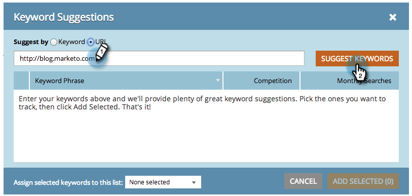

# SEO - 추천 키워드 가져오기 {#seo-get-suggested-keywords}

Marketo SEO는 추적해야 하는 키워드를 제안할 수 있습니다. 키워드나 사이트의 URL을 기반으로 제안을 할 수 있습니다. 한번 해봐!

## 키워드를 사용하여 키워드 제안 가져오기 {#get-keyword-suggestions-using-a-keyword}

1. 로 이동 **[!UICONTROL 키워드]** 섹션.

   

1. 클릭 **[!UICONTROL 제안 사항 가져오기]**.

   

1. 입력 **[!UICONTROL 키워드]**. 클릭 **[!UICONTROL 키워드 제안]**.

   

   >[!TIP]
   >
   >할 수 있다는 걸 알고 있었습니까?  [새 목록 또는 기존 목록에 키워드 추가](/help/marketo/product-docs/additional-apps/seo/understanding-seo/seo-managing-lists.md) 바로 여기요?

1. 추천 키워드를 선택합니다. 클릭 **[!UICONTROL 선택 항목 추가]**.

   

   잘됐네! 키워드가 추가되었습니다.

   

   예하! 키워드를 기반으로 키워드 제안을 얻는 방법을 알았으므로 URL을 기반으로 제안을 받아 보십시오.

## URL에서 키워드 제안 가져오기  {#get-keyword-suggestions-from-a-url}

1. 로 이동 **[!UICONTROL 키워드]** 섹션.

   

1. 클릭 **[!UICONTROL 제안 사항 가져오기]**.

   

1. 설정 **[!UICONTROL 제안 방법]** 끝 **[!UICONTROL URL]**.

   

1. 입력 **[!UICONTROL URL]** 및 클릭 **[!UICONTROL 키워드 제안]**.

   

   >[!TIP]
   >
   >할 수 있다는 걸 알고 있었습니까? [새 목록 또는 기존 목록에 키워드 추가](/help/marketo/product-docs/additional-apps/seo/understanding-seo/seo-managing-lists.md) 바로 여기요?

1. 추천 키워드를 선택합니다. 클릭 **[!UICONTROL 선택 항목 추가]**.

   

잘됐네! 키워드가 추가되었습니다.

>[!MORELIKETHIS]
>
>* [키워드 이해(요약 보기)](/help/marketo/product-docs/additional-apps/seo/keywords/seo-understanding-keywords.md)
>* [목록에서 키워드 추가/제거](/help/marketo/product-docs/additional-apps/seo/keywords/seo-add-remove-keywords-from-a-list.md)

