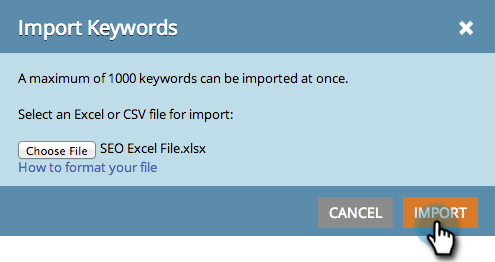

# SEO - CSV로 키워드 가져오기 {#seo-importing-keywords-with-a-csv}

1. 수동으로 [키워드를 추가](/help/marketo/product-docs/additional-apps/seo/keywords/seo-add-keywords.md)하고, [키워드 제안을 받고](/help/marketo/product-docs/additional-apps/seo/keywords/seo-get-suggested-keywords.md)하며, CSV 파일에서 키워드를 가져올 수도 있습니다. 가져오기 방법은 다음과 같습니다.

1. **[!UICONTROL Keywords]** 섹션으로 이동합니다.

   

1. **[!UICONTROL Import]**&#x200B;를 클릭합니다.

   

1. 가져올 Excel 파일을 선택하십시오.

   

1. **[!UICONTROL Choose File]**&#x200B;를 클릭합니다.

   

   >[!NOTE]
   >
   >가져오기 제한은 구독에 따라 다릅니다. 자세한 내용은 영업 담당자에게 문의하십시오.

1. **[!UICONTROL Import]**&#x200B;를 클릭합니다.

   

   새 키워드가 키워드 목록에 알파벳순으로 표시됩니다.

   

   >[!NOTE]
   >
   >각 키워드와 관련된 모든 데이터를 로드하는 데 몇 분이 걸릴 수 있습니다.

   >[!MORELIKETHIS]
   >
   >* [키워드 이해(요약 보기)](/help/marketo/product-docs/additional-apps/seo/keywords/seo-understanding-keywords.md)
   >* [목록에서 키워드 추가/제거](/help/marketo/product-docs/additional-apps/seo/keywords/seo-add-remove-keywords-from-a-list.md)
