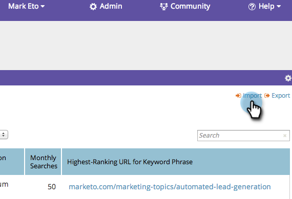

# SEO - CSV로 키워드 가져오기 {#seo-importing-keywords-with-a-csv}

1. 다음을 수행할 수 있습니다 [키워드 추가](/help/marketo/product-docs/additional-apps/seo/keywords/seo-add-keywords.md) 수동으로, [키워드 제안 받기](/help/marketo/product-docs/additional-apps/seo/keywords/seo-get-suggested-keywords.md) CSV 파일에서 키워드를 가져옵니다. 가져오기 방법은 다음과 같습니다.

1. 로 이동합니다. **키워드** 섹션을 참조하십시오.

   

1. 클릭 **가져오기**.

   

1. 가져올 Excel 파일을 선택합니다.

   

1. 클릭 **파일 선택**.

   

   >[!NOTE]
   >
   >가져오기 제한은 가입에 따라 다릅니다. 자세한 내용은 영업 담당자에게 문의하십시오.

1. 클릭 **가져오기**.

   

   키워드 목록에 알파벳 순서로 새 키워드가 표시됩니다.

   

   각 키워드와 연결된 모든 데이터를 로드하는 데 몇 분이 걸릴 수 있습니다. 삶의 의미를 깊이 생각해보자.

   >[!MORELIKETHIS]
   >
   >* [키워드 이해(요약 보기)](/help/marketo/product-docs/additional-apps/seo/keywords/seo-understanding-keywords.md)
   >* [목록에서 키워드 추가/제거](/help/marketo/product-docs/additional-apps/seo/keywords/seo-add-remove-keywords-from-a-list.md)

