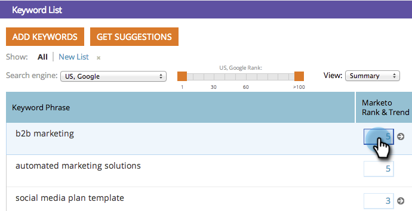

# SEO - 키워드 트렌드 차트 {#seo-keyword-trends-chart}

시간 경과에 따라 키워드 [SERP 순위](/help/marketo/product-docs/additional-apps/seo/understanding-seo/understanding-search-engine-optimization.md)의 추세를 모니터링하는 것이 중요합니다. 진행 상황을 모니터링하려면 이 멋진 차트를 확인하십시오.

1. **[!UICONTROL 키워드]** 섹션으로 이동합니다.

   

1. 트렌드를 표시할 키워드의 등급 상자를 클릭합니다.

   

   지난 30일 동안의 [SERP 순위](/help/marketo/product-docs/additional-apps/seo/understanding-seo/understanding-search-engine-optimization.md)를 표시합니다.

   

   >[!TIP]
   >
   >키워드 트렌드 보고서에서 키워드 순위에 대해 자세히 알아볼 수 있습니다.

   >[!MORELIKETHIS]
   >
   >[키워드 트렌드 보고서 사용](/help/marketo/product-docs/additional-apps/seo/reports/seo-use-the-keyword-trends-report.md)
