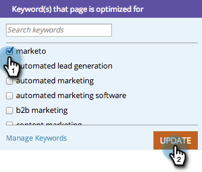

# SEO - 타깃팅된 키워드 {#seo-optimize-specific-pages-with-targeted-keywords}으로 특정 페이지 최적화

어떤 키워드는 특정 페이지와 잘 어울린다. 완벽한 키워드를 완벽한 페이지에 연결하는 방법입니다. 이를 통해 가장 정확한 데이터와 개선을 위한 최상의 권장 사항을 제공할 수 있습니다.

1. **페이지** 섹션으로 이동합니다.

   a

1. 세부 사항을 볼 페이지를 클릭합니다.

   

1. 페이지를 최적화할 키워드를 선택합니다. **업데이트**&#x200B;를 클릭합니다.

   >[!TIP]
   >
   >페이지당 3개 미만의 키워드를 사용하는 것이 좋습니다. 이상적으로는, 하나만

   

   좋아! 가능한 많은 페이지와 키워드에 대해 이 작업을 수행합니다.

