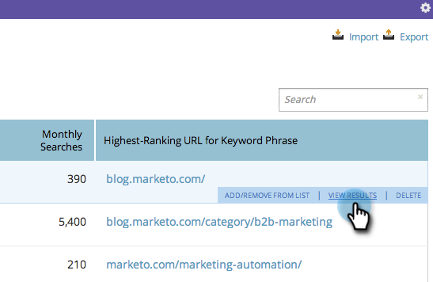

# SEO - 검색 엔진의 키워드 결과 보기 {#seo-view-keyword-results-in-search-engine}

컨텐츠가 검색 엔진에서 어떻게 표시되는지 확인하려면 간단한 단축키를 추가했습니다.

1. **키워드** 섹션으로 이동합니다.

   

1. 키워드 위로 마우스를 가져갑니다. **결과 보기**&#x200B;를 클릭합니다.

   

1. 결과를 볼 검색 엔진을 선택합니다.

   

1. 굉장해! 이제 새 창에서 키워드에 대한 검색 결과를 볼 수 있습니다.

   
