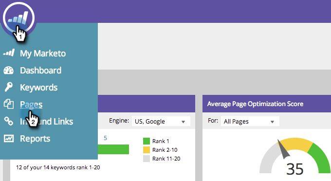

# SEO - 페이지 추가 {#seo-add-pages}

페이지가 있습니다! Marketing To SEO는 자동으로 사이트를 탐색하고 추적합니다. 몇 가지 누락된 경우 다음과 같이 SEO 앱에서 가져옵니다.

1. 페이지 **섹션으로** 이동합니다.

   

1. 페이지 **추가를 클릭합니다**.

   

1. 추가할 URL을 입력합니다. 추가를 **클릭합니다**.

   

   >[!TIP]
   >
   >페이지를 새 목록 또는 기존 목록에 [추가할 수 있다는 것을 알고 계십니까](../../../../product-docs/additional-apps/seo/understanding-seo/seo-managing-lists.md)? 확인!

   페이지 데이터를 로드하는 데 시간이 걸릴 수 있습니다. 녹색 경고 메시지가 표시될 때까지 기다린 후 페이지를 새로 고침하여 표시를 업데이트합니다.
   

   쉬운 레몬스퀴지! 이제 이 페이지의 검색 성과를 추적할 수 있습니다.

