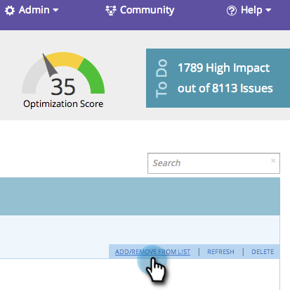

# SEO - 목록에서 페이지 추가/제거 {#seo-add-remove-page-from-list}

목록을 만들어 페이지를 쉽게 관리합니다. 목록을 사용하여 페이지를 구성하거나 대시보드에서 데이터를 필터링할 수 있습니다.

>[!IMPORTANT]
>
>2026년 3월 31일에 Marketo Engage은 검색 엔진 최적화 기능을 사용하지 않습니다. 3월 30일 이전에 관련 데이터를 내보내십시오. [자세히 알아보기](https://nation.marketo.com/t5/product-blogs/marketo-engage-seo-feature-deprecation/ba-p/359060){target="_blank"}
>
>* [내보내기 문제](https://experienceleague.adobe.com/ko/docs/marketo/using/product-docs/additional-apps/seo/pages/seo-export-issues-to-csv){target="_blank"}
>* [키워드 결과 내보내기](https://experienceleague.adobe.com/ko/docs/marketo/using/product-docs/additional-apps/seo/keywords/seo-exporting-keyword-results){target="_blank"}
>* [키워드 트렌드 내보내기](https://experienceleague.adobe.com/ko/docs/marketo/using/product-docs/additional-apps/seo/reports/seo-use-the-keyword-trends-report#exporting-data){target="_blank"}
>* [경쟁업체 키워드 트렌드 내보내기](https://experienceleague.adobe.com/ko/docs/marketo/using/product-docs/additional-apps/seo/reports/seo-use-the-competitor-kw-trends-report#exporting-data){target="_blank"}

## 목록에 페이지 추가 {#add-page-to-a-list}

1. **[!UICONTROL Pages]** 섹션으로 이동합니다.

   

1. 목록에 추가할 페이지를 마우스로 가리킵니다. **[!UICONTROL Add/Remove From List]**&#x200B;를 클릭합니다.

   

1. 페이지를 추가할 목록을 클릭합니다.

   

   >[!TIP]
   >
   >페이지를 이동할 새 목록을 만들 수도 있습니다. [!UICONTROL Create a new list]에 원하는 이름을 입력하세요.

1. 페이지를 방금 추가한 목록을 클릭합니다.

   

예이! 이제 목록에 페이지가 추가된 것을 볼 수 있습니다.

## 목록에서 페이지 제거 {#remove-page-from-a-list}

1. **[!UICONTROL Pages]** 섹션으로 이동합니다.

   

1. **[!UICONTROL Pages]** 탭에서 정리할 목록을 클릭합니다.

   

1. 제거할 페이지 위로 마우스를 가져갑니다. **[!UICONTROL Add/Remove From List]**&#x200B;를 클릭합니다.

   

1. 제거할 목록을 클릭합니다.

   >[!NOTE]
   >
   >키워드가 현재 속한 모든 목록에는 확인 표시가 나타납니다. 목록에서 제거되면 검사가 사라집니다.

   

완료. 페이지가 목록에서 제거됩니다.
