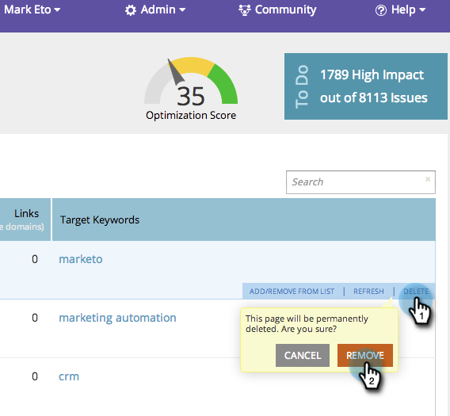

# SEO - 페이지 {#seo-remove-delete-a-page} 제거/삭제

페이지를 삭제하시겠습니까? 괜찮아요, 여기 있습니다.

1. **페이지** 섹션으로 이동합니다.

   

1. 페이지 탭에서 제거할 페이지 위로 마우스를 가져가 **삭제**&#x200B;를 클릭한 다음 **제거**&#x200B;를 클릭합니다.

   

케이크 한 조각. 이제 이 페이지가 목록에서 영구적으로 제거됩니다.
