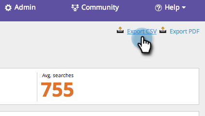

# SEO - 경쟁업체 KW 트렌드 보고서 사용 {#seo-use-the-competitor-kw-trends-report}

이 보고서에서 시간 경과에 따라 귀사와 경쟁사가 키워드에 대해 어떻게 순위를 매겼는지를 확인할 수 있습니다.

## 보고서 찾기 {#find-reports}

1. 이동 **보고서**.

   

1. 클릭 **경쟁력 KW 등급 추세**.

   

## KW 등급 트렌드 그래프 {#kw-rank-trends-graph}

이 그래프는 지정된 범위에서 키워드의 비율과 경쟁업체가 스택하는 방식을 표시할 수 있습니다.

| 항목 | 설명 |
|---|---|
| 키워드 | 추적하는 키워드 수입니다. |
| 등급 URL | 설정한 범위에서 사이트 등급에 있는 URL의 수입니다. |
| 등급 % | 설정한 범위에서 키워드 순위 비율입니다. |
| 평균 검색 | 설정한 범위(최근 30일 동안, Google 미국 검색에서) 동안 발생한 해당 키워드에 대한 평균 검색 수입니다 |

## 데이터 필터링 {#filtering-data}

1. 드롭다운을 클릭하고 원하는 기간을 선택합니다.

   

1. 을(를) 클릭합니다. **등급** 드롭다운을 클릭하여 키워드를 볼 등급 범위를 선택합니다.

   

## 데이터 내보내기  {#exporting-data}

>[!TIP]
>
>이 보고서를 데스크탑으로 내보낼 수 있습니다.

1. 클릭 **CSV 내보내기** 또는 **Export PDF**.

   

   A+ work!
